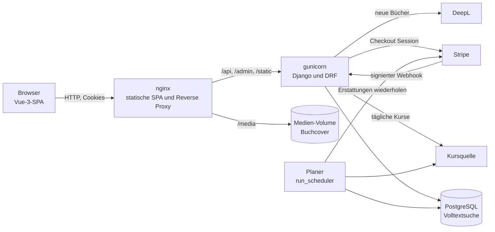
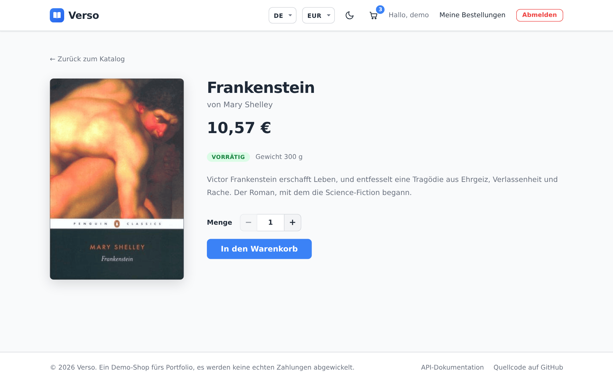
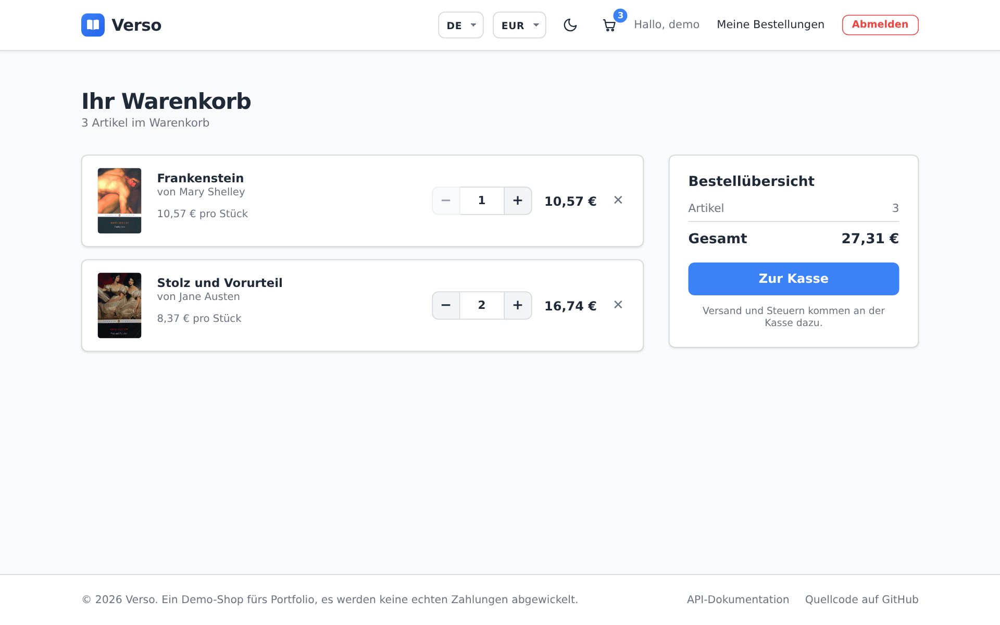
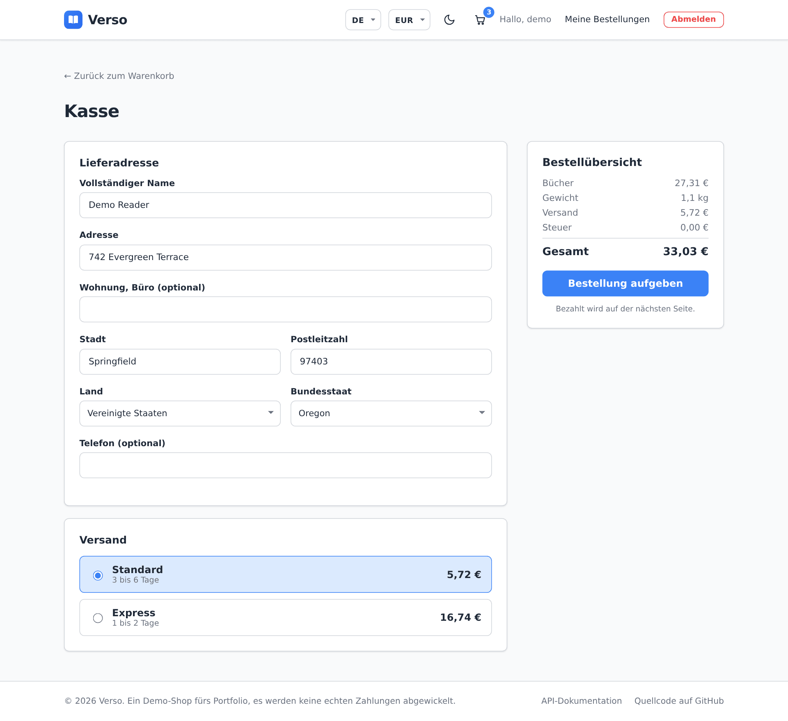
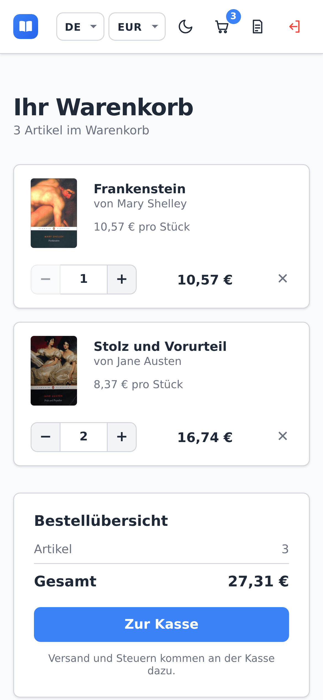
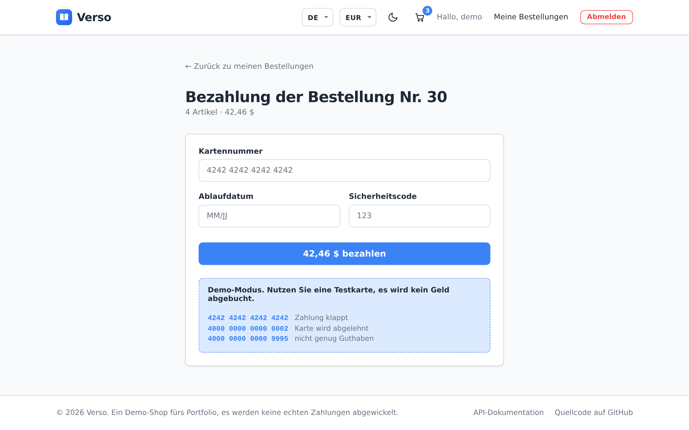
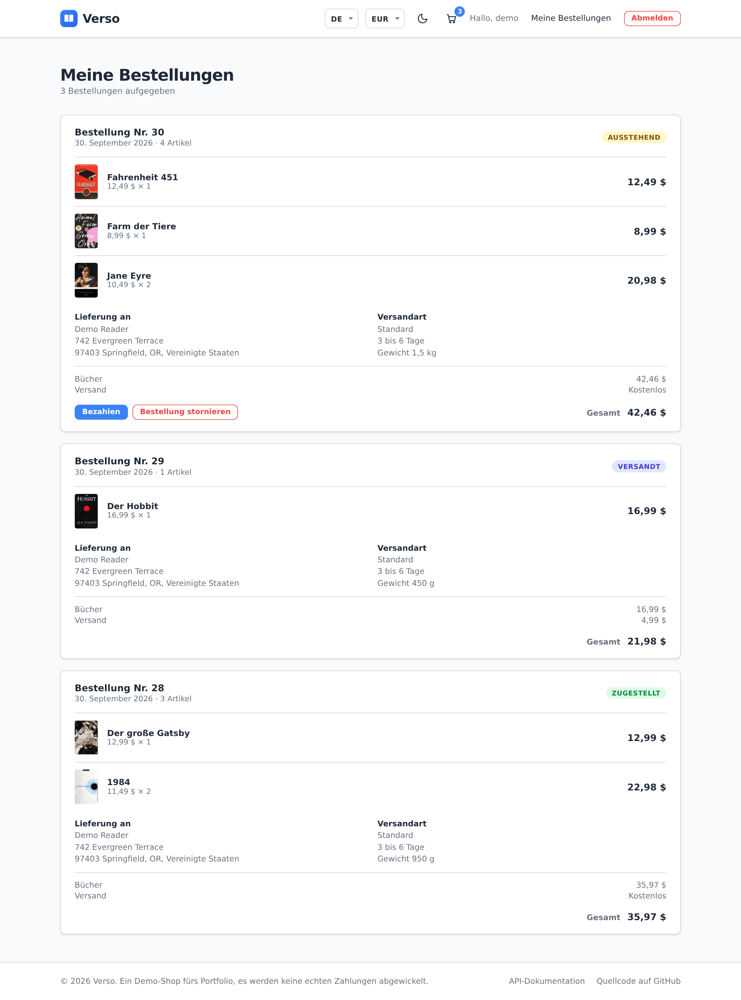
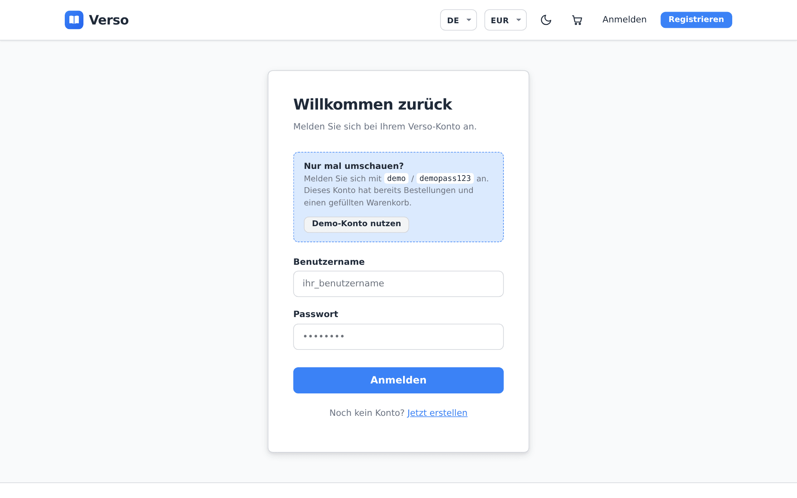

# Verso

> [🇬🇧 English](README.md) | [🇷🇺 Русский](README.ru.md) | [🇫🇷 Français](README.fr.md) | 🇩🇪 Deutsch

[](https://github.com/DogNellaf/verso-bookshop/actions/workflows/ci.yml)


[](https://github.com/DogNellaf/verso-bookshop/releases)


Verso ist eine Online-Buchhandlung mit Django REST Framework und Vue 3. Man
kann im Katalog suchen, einen Warenkorb füllen, eine Lieferadresse eingeben,
eine Versandart wählen und mit Karte bezahlen. Versandkosten und Steuer hängen
vom Zielland ab. Eine Bestellung lässt sich stornieren, bis sie versandt ist,
und das Geld wird erstattet. Preise erscheinen in jeder Währung, die der Shop
anbietet, ab Werk US-Dollar, Euro und Rubel. Mitarbeitende verwalten Bücher,
Bestellungen, Erstattungen, Währungen, Versand und Steuern im Django-Admin. Die
Oberfläche ist standardmäßig englisch. Russisch, Französisch und Deutsch lassen
sich im Kopfbereich wählen, und auch der Buchkatalog ist übersetzt.


## Schnellstart

```bash
docker compose up --build
```

Öffnen Sie <http://localhost:8080> und klicken Sie auf der Anmeldeseite auf
**Demo-Konto nutzen**, oder melden Sie sich mit **demo / demopass123** an. Der
Demo-Nutzer hat schon drei Bestellungen und einige Bücher im Warenkorb. Beim
ersten Start bekommt die Datenbank 18 klassische Romane mit Covern und
aktuelle Wechselkurse. Ein eigener Planer-Container hält die Kurse aktuell und
wiederholt fehlgeschlagene Erstattungen.

Zum Ausprobieren einer Zahlung bestellen Sie den Warenkorb und bezahlen mit
der Testkarte **4242 4242 4242 4242** (beliebiges künftiges Datum, beliebiger
Code). Die Karte **4000 0000 0000 0002** wird abgelehnt. Im Demo-Modus wird
kein Geld abgebucht. Wie man echtes Stripe Checkout nutzt, steht unter
[Zahlungen](#zahlungen). Vor der Zahlung geben Sie eine Adresse ein und
wählen eine Versandart, und die Steuer des Ziellandes kommt hinzu.

Die API-Dokumentation (Swagger UI) liegt unter
<http://localhost:8080/api/docs/>, der Admin unter
<http://localhost:8080/admin/>. Damit beim Start ein Admin-Konto angelegt
wird, setzen Sie `DJANGO_SUPERUSER_USERNAME` und `DJANGO_SUPERUSER_PASSWORD`
in `.env`.

## Fallstudie

### Problem

Eine kleine Buchhandlung will online verkaufen. Sie darf nicht mehr Exemplare
verkaufen, als sie hat, auch wenn zwei Personen gleichzeitig bestellen. Alte
Bestellungen sollen ihre Preise behalten, wenn sich Katalog oder Wechselkurse
ändern. Die Kundschaft kommt aus mehreren Ländern, also braucht die Seite ihre
Sprache und ihre Währung und muss auf dem Handy funktionieren.

### Lösung

Die ganze Geschäftslogik steckt in der REST-API, die Vue-App ruft sie nur auf.
Eine Bestellung durchläuft diese Status.

| Status | Wer ihn setzt | Bestand |
|---|---|---|
| **Ausstehend** | Die Bestellung | Exemplare werden vom Bestand abgebucht |
| **Bezahlt** | Eine erfolgreiche Zahlung (Demo-Karte oder Stripe-Webhook) | Keine Änderung |
| **Versandt, Zugestellt** | Mitarbeitende im Admin | Keine Änderung |
| **Storniert** | Die Kundschaft, bis die Bestellung versandt ist. Eine bezahlte Bestellung wird erstattet | Exemplare gehen zurück in den Bestand |

Versand und Steuern kommen aus Tabellen, die Mitarbeitende im Admin pflegen.
Das sind die Standardwerte.

| Zone | Versand, erstes kg | Jedes weitere kg | Kostenlos ab | Steuer auf Bücher |
|---|---|---|---|---|
| USA | Standard $4.99, Express $14.99 | $1.50, $4.00 | $35 | Sales Tax des Bundesstaats, etwa 7,25 % in Kalifornien und 8,875 % in New York City |
| Europäische Union | Standard $6.99, Express $19.99 | $2.00, $5.00 | $50 | ermäßigte MwSt., etwa 7 % in Deutschland und 5,5 % in Frankreich |
| Russland | Russische Post $5.99, Kurier $11.99 | $1.50, $3.00 | $40 | 10 % |
| Rest der Welt | International $12.99 | $6.00 | $80 | keine |

Jedes Buch hat ein Gewicht. Eine Versandart berechnet ihren Grundpreis für das
erste Kilogramm und einen festen Betrag für jedes weitere angefangene
Kilogramm, und Express nimmt Pakete bis 10 kg. Ein Steuersatz gilt für ein
Land, einen Bundesstaat oder einen Bereich von Postleitzahlen, und der
genaueste gewinnt. Ab Werk sind die Sätze aller US-Bundesstaaten und die
kombinierten Stadtsätze von New York City und Chicago angelegt. Jeder Satz legt
auch fest, ob der Versand besteuert wird.

Die Bestellung läuft in einer Transaktion. Zuerst werden die Buchzeilen
gesperrt, danach wird der Bestand geprüft.

```python
with transaction.atomic():
    books = {b.id: b for b in Book.objects.select_for_update().filter(id__in=ids)}
    errors = [stock_message(books[i.book_id]) for i in items
              if i.quantity > books[i.book_id].stock]
    if errors:
        raise ValidationError({"detail": _("Not enough stock."), "items": errors})
    order = Order.objects.create(buyer=user, currency=order_currency)
    ...  # Titel und Preise in dieser Währung speichern, Bestand abbuchen, Warenkorb leeren
```

### Technische Details

- Bestellung und Stornierung sperren die Buchzeilen mit `SELECT … FOR UPDATE`.
  Prüfung, Bestandsänderung und die neue Bestellung werden in einer
  Transaktion gespeichert, deshalb bleibt nach einer fehlgeschlagenen Prüfung
  keine halbe Bestellung übrig.
- Eine Bestellposition speichert Titel und Preis zum Zeitpunkt des Kaufs in
  der Währung, die die Kundschaft gewählt hat. Ein geändertes Buch oder ein
  neuer Kurs ändert keine alten Bestellungen.
- Zahlungen laufen über eine kleine Anbieter-Schnittstelle. Der Demo-Anbieter
  prüft die Kartennummer mit dem Luhn-Algorithmus und hat Testkarten für
  Erfolg, Ablehnung und fehlende Deckung. Der Stripe-Anbieter legt eine
  Checkout Session an, und erst der signierte Stripe-Webhook markiert die
  Bestellung als bezahlt. Doppelte Webhooks ändern nichts.
- Der Server berechnet Versand und Steuer für Adresse und Versandart in der
  gewählten Währung. Der Preis folgt dem Gewicht der Bücher, eine Versandart
  entfällt, wenn das Paket über ihrem Limit liegt, und die Steuer ergibt sich
  aus Land, US-Bundesstaat oder Postleitzahl. Die Bestellung speichert Adresse,
  Versandart mit Lieferzeit, Gewicht und alle Beträge, spätere Preisänderungen
  berühren sie also nicht.
- Jede Erstattung ist eine eigene Zeile mit Betrag und Grund, daher lässt sich
  eine Zahlung in Teilen erstatten. Mitarbeitende erstatten im Admin jeden
  Betrag, und eine Stornierung erstattet den Rest. Geld, das für eine bereits
  stornierte Bestellung eingeht, geht automatisch zurück. Die Zeilen bleiben
  während des Anbieteraufrufs gesperrt und Stripe bekommt pro Erstattung einen
  Idempotenzschlüssel, daher wird nie doppelt erstattet. Eine fehlgeschlagene
  Erstattung wiederholt der Planer bis zu zehnmal.
- Der Planer ist ein Management-Befehl in einem eigenen Container. Er holt
  einmal am Tag die Wechselkurse, wiederholt alle 15 Minuten Erstattungen,
  storniert Zahlungen, die nach einem Tag noch offen sind, und storniert
  Bestellungen, die zwei Tage unbezahlt bleiben, wodurch ihre Bücher zurück in
  den Bestand gehen. Jeder Job sperrt
  seine Zeile in der Tabelle `JobRun`, daher laufen nie zwei Prozesse mit
  demselben Job, und der Admin zeigt Zeit und Ergebnis des letzten Laufs.
- Preise werden in US-Dollar gespeichert. Währungen sind Zeilen, die
  Mitarbeitende im Admin anlegen. Eine neue Währung bekommt sofort ihren Kurs
  aus einer öffentlichen Quelle, und das Frontend erfährt davon über
  `/api/currencies/`. Eine Middleware rechnet die Preise in die Währung um, die
  die SPA im Header `X-Currency` anfragt, und rundet auf die kleinste Einheit
  der Währung, daher erscheinen Yen ohne Nachkommastellen. Auch der Preisfilter nutzt diese Währung.
- Auf PostgreSQL nutzt der Katalog die Volltextsuche. Jedes Buch hat einen
  `tsvector` aus dem englischen Text und allen Übersetzungen, jeweils mit der
  eigenen Stammformbildung, und einen GIN-Index. Die Treffer sind nach
  Relevanz sortiert, die `websearch`-Syntax funktioniert („Anführungszeichen“,
  -Minus), und ein Trigramm-Index findet auch Tippfehler wie „Tolkein“. Unter
  SQLite in der Entwicklung wird nach Teilzeichenketten gesucht.
- Der Warenkorb wird mit einer festen Zahl von SQL-Abfragen geladen. Ein Test
  zählt sie, ein N+1-Problem lässt die CI scheitern.
- Suche, Sortierung, der Filter „vorrätig“ und die Seitennummer stehen in der
  URL. Eine Katalogseite lässt sich teilen, neu laden oder mit der
  Zurück-Taste wieder öffnen.
- Die Cover der Demo-Bücher stammen von Open Library und liegen im Repository.
  Ein Buch ohne Bild bekommt ein erzeugtes Cover. Die Dateien von Swagger UI
  werden lokal ausgeliefert, die App braucht kein CDN.

### Sicherheit

- JWT-Tokens gelangen nie zu JavaScript. Das Backend legt sie in
  httpOnly-Cookies mit `SameSite=Lax` (und `Secure` bei HTTPS). Das
  Refresh-Cookie geht nur an `/api/auth/`.
- Da der Browser Cookies selbst mitschickt, muss jede unsichere Anfrage die
  CSRF-Prüfung von Django bestehen. Die SPA liest das Cookie `csrftoken` und
  schickt den Wert in `X-CSRFToken`, auch bei Anmeldung und Registrierung.
- Das Access-Token gilt 30 Minuten. Das Refresh-Token wird bei jeder Nutzung
  ersetzt und das alte kommt auf eine Sperrliste, ein gestohlenes
  Refresh-Token ist also nach der nächsten Erneuerung wertlos. Auch die
  Abmeldung widerruft es.
- Anmeldung, Registrierung und Token-Erneuerung sind standardmäßig auf
  20 Anfragen pro Minute begrenzt. Anonyme und angemeldete Nutzer haben
  getrennte Limits.
- Der Stripe-Webhook wird nur mit gültiger Stripe-Signatur angenommen.
- Nach der Anmeldung leitet die Seite nur auf relative Pfade derselben Seite
  weiter, daher kann `?next=` niemanden auf eine fremde Domain schicken.
- Jeder sieht nur den eigenen Warenkorb, die eigenen Bestellungen und
  Zahlungen. Alles andere liefert 404.
- Geheimnisse kommen aus Umgebungsvariablen. `HTTPS=True` aktiviert sichere
  Cookies, HSTS und die Weiterleitung auf HTTPS. Der Header `X-Frame-Options`
  ist immer `DENY`.

### Lokalisierung

- Es gibt vier Sprachen, Englisch, Russisch, Französisch und Deutsch.
  Standard ist Englisch, die Browsersprache wird absichtlich ignoriert. Der
  Umschalter EN / RU / FR / DE speichert die Wahl im Browser und setzt
  `<html lang>`.
- Die Oberfläche nutzt vue-i18n mit den Pluralregeln jeder Sprache („1 Buch,
  3 Bücher“, „1 книга, 3 книги, 5 книг“). Ein Test prüft, dass alle Sprachen
  dieselben Schlüssel haben.
- Titel, Autoren und Beschreibungen der Bücher stehen in `BookTranslation`,
  eine Zeile pro Sprache, mit Rückfall auf Englisch. Ist `DEEPL_API_KEY`
  gesetzt, wird ein neues Buch beim Anlegen automatisch übersetzt.
- Maschinelle Übersetzungen werden zur Prüfung markiert. Der Admin hat eine
  Prüfliste und die Aktion „Mark as reviewed“, und das Speichern einer
  korrigierten Übersetzung zählt als Prüfung. Mit
  `PUBLISH_UNREVIEWED_TRANSLATIONS=False` zeigt der Shop den englischen Text,
  bis ein Mensch die Übersetzung freigibt.
- API-Meldungen, auch Kartenfehler, sind mit Django gettext übersetzt. Das
  Frontend schickt die gewählte Sprache im `Accept-Language`-Header. Die CI
  prüft, dass die kompilierten `.mo`-Dateien zu den `.po`-Dateien passen.
- Die Währung folgt der Sprache (USD für Englisch, RUB für Russisch, EUR für
  Französisch und Deutsch), bis man eine andere wählt. Preise und Daten werden
  mit `Intl` formatiert.

### Architektur



SPA und API teilen sich einen Origin, daher gibt es in Produktion kein CORS,
und die Cookies bleiben First-Party. In der Entwicklung leitet der Vite-Server
dieselben Pfade an `runserver` weiter.

| Modul | Aufgabe |
|---|---|
| `backend/main/views.py` | Katalog, Warenkorb, Bestellung, Historie, Stornierung |
| `backend/main/checkout.py` | Versandzonen und Versandarten, Steuern, Angebot für einen Warenkorb |
| `backend/main/orders.py` | Stornierung mit Rückbuchung in den Bestand und Erstattung |
| `backend/main/authentication.py`, `auth_views.py` | JWT in httpOnly-Cookies, CSRF, Anmeldung, Erneuerung, Abmeldung |
| `backend/main/payments/`, `payment_views.py` | Demo- und Stripe-Anbieter, Zahlungsstatus, Webhook |
| `backend/main/currency.py` | Aktive Währung, Umrechnung, Kurs-Cache |
| `backend/main/search.py` | Suchdokument, Volltextabfrage, Toleranz für Tippfehler |
| `backend/main/machine_translation.py` | Übersetzung neuer Bücher mit DeepL |
| `backend/main/scheduler.py` | Periodische Jobs und ihre Einträge in `JobRun` |
| `backend/main/models.py` | `Book`, `BookTranslation`, `Cart`, `Order`, `Payment`, `Refund`, `Currency`, `ShippingZone`, `TaxRate` |
| `frontend/src/services/api.ts` | Typisierter API-Client, CSRF, gemeinsame Sitzungserneuerung |
| `frontend/src/currency.ts`, `i18n/` | Wahl von Währung und Sprache, Texte in vier Sprachen |
| `frontend/src/pages/Payment.vue` | Kartenformular im Demo-Modus, Weiterleitung zu Stripe |

### Was die Überarbeitung geändert hat

Anfangs war das Projekt ein Django-Shop mit serverseitig gerenderten Seiten,
eine Bestellung konnte nur ein Buch enthalten und ließ sich nicht bezahlen.
Später wurde es in eine REST-API und ein Vue-Frontend aufgeteilt. Die
Überarbeitung brachte diese Änderungen.

- Reste einer generierten Vorlage entfernt, etwa ungenutztes Tailwind und
  PostCSS, React-Typen, Analytics und Platzhalterbilder.
- Stornierung, Katalogfilter und ein Warenkorb mit fester Zahl an Abfragen.
- Eine Bestellseite mit Lieferadresse, Versandzonen und Versandarten sowie
  Steuern nach Land, US-Bundesstaat und Postleitzahl, dazu Versand nach
  Gewicht.
- Kartenzahlung mit einem Demo-Anbieter und Stripe Checkout, mit vollen und
  teilweisen Erstattungen.
- Die Liste der Währungen wird im Admin gepflegt.
- Ein Planer-Container für Wechselkurse, wiederholte Erstattungen,
  liegengebliebene Zahlungen und unbezahlte Bestellungen.
- Preise in Euro und Rubel mit gespeicherten Wechselkursen.
- JWT aus `localStorage` in httpOnly-Cookies verschoben, mit CSRF-Schutz und
  Widerruf von Tokens.
- Volltextsuche von PostgreSQL in vier Sprachen mit Toleranz für Tippfehler
  statt Suche nach Teilzeichenketten.
- Oberfläche, API-Meldungen und Katalog auf Russisch, Französisch und Deutsch
  übersetzt, neue Bücher übersetzt DeepL, maschinelle Übersetzungen werden
  geprüft.
- Neues Frontend mit Zustand in der URL, Dark Mode, mobiler Ansicht und echten
  Covern für die Demo-Bücher.
- API-Dokumentation mit OpenAPI und Swagger UI, Ratenlimits, Health Check und
  HTTPS-Einstellungen.
- 287 Tests, ein Smoke-Test im Browser, und die Backend-Tests laufen in der CI
  auf SQLite und auf PostgreSQL.

## Screenshots

| Buchseite | Warenkorb |
|---|---|
|  |  |

| Bestellung | Mobil |
|---|---|
|  |  |

| Bezahlung | Bestellhistorie |
|---|---|
|  |  |

| Dark Mode | Anmeldung |
|---|---|
|  |  |

## Zahlungen

Der Demo-Modus braucht keine Einrichtung. Für echte Zahlungen mit Stripe
setzen Sie diese Variablen und richten einen Stripe-Webhook auf
`/api/payments/stripe/webhook/` für die Ereignisse
`checkout.session.completed` und `checkout.session.expired` ein.

```bash
PAYMENT_PROVIDER=stripe
STRIPE_SECRET_KEY=sk_test_...
STRIPE_WEBHOOK_SECRET=whsec_...
SITE_URL=https://your-shop.example
```

Zum lokalen Testen gibt der Befehl
`stripe listen --forward-to localhost:8080/api/payments/stripe/webhook/`
das Webhook-Geheimnis aus.

## Ohne Docker starten

Man braucht Python 3.12 oder neuer, Node.js 20 oder neuer und pnpm. Ohne
Postgres-Einstellungen nutzt das Backend SQLite, und die Suche arbeitet mit
Teilzeichenketten.

```bash
./scripts/build-dev.sh          # Linux und macOS, richtet beide Apps ein und startet sie
.\scripts\build-dev.ps1         # Windows (PowerShell)
```

Oder Schritt für Schritt.

```bash
cd backend
python -m venv .venv && source .venv/bin/activate
pip install -r requirements.txt
python manage.py migrate
python manage.py seed                   # Demo-Katalog, Übersetzungen, Cover, Demo-Nutzer
python manage.py update_exchange_rates  # optional, seed hat Standardkurse
python manage.py runserver              # http://127.0.0.1:8000

cd ../frontend
pnpm install
pnpm run dev                            # http://127.0.0.1:5173
```

Die Cover der Demo-Bücher liegen in `backend/main/fixtures/covers/`, daher
funktioniert `seed` ohne Internet. `--flush` beginnt mit einem leeren
Katalog. `python manage.py translate_books` ergänzt fehlende Übersetzungen mit
DeepL. `python manage.py run_scheduler` startet die periodischen Jobs, und
`run_scheduler --once` macht einen einzelnen Durchlauf für cron.

## Konfiguration

Die Einstellungen kommen aus Umgebungsvariablen. docker-compose liest sie aus
`.env`, siehe [`.env.example`](.env.example).

| Variable | Zweck | Standard |
|---|---|---|
| `SECRET_KEY` | Geheimer Django-Schlüssel | unsicherer Entwicklungsschlüssel |
| `DEBUG` | Debug-Modus | `True` (`False` in Docker) |
| `ALLOWED_HOSTS` | Erlaubte Hosts, durch Kommas getrennt | lokale Hosts im Debug-Modus |
| `CORS_ALLOWED_ORIGINS`, `CSRF_TRUSTED_ORIGINS` | Adressen des Frontends | Vite-Server |
| `POSTGRES_DB`, `POSTGRES_USER`, `POSTGRES_PASSWORD`, `POSTGRES_HOST`, `POSTGRES_PORT` | PostgreSQL wird genutzt, wenn `POSTGRES_DB` gesetzt ist | SQLite |
| `SITE_URL` | Öffentliche Adresse für die Rückkehr von Stripe | `http://localhost:8080` |
| `PAYMENT_PROVIDER` | `demo` oder `stripe` | `demo` |
| `STRIPE_SECRET_KEY`, `STRIPE_WEBHOOK_SECRET` | Stripe-Schlüssel | keine |
| `DEEPL_API_KEY` | Maschinelle Übersetzung neuer Bücher | keiner |
| `AUTO_TRANSLATE_BOOKS` | Ein Buch beim Anlegen übersetzen | `True` |
| `PUBLISH_UNREVIEWED_TRANSLATIONS` | Maschinelle Übersetzungen vor der Prüfung zeigen | `True` |
| `EXCHANGE_RATES_URL` | Kursquelle mit USD als Basis | open.er-api.com |
| `UPDATE_RATES_ON_START` | Kurse beim Containerstart holen | `1` |
| `EXCHANGE_RATES_INTERVAL_HOURS` | Wie oft der Planer die Kurse holt | `24` |
| `PAYMENT_TIMEOUT_HOURS` | Nach so vielen Stunden werden offene Zahlungen storniert | `24` |
| `UNPAID_ORDER_TIMEOUT_HOURS` | Ältere unbezahlte Bestellungen werden storniert und zurückgebucht | `48` |
| `SEED_ON_START` | Demo-Daten beim Containerstart laden | `1` |
| `DJANGO_SUPERUSER_USERNAME`, `DJANGO_SUPERUSER_PASSWORD`, `DJANGO_SUPERUSER_EMAIL` | Admin-Konto, das beim Start angelegt wird | keins |
| `HTTPS` | Sichere Cookies, HSTS, Weiterleitung auf HTTPS | `False` |
| `THROTTLE_ANON`, `THROTTLE_USER`, `THROTTLE_AUTH` | Ratenlimits | `120/min`, `600/min`, `20/min` |
| `LOG_LEVEL` | Log-Level | `INFO` |

## Tests

```bash
cd backend
ruff check . && ruff format --check .
coverage run manage.py test && coverage report

cd ../frontend
pnpm run type-check
pnpm run coverage
BASE_URL=http://localhost:8080 pnpm run smoke   # Browsertest gegen die laufende App
```

Das Backend hat 176 Tests mit 95 % Abdeckung. Sie prüfen API, Cookie-Anmeldung
und CSRF, Bestellung, Stornierung, beide Zahlungsanbieter samt
Webhook-Signatur, Versand nach Gewicht, Steuern nach Land, Bundesstaat und
Postleitzahl, volle und teilweise Erstattungen und ihre Wiederholung, den
Planer, im Admin gepflegte Währungen, Volltextsuche, maschinelle Übersetzung
und ihre Prüfung, die Zahl der SQL-Abfragen und Ratenlimits. Die CI führt sie
auf SQLite und auf PostgreSQL aus. Das Frontend hat 111 Tests mit 95 %
Abdeckung für die Bestellseite, Seiten, das Zahlungsformular, Router-Prüfungen,
den API-Client, Währungen und Übersetzungen. Der Smoke-Test läuft in der CI
gegen den ganzen Docker-Compose-Stack. Er meldet sich an, prüft die Sales Tax
von New York City, kauft ein Buch mit Lieferung nach Deutschland, bezahlt erst
mit einer abgelehnten, dann mit einer gültigen Testkarte, storniert die
Bestellung für eine Erstattung und prüft, dass JavaScript kein Token lesen
kann.

Screenshots in allen Sprachen entstehen an der laufenden App mit
`cd frontend && BASE_URL=http://localhost:8080 pnpm run screenshots`.

## Projektstruktur

```
├── backend/
│   ├── bookshop/            # Einstellungen und Root-URLconf
│   ├── locale/              # API-Meldungen auf Russisch, Französisch und Deutsch (gettext)
│   └── main/
│       ├── fixtures/covers/ # Cover der Demo-Bücher
│       ├── management/      # seed, update_exchange_rates, translate_books, run_scheduler
│       ├── payments/        # Demo- und Stripe-Anbieter
│       ├── migrations/
│       ├── tests/           # Anmeldung, Kern, Bestellung, Währungen, Zahlungen, Erstattungen, Planer, Suche, Übersetzung
│       ├── authentication.py, auth_views.py, payment_views.py
│       ├── checkout.py, orders.py, countries.py
│       ├── currency.py, search.py, machine_translation.py, scheduler.py
│       └── models.py, serializers.py, views.py, admin.py
├── frontend/
│   ├── src/
│   │   ├── i18n/            # Einrichtung von vue-i18n und Texte in vier Sprachen
│   │   ├── pages/           # Katalog, Buch, Warenkorb, Bestellung, Bezahlung, Bestellungen, Anmeldung, 404
│   │   ├── components/      # BookCover, StockBadge
│   │   ├── services/api.ts  # typisierter API-Client
│   │   ├── currency.ts
│   │   └── router.ts
│   ├── scripts/             # screenshots.mjs, smoke.mjs
│   └── nginx.conf
├── docs/screenshots/        # en, ru, fr, de
├── .github/                 # Workflows (CI, Release), Dependabot
├── docker-compose.yml
└── CHANGELOG.md
```

## Lizenz

[MIT](LICENSE)
