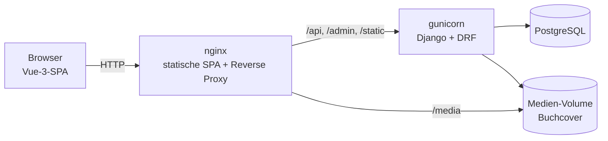

# Verso

> [🇬🇧 English](README.md) | [🇷🇺 Русский](README.ru.md) | [🇫🇷 Français](README.fr.md) | 🇩🇪 Deutsch

[](https://github.com/DogNellaf/verso-bookshop/actions/workflows/ci.yml)


Eine Online-Buchhandlung: eine Django-REST-Framework-API mit Admin-Backoffice
und ein Shop-Frontend in Vue 3 + TypeScript. Besucher durchsuchen den Katalog,
behalten einen dauerhaften Warenkorb, bestellen und verfolgen oder stornieren
ihre Bestellungen. Die Oberfläche ist standardmäßig englisch und über den
Sprachumschalter im Kopfbereich auch auf Russisch, Französisch und Deutsch
verfügbar — einschließlich des Buchkatalogs selbst.


## Schnellstart

```bash
docker compose up --build
```

Öffnen Sie <http://localhost:8080> und klicken Sie auf der Anmeldeseite auf
**Demo-Konto nutzen** (**demo / demopass123**). Der Demo-Nutzer hat bereits
drei Bestellungen in verschiedenen Status und einen gefüllten Warenkorb. Beim
ersten Start werden 18 klassische Romane in den Katalog geladen.

- Interaktive API-Referenz (Swagger UI): <http://localhost:8080/api/docs/>
- Admin: <http://localhost:8080/admin/> — setzen Sie `DJANGO_SUPERUSER_USERNAME`
  und `DJANGO_SUPERUSER_PASSWORD` in `.env`, dann wird beim Start ein Konto
  angelegt.

Um den Bestandsschutz in Aktion zu sehen, legen Sie die letzten Exemplare
eines Buches in zwei Browsern in den Warenkorb und bestellen Sie in beiden:
Die zweite Bestellung wird mit einem Hinweis abgelehnt, wie viele Exemplare
noch übrig sind.

## Fallstudie

### Problem

Eine kleine Buchhandlung möchte online verkaufen. Der Shop muss sich wie ein
echter verhalten, nicht wie eine CRUD-Demo: Er darf nie ein Exemplar verkaufen,
das er nicht hat — auch nicht, wenn zwei Personen gleichzeitig bestellen; die
Bestellhistorie darf sich nicht ändern, wenn Preise oder Katalog bearbeitet
werden; und das Frontend soll auf dem Handy und in mehreren Sprachen angenehm
zu bedienen sein.

### Lösung

Alle Geschäftsregeln liegen in der REST-API; die SPA ist ein schlanker,
typisierter Client. Eine Bestellung durchläuft diese Status:

| Status | Gesetzt von | Auswirkung auf den Bestand |
|---|---|---|
| **Ausstehend** | Der Bestellung | Exemplare werden atomar vom Bestand abgebucht |
| **Bezahlt / Versandt / Zugestellt** | Mitarbeitenden im Admin | — |
| **Storniert** | Der Kundin / dem Kunden (nur solange ausstehend) | Exemplare gehen zurück in den Bestand |

Die Bestellung ist eine einzige Transaktion, die zuerst die betroffenen
Buchzeilen sperrt:

```python
with transaction.atomic():
    books = {b.id: b for b in Book.objects.select_for_update().filter(id__in=ids)}
    errors = [stock_message(books[i.book_id]) for i in items
              if i.quantity > books[i.book_id].stock]
    if errors:
        raise ValidationError({"detail": _("Not enough stock."), "items": errors})
    order = Order.objects.create(buyer=user)
    ...  # Titel und Preis festhalten, Bestand abbuchen, Warenkorb leeren
```

### Technische Highlights

- **Kein Überverkauf.** Bestellung und Stornierung sperren die Buchzeilen mit
  `SELECT … FOR UPDATE`; Prüfung, Bestandsänderung und Bestellung sind eine
  Transaktion, sodass eine fehlgeschlagene Prüfung nichts hinterlässt.
- **Die Historie ist ein Schnappschuss.** Jede Bestellposition speichert Titel
  und Stückpreis zum Kaufzeitpunkt, der Fremdschlüssel zum Buch ist
  `SET_NULL` — Bearbeiten oder Löschen eines Buches schreibt keine alten
  Bestellungen um.
- **Konstante Anzahl an Abfragen.** Der Warenkorb lädt Positionen und Bücher
  mit einem `JOIN` plus einer Abfrage für Übersetzungen; ein Test fixiert die
  Zahl der SQL-Abfragen, sodass eine N+1-Regression die CI scheitern lässt.
- **Die URL ist der Zustand.** Suche, Sortierung, der Filter „vorrätig“ und die
  Seitennummer stehen im Query-String: Jede Katalogansicht lässt sich teilen,
  neu laden oder per Zurück-Taste wieder aufrufen.
- **Ein Token-Refresh für viele Anfragen.** Läuft das Access-Token ab, warten
  alle gleichzeitigen 401-Antworten auf eine einzige Erneuerung, statt mit
  demselben rotierenden Refresh-Token gegeneinander anzutreten.
- **Fertiger Eindruck, auch offline.** Bücher ohne Bild bekommen ein
  generiertes typografisches Cover (Farbe aus dem Titel abgeleitet), und die
  Swagger-UI-Dateien werden lokal ausgeliefert — kein Fremd-CDN nötig.
- **Dokumentierte, geprüfte API.** Das OpenAPI-3-Schema wird aus dem Code
  erzeugt und in der CI validiert, Warnungen gelten als Fehler.

### Sicherheit

- JWT-Access-Tokens gelten 30 Minuten; Refresh-Tokens rotieren bei jeder
  Nutzung. Lässt sich die Sitzung nicht erneuern, meldet die Oberfläche ab,
  statt einen veralteten Zustand anzuzeigen.
- Anmeldung, Registrierung und Token-Refresh sind ratenbegrenzt (standardmäßig
  `20/min`); anonymer und angemeldeter Verkehr haben eigene Limits.
- Die Registrierung nutzt die Passwort-Validatoren von Django.
- Die Weiterleitung `?next=` nach der Anmeldung akzeptiert nur relative Pfade
  derselben Seite und taugt daher nicht als Open Redirect.
- Nutzer sehen nur ihren eigenen Warenkorb und ihre eigenen Bestellungen; alles
  andere ist ein 404.
- Geheimnisse und Hosts kommen aus der Umgebung. `HTTPS=True` aktiviert sichere
  Cookies, HSTS und die HTTPS-Weiterleitung; `X-Frame-Options: DENY` und
  `nosniff` sind immer aktiv.

### Lokalisierung

- **Englisch, Russisch, Französisch und Deutsch.** Englisch ist für alle der
  Standard; die Browsersprache wird bewusst ignoriert, und der Umschalter
  EN / RU / FR / DE speichert die Wahl im Browser und setzt `<html lang>`.
- **Die Oberfläche** ist mit vue-i18n übersetzt, mit korrekten Pluralregeln
  („1 Buch / 3 Bücher“, „1 книга / 3 книги / 5 книг“). Ein Test prüft, dass
  jede Sprache genau dieselben Schlüssel hat.
- **Der Katalog** ist ebenfalls übersetzbar: `BookTranslation` speichert Titel,
  Autor und Beschreibung je Sprache, mit Rückfall auf das englische Original.
  Die Suche findet Bücher in jeder Sprache, und die Sortierung nach Titel oder
  Autor verwendet die übersetzten Werte.
- **API-Meldungen** sind mit Djangos gettext übersetzt. Die SPA sendet die
  gewählte Sprache im `Accept-Language`-Header, daher kommen Fehler wie „Von
  „Dune“ sind nur noch 2 Exemplare vorrätig“ in der Sprache des Nutzers und in
  der richtigen Pluralform an. Die CI prüft, dass die kompilierten
  `.mo`-Kataloge zu den `.po`-Quellen passen.
- Preise und Daten werden mit `Intl` für die aktive Sprache formatiert.

### Architektur



SPA und API kommen vom selben Origin, daher gibt es in Produktion kein CORS und
das Frontend nutzt relative URLs. In der Entwicklung leitet der Vite-Dev-Server
dieselben Pfade an `runserver` weiter.

| Modul | Aufgabe |
|---|---|
| `backend/main/views.py` | Katalog, Anmeldung, Warenkorb, Bestellung, Historie, Stornierung |
| `backend/main/serializers.py` | API-Formate; wählt die Buchübersetzung für die Anfragesprache |
| `backend/main/models.py` | `Book`, `BookTranslation`, `Cart`, `CartItem`, `Order`, `OrderItem` |
| `backend/main/management/commands/seed.py` | Demo-Katalog, Übersetzungen, Cover, Demo-Nutzer |
| `frontend/src/services/api.ts` | Typisierter API-Client, JWT-Speicherung, gemeinsamer Token-Refresh |
| `frontend/src/router.ts` | Lazy geladene Routen, Auth-Guards, Seitentitel |
| `frontend/src/i18n/` | vue-i18n-Einrichtung, Pluralregeln, Texte EN/RU/FR/DE |

### Was die Überarbeitung geändert hat

Das Projekt begann als serverseitig gerenderter Django-Shop, in dem eine
Bestellung nur ein Buch enthielt, und wurde später in eine REST-API und ein
Vue-Frontend aufgeteilt. Portfolio-reif wurde es durch:

- das Entfernen von Resten eines generierten Gerüsts: ungenutzte
  Tailwind/PostCSS-Kette, React-Typen, Analytics und Platzhalterbilder;
- Stornierung mit Rückbuchung des Bestands unter Zeilensperren, Katalogfilter
  und einen Warenkorb mit konstanter Abfragezahl;
- API-Dokumentation mit OpenAPI + Swagger UI, Rate Limiting, einen in
  docker-compose eingebundenen Health Check und HTTPS-Härtung;
- ein neu aufgebautes Frontend: Zustand in der URL, Auth-Guards mit Rücksprung
  nach der Anmeldung, bestandsabhängige Mengenauswahl, Skeletons, leere
  Zustände, eine 404-Seite, Dark Mode und ein mobiles Layout;
- die Übersetzung von Oberfläche, API-Meldungen und Katalog ins Russische,
  Französische und Deutsche;
- eine auf 138 Tests erweiterte Testsuite sowie Lint, Schema-Validierung,
  Übersetzungs- und Coverage-Prüfungen in der CI.

## Screenshots

| Buchseite | Warenkorb |
|---|---|
|  |  |

| Dark Mode | Mobil |
|---|---|
|  |  |

| Bestellhistorie | API-Referenz |
|---|---|
|  |  |

## Ohne Docker starten

Benötigt werden Python 3.12+, Node.js 20+ und pnpm. Ohne Postgres-Einstellungen
wird SQLite verwendet.

```bash
./scripts/build-dev.sh          # Linux / macOS: richtet beide Apps ein und startet sie
.\scripts\build-dev.ps1         # Windows (PowerShell)
```

Oder von Hand:

```bash
cd backend
python -m venv .venv && source .venv/bin/activate
pip install -r requirements.txt
python manage.py migrate
python manage.py seed           # Demo-Katalog, Übersetzungen, Cover, Demo-Nutzer
python manage.py runserver      # http://127.0.0.1:8000

cd ../frontend
pnpm install
pnpm run dev                    # http://127.0.0.1:5173
```

Die Cover der Demo-Bücher (von Open Library) liegen im Repository unter
`backend/main/fixtures/covers/`, daher funktioniert `seed` auch offline. Für
Bücher ohne mitgeliefertes Cover lädt `seed` eines von Open Library;
`--save-covers` legt die Downloads dort ab, `--no-covers` überspringt das
Herunterladen, `--flush` beginnt von vorn.

## Konfiguration

Einstellungen kommen aus Umgebungsvariablen; docker-compose liest sie aus
`.env`. Siehe [`.env.example`](.env.example).

| Variable | Zweck | Standard |
|---|---|---|
| `SECRET_KEY` | Geheimer Django-Schlüssel | unsicherer Dev-Schlüssel |
| `DEBUG` | Debug-Modus | `True` (`False` in Docker) |
| `ALLOWED_HOSTS` | Erlaubte Hosts, durch Kommas getrennt | lokale Hosts im Debug |
| `CORS_ALLOWED_ORIGINS`, `CSRF_TRUSTED_ORIGINS` | Frontend-Origins | Vite-Dev-Server |
| `POSTGRES_DB`, `POSTGRES_USER`, `POSTGRES_PASSWORD`, `POSTGRES_HOST`, `POSTGRES_PORT` | PostgreSQL, wenn `POSTGRES_DB` gesetzt ist | SQLite |
| `SEED_ON_START` | Demo-Daten beim Containerstart laden | `1` |
| `DJANGO_SUPERUSER_USERNAME`, `DJANGO_SUPERUSER_PASSWORD`, `DJANGO_SUPERUSER_EMAIL` | Beim Start angelegtes Admin-Konto | — |
| `HTTPS` | Sichere Cookies, HSTS, HTTPS-Weiterleitung | `False` |
| `THROTTLE_ANON`, `THROTTLE_USER`, `THROTTLE_AUTH` | Ratenlimits | `120/min`, `600/min`, `20/min` |
| `LOG_LEVEL` | Log-Level | `INFO` |

## Tests

```bash
cd backend
ruff check . && ruff format --check .
coverage run manage.py test && coverage report

cd ../frontend
pnpm run type-check
pnpm run coverage
```

Das Backend hat 60 Tests (94 % Abdeckung): API, Modelle, nebenläufige
Bestellungen, Stornierung, Filter, Übersetzungen, Zahl der SQL-Abfragen, Rate
Limiting und den `seed`-Befehl. Das Frontend hat 78 Tests (92 % Abdeckung):
Seiten, Router-Guards, API-Client, Komponenten und i18n. Die CI prüft außerdem
fehlende Migrationen, validiert das OpenAPI-Schema, kontrolliert die
kompilierten Übersetzungen und baut die Docker-Images.

Screenshots in allen Sprachen werden von einer laufenden Instanz erstellt:
`cd frontend && BASE_URL=http://localhost:8080 pnpm run screenshots`.

## Einschränkungen

Bekannte Grenzen der aktuellen Umsetzung:

- Es gibt keinen Zahlungsanbieter: Eine Bestellung wird als „ausstehend“
  angelegt und von Mitarbeitenden im Admin weitergeführt.
- Nur die Demo-Bücher sind übersetzt; neue Bücher erscheinen auf Englisch, bis
  im Admin eine Übersetzung hinzugefügt wird.
- Preise gibt es in einer Währung (USD) für alle Sprachen.
- JWTs liegen im `localStorage`. Eine Sitzung per httpOnly-Cookie wäre robuster
  gegen XSS, erfordert aber CSRF-Schutz.
- Die Suche nutzt `icontains`; ein großer Katalog bräuchte die Volltextsuche
  von PostgreSQL.

## Projektstruktur

```
├── backend/
│   ├── bookshop/            # Einstellungen und Root-URLconf
│   ├── locale/              # API-Meldungen auf Russisch, Französisch und Deutsch (gettext)
│   └── main/
│       ├── fixtures/covers/ # Mitgelieferte Demo-Cover (Offline-Seeding)
│       ├── management/      # seed-Befehl und Katalogübersetzungen
│       ├── filters.py, pagination.py, serializers.py, views.py, admin.py
│       └── tests.py
├── frontend/
│   ├── src/
│   │   ├── i18n/            # vue-i18n-Einrichtung und Texte EN/RU/FR/DE
│   │   ├── pages/           # Katalog, Buch, Warenkorb, Bestellungen, Anmeldung, Registrierung, 404
│   │   ├── components/      # BookCover, StockBadge
│   │   ├── services/api.ts  # Typisierter API-Client
│   │   └── router.ts
│   ├── scripts/screenshots.mjs
│   └── nginx.conf
├── docs/screenshots/        # en/, ru/, fr/, de/
├── docker-compose.yml
└── .github/workflows/ci.yml
```

## Lizenz

[MIT](LICENSE)
