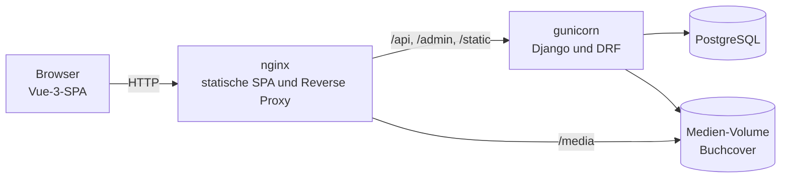

# Verso

> [🇬🇧 English](README.md) | [🇷🇺 Русский](README.ru.md) | [🇫🇷 Français](README.fr.md) | 🇩🇪 Deutsch

[](https://github.com/DogNellaf/verso-bookshop/actions/workflows/ci.yml)


Verso ist eine Online-Buchhandlung mit Django REST Framework und Vue 3. Man
kann im Katalog suchen, einen Warenkorb füllen, bestellen und die Bestellung
stornieren, solange sie noch aussteht. Mitarbeitende verwalten Bücher und
Bestellungen im Django-Admin. Die Oberfläche ist standardmäßig englisch.
Russisch, Französisch und Deutsch lassen sich im Kopfbereich wählen, und auch
der Buchkatalog ist übersetzt.


## Schnellstart

```bash
docker compose up --build
```

Öffnen Sie <http://localhost:8080> und klicken Sie auf der Anmeldeseite auf
**Demo-Konto nutzen**, oder melden Sie sich mit **demo / demopass123** an. Der
Demo-Nutzer hat schon drei Bestellungen und einige Bücher im Warenkorb. Beim
ersten Start bekommt die Datenbank 18 klassische Romane mit Covern.

Die API-Dokumentation (Swagger UI) liegt unter
<http://localhost:8080/api/docs/>, der Admin unter
<http://localhost:8080/admin/>. Damit beim Start ein Admin-Konto angelegt
wird, setzen Sie `DJANGO_SUPERUSER_USERNAME` und `DJANGO_SUPERUSER_PASSWORD`
in `.env`.

Zum Testen der Bestandsprüfung legen Sie die letzten Exemplare eines Buches in
zwei Browsern in den Warenkorb und bestellen in beiden. Die zweite Bestellung
wird abgelehnt, und die Meldung sagt, wie viele Exemplare noch da sind.

## Fallstudie

### Problem

Eine kleine Buchhandlung will online verkaufen. Sie darf nicht mehr Exemplare
verkaufen, als sie hat, auch wenn zwei Personen gleichzeitig bestellen. Alte
Bestellungen sollen ihre Preise behalten, wenn sich der Katalog ändert. Die
Seite soll auf dem Handy und in mehreren Sprachen funktionieren.

### Lösung

Die ganze Geschäftslogik steckt in der REST-API, die Vue-App ruft sie nur auf.
Eine Bestellung durchläuft diese Status.

| Status | Wer ihn setzt | Bestand |
|---|---|---|
| **Ausstehend** | Die Bestellung | Exemplare werden vom Bestand abgebucht |
| **Bezahlt, Versandt, Zugestellt** | Mitarbeitende im Admin | Keine Änderung |
| **Storniert** | Die Kundschaft, nur solange die Bestellung aussteht | Exemplare gehen zurück in den Bestand |

Die Bestellung läuft in einer Transaktion. Zuerst werden die Buchzeilen
gesperrt, danach wird der Bestand geprüft.

```python
with transaction.atomic():
    books = {b.id: b for b in Book.objects.select_for_update().filter(id__in=ids)}
    errors = [stock_message(books[i.book_id]) for i in items
              if i.quantity > books[i.book_id].stock]
    if errors:
        raise ValidationError({"detail": _("Not enough stock."), "items": errors})
    order = Order.objects.create(buyer=user)
    ...  # Titel und Preis speichern, Bestand abbuchen, Warenkorb leeren
```

### Technische Details

- Bestellung und Stornierung sperren die Buchzeilen mit `SELECT … FOR UPDATE`.
  Prüfung, Bestandsänderung und die neue Bestellung werden in einer
  Transaktion gespeichert, deshalb bleibt nach einer fehlgeschlagenen Prüfung
  keine halbe Bestellung übrig.
- Eine Bestellposition speichert Titel und Preis zum Zeitpunkt des Kaufs. Die
  Verbindung zum Buch ist `SET_NULL`, deshalb ändert das Bearbeiten oder
  Löschen eines Buches keine alten Bestellungen.
- Der Warenkorb wird mit einer festen Zahl von SQL-Abfragen geladen, einem
  `JOIN` für Positionen und Bücher und einer Abfrage für Übersetzungen. Ein
  Test zählt die Abfragen, ein N+1-Problem lässt die CI scheitern.
- Suche, Sortierung, der Filter „vorrätig“ und die Seitennummer stehen in der
  URL. Eine Katalogseite lässt sich teilen, neu laden oder mit der
  Zurück-Taste wieder öffnen.
- Wenn das Access-Token abläuft, warten parallele Anfragen auf eine gemeinsame
  Erneuerung, statt jede eine eigene zu senden.
- Die Cover der Demo-Bücher stammen von Open Library und liegen im Repository.
  Ein Buch ohne Bild bekommt ein erzeugtes Cover mit Titel und Autor. Die
  Dateien von Swagger UI werden lokal ausgeliefert, die App braucht kein CDN.
- Das OpenAPI-3-Schema wird aus dem Code erzeugt. Die CI prüft es und schlägt
  bei Warnungen fehl.

### Sicherheit

- Das JWT-Access-Token gilt 30 Minuten. Das Refresh-Token wird bei jeder
  Nutzung ersetzt. Lässt sich die Sitzung nicht erneuern, meldet die Seite
  den Nutzer ab.
- Anmeldung, Registrierung und Token-Erneuerung sind standardmäßig auf
  20 Anfragen pro Minute begrenzt. Anonyme und angemeldete Nutzer haben
  getrennte Limits.
- Bei der Registrierung prüfen die Django-Validatoren das Passwort.
- Nach der Anmeldung leitet die Seite nur auf relative Pfade derselben Seite
  weiter, daher kann `?next=` niemanden auf eine fremde Domain schicken.
- Jeder sieht nur den eigenen Warenkorb und die eigenen Bestellungen. Eine
  fremde Bestellung liefert 404.
- Geheimnisse und Hosts kommen aus Umgebungsvariablen. `HTTPS=True`
  aktiviert sichere Cookies, HSTS und die Weiterleitung auf HTTPS. Der Header
  `X-Frame-Options` ist immer `DENY`.

### Lokalisierung

- Es gibt vier Sprachen, Englisch, Russisch, Französisch und Deutsch.
  Standard ist Englisch, die Browsersprache wird absichtlich ignoriert. Der
  Umschalter EN / RU / FR / DE speichert die Wahl im Browser und setzt
  `<html lang>`.
- Die Oberfläche nutzt vue-i18n mit den Pluralregeln jeder Sprache („1 Buch,
  3 Bücher“, „1 книга, 3 книги, 5 книг“). Ein Test prüft, dass alle Sprachen
  dieselben Schlüssel haben.
- Titel, Autoren und Beschreibungen der Bücher stehen in `BookTranslation`,
  eine Zeile pro Sprache. Fehlt eine Übersetzung, wird der englische Text
  gezeigt. Die Suche durchsucht alle Sprachen, und die Sortierung nach Titel
  oder Autor nutzt den übersetzten Text.
- Fehlermeldungen der API sind mit Django gettext übersetzt. Das Frontend
  schickt die gewählte Sprache im `Accept-Language`-Header, deshalb kommt eine
  Meldung wie „nur noch 2 Exemplare vorrätig“ in der Sprache des Nutzers und
  in der richtigen Pluralform an. Die CI prüft, dass die kompilierten
  `.mo`-Dateien zu den `.po`-Dateien passen.
- Preise und Daten werden mit `Intl` für die gewählte Sprache formatiert.

### Architektur



SPA und API teilen sich einen Origin, daher gibt es in Produktion kein CORS,
und das Frontend nutzt relative URLs. In der Entwicklung leitet der
Vite-Server dieselben Pfade an `runserver` weiter.

| Modul | Aufgabe |
|---|---|
| `backend/main/views.py` | Katalog, Anmeldung, Warenkorb, Bestellung, Historie, Stornierung |
| `backend/main/serializers.py` | API-Format, Auswahl der Buchübersetzung für die Sprache der Anfrage |
| `backend/main/models.py` | `Book`, `BookTranslation`, `Cart`, `CartItem`, `Order`, `OrderItem` |
| `backend/main/management/commands/seed.py` | Demo-Katalog, Übersetzungen, Cover, Demo-Nutzer |
| `frontend/src/services/api.ts` | Typisierter API-Client, JWT-Speicher, gemeinsame Token-Erneuerung |
| `frontend/src/router.ts` | Lazy geladene Routen, Zugriffsprüfungen, Seitentitel |
| `frontend/src/i18n/` | Einrichtung von vue-i18n, Pluralregeln, Texte in vier Sprachen |

### Was die Überarbeitung geändert hat

Anfangs war das Projekt ein Django-Shop mit serverseitig gerenderten Seiten,
und eine Bestellung konnte nur ein Buch enthalten. Später wurde es in eine
REST-API und ein Vue-Frontend aufgeteilt. Die Überarbeitung brachte diese
Änderungen.

- Reste einer generierten Vorlage entfernt, etwa ungenutztes Tailwind und
  PostCSS, React-Typen, Analytics und Platzhalterbilder.
- Stornierung mit Rückbuchung des Bestands unter Zeilensperre, Katalogfilter
  und ein Warenkorb mit fester Zahl an Abfragen.
- API-Dokumentation mit OpenAPI und Swagger UI, Ratenlimits, ein Health Check
  für docker-compose und HTTPS-Einstellungen.
- Neues Frontend. Der Katalogzustand steht in der URL, nach der Anmeldung
  landet man wieder auf der vorherigen Seite, die Menge ist durch den Bestand
  begrenzt, und es gibt Ladeplatzhalter, leere Zustände, eine 404-Seite, einen
  Dark Mode und eine mobile Ansicht.
- Oberfläche, API-Meldungen und Katalog auf Russisch, Französisch und Deutsch
  übersetzt.
- Echte Cover für die Demo-Bücher.
- 138 Tests, und die CI prüft Lint, Schema, Übersetzungen und Abdeckung.

## Screenshots

| Buchseite | Warenkorb |
|---|---|
|  |  |

| Dark Mode | Mobil |
|---|---|
|  |  |

| Bestellhistorie | API-Dokumentation |
|---|---|
|  |  |

## Ohne Docker starten

Man braucht Python 3.12 oder neuer, Node.js 20 oder neuer und pnpm. Ohne
Postgres-Einstellungen nutzt das Backend SQLite.

```bash
./scripts/build-dev.sh          # Linux und macOS, richtet beide Apps ein und startet sie
.\scripts\build-dev.ps1         # Windows (PowerShell)
```

Oder Schritt für Schritt.

```bash
cd backend
python -m venv .venv && source .venv/bin/activate
pip install -r requirements.txt
python manage.py migrate
python manage.py seed           # Demo-Katalog, Übersetzungen, Cover, Demo-Nutzer
python manage.py runserver      # http://127.0.0.1:8000

cd ../frontend
pnpm install
pnpm run dev                    # http://127.0.0.1:5173
```

Die Cover der Demo-Bücher liegen in `backend/main/fixtures/covers/`, daher
funktioniert `seed` ohne Internet. Für ein Buch ohne gespeichertes Cover lädt
`seed` eines von Open Library. `--save-covers` legt die Downloads in diesem
Ordner ab, `--no-covers` überspringt das Herunterladen und `--flush` beginnt
mit einem leeren Katalog.

## Konfiguration

Die Einstellungen kommen aus Umgebungsvariablen. docker-compose liest sie aus
`.env`, siehe [`.env.example`](.env.example).

| Variable | Zweck | Standard |
|---|---|---|
| `SECRET_KEY` | Geheimer Django-Schlüssel | unsicherer Entwicklungsschlüssel |
| `DEBUG` | Debug-Modus | `True` (`False` in Docker) |
| `ALLOWED_HOSTS` | Erlaubte Hosts, durch Kommas getrennt | lokale Hosts im Debug-Modus |
| `CORS_ALLOWED_ORIGINS`, `CSRF_TRUSTED_ORIGINS` | Adressen des Frontends | Vite-Server |
| `POSTGRES_DB`, `POSTGRES_USER`, `POSTGRES_PASSWORD`, `POSTGRES_HOST`, `POSTGRES_PORT` | PostgreSQL wird genutzt, wenn `POSTGRES_DB` gesetzt ist | SQLite |
| `SEED_ON_START` | Demo-Daten beim Containerstart laden | `1` |
| `DJANGO_SUPERUSER_USERNAME`, `DJANGO_SUPERUSER_PASSWORD`, `DJANGO_SUPERUSER_EMAIL` | Admin-Konto, das beim Start angelegt wird | keins |
| `HTTPS` | Sichere Cookies, HSTS, Weiterleitung auf HTTPS | `False` |
| `THROTTLE_ANON`, `THROTTLE_USER`, `THROTTLE_AUTH` | Ratenlimits | `120/min`, `600/min`, `20/min` |
| `LOG_LEVEL` | Log-Level | `INFO` |

## Tests

```bash
cd backend
ruff check . && ruff format --check .
coverage run manage.py test && coverage report

cd ../frontend
pnpm run type-check
pnpm run coverage
```

Das Backend hat 60 Tests mit 94 % Abdeckung. Sie prüfen API, Modelle,
Bestellung, Stornierung, Filter, Übersetzungen, die Zahl der SQL-Abfragen,
Ratenlimits und den Befehl `seed`. Das Frontend hat 78 Tests mit 92 %
Abdeckung für Seiten, Zugriffsprüfungen im Router, den API-Client,
Komponenten und Übersetzungen. Außerdem sucht die CI nach fehlenden
Migrationen, prüft das OpenAPI-Schema und die kompilierten Übersetzungen und
baut die Docker-Images.

Screenshots in allen Sprachen entstehen an der laufenden App mit
`cd frontend && BASE_URL=http://localhost:8080 pnpm run screenshots`.

## Einschränkungen

Was in der aktuellen Version fehlt.

- Es gibt keinen Zahlungsdienst. Eine Bestellung wird als ausstehend angelegt,
  danach bearbeiten Mitarbeitende sie im Admin.
- Nur die Demo-Bücher sind übersetzt. Ein neues Buch erscheint auf Englisch,
  bis jemand im Admin eine Übersetzung anlegt.
- Alle Preise sind in US-Dollar.
- JWTs liegen im `localStorage`. Ein httpOnly-Cookie würde besser vor XSS
  schützen, braucht aber CSRF-Schutz.
- Die Suche nutzt `icontains`. Ein großer Katalog bräuchte die Volltextsuche
  von PostgreSQL.

## Projektstruktur

```
├── backend/
│   ├── bookshop/            # Einstellungen und Root-URLconf
│   ├── locale/              # API-Meldungen auf Russisch, Französisch und Deutsch (gettext)
│   └── main/
│       ├── fixtures/covers/ # Cover der Demo-Bücher
│       ├── management/      # Befehl seed und Katalogübersetzungen
│       ├── filters.py, pagination.py, serializers.py, views.py, admin.py
│       └── tests.py
├── frontend/
│   ├── src/
│   │   ├── i18n/            # Einrichtung von vue-i18n und Texte in vier Sprachen
│   │   ├── pages/           # Katalog, Buch, Warenkorb, Bestellungen, Anmeldung, Registrierung, 404
│   │   ├── components/      # BookCover, StockBadge
│   │   ├── services/api.ts  # typisierter API-Client
│   │   └── router.ts
│   ├── scripts/screenshots.mjs
│   └── nginx.conf
├── docs/screenshots/        # en, ru, fr, de
├── docker-compose.yml
└── .github/workflows/ci.yml
```

## Lizenz

[MIT](LICENSE)
