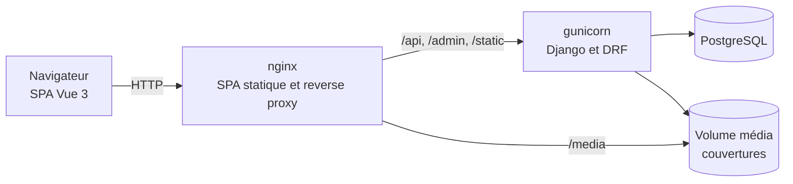

# Verso

> [🇬🇧 English](README.md) | [🇷🇺 Русский](README.ru.md) | 🇫🇷 Français | [🇩🇪 Deutsch](README.de.md)

[](https://github.com/DogNellaf/verso-bookshop/actions/workflows/ci.yml)


Verso est une librairie en ligne écrite avec Django REST Framework et Vue 3.
On peut chercher des livres dans le catalogue, remplir un panier, passer
commande et annuler la commande tant qu'elle est en attente. L'équipe gère les
livres et les commandes dans l'administration Django. L'interface est en
anglais par défaut. Le russe, le français et l'allemand se choisissent dans
l'en-tête, et le catalogue est traduit lui aussi.


## Démarrage rapide

```bash
docker compose up --build
```

Ouvrez <http://localhost:8080> et cliquez sur **Compte de démo** sur la page
de connexion, ou connectez-vous avec **demo / demopass123**. L'utilisateur de
démo a déjà trois commandes et quelques livres dans son panier. Au premier
démarrage, la base reçoit 18 romans classiques avec leurs couvertures.

La documentation de l'API (Swagger UI) se trouve sur
<http://localhost:8080/api/docs/> et l'administration sur
<http://localhost:8080/admin/>. Pour créer un compte administrateur au
démarrage, définissez `DJANGO_SUPERUSER_USERNAME` et
`DJANGO_SUPERUSER_PASSWORD` dans `.env`.

Pour voir le contrôle du stock, mettez les derniers exemplaires d'un livre
dans le panier depuis deux navigateurs et passez les deux commandes. La
seconde est refusée, et le message indique combien d'exemplaires il reste.

## Étude de cas

### Problème

Une petite librairie veut vendre en ligne. Elle ne doit pas vendre plus
d'exemplaires qu'elle n'en a, même si deux personnes commandent au même
moment. Les anciennes commandes doivent garder leurs prix quand le catalogue
change. Le site doit fonctionner sur téléphone et en plusieurs langues.

### Solution

Toutes les règles métier sont dans l'API REST, l'application Vue ne fait que
l'appeler. Une commande passe par ces statuts.

| Statut | Qui le définit | Stock |
|---|---|---|
| **En attente** | La validation du panier | Les exemplaires sont retirés du stock |
| **Payée, Expédiée, Livrée** | L'équipe, dans l'administration | Pas de changement |
| **Annulée** | Le client, seulement si la commande est en attente | Les exemplaires reviennent en stock |

La commande se fait dans une seule transaction. Les lignes des livres sont
d'abord verrouillées, puis le stock est vérifié.

```python
with transaction.atomic():
    books = {b.id: b for b in Book.objects.select_for_update().filter(id__in=ids)}
    errors = [stock_message(books[i.book_id]) for i in items
              if i.quantity > books[i.book_id].stock]
    if errors:
        raise ValidationError({"detail": _("Not enough stock."), "items": errors})
    order = Order.objects.create(buyer=user)
    ...  # garder titre et prix, retirer du stock, vider le panier
```

### Points techniques

- La commande et l'annulation verrouillent les lignes des livres avec
  `SELECT … FOR UPDATE`. La vérification, la mise à jour du stock et la
  nouvelle commande sont enregistrées dans une seule transaction, donc un
  échec ne laisse pas de commande à moitié créée.
- Une ligne de commande garde le titre et le prix du moment de l'achat. Le
  lien vers le livre est en `SET_NULL`, donc modifier ou supprimer un livre ne
  change pas les anciennes commandes.
- Le panier se charge avec un nombre fixe de requêtes SQL, un `JOIN` pour les
  articles et les livres et une requête pour les traductions. Un test compte
  les requêtes, et un problème N+1 fait échouer la CI.
- La recherche, le tri, le filtre « en stock » et le numéro de page sont dans
  l'URL. Une page du catalogue peut être partagée, rechargée ou retrouvée avec
  le bouton retour.
- Quand le jeton d'accès expire, les requêtes en parallèle attendent un seul
  rafraîchissement commun au lieu d'en envoyer chacune un.
- Les couvertures des livres de démo viennent d'Open Library et sont stockées
  dans le dépôt. Un livre sans image reçoit une couverture générée avec son
  titre et son auteur. Les fichiers de Swagger UI sont servis localement,
  l'application n'a besoin d'aucun CDN.
- Le schéma OpenAPI 3 est généré à partir du code. La CI le valide et échoue
  en cas d'avertissement.

### Sécurité

- Le jeton d'accès JWT dure 30 minutes. Le jeton de rafraîchissement change à
  chaque utilisation. Si la session ne peut pas être rafraîchie, le site
  déconnecte l'utilisateur.
- La connexion, l'inscription et le rafraîchissement du jeton sont limités à
  20 requêtes par minute par défaut. Les visiteurs anonymes et les
  utilisateurs connectés ont des limites séparées.
- L'inscription vérifie le mot de passe avec les validateurs de Django.
- Après la connexion, le site ne redirige que vers des chemins relatifs du
  même site, donc `?next=` ne peut pas envoyer l'utilisateur vers un autre
  domaine.
- Chaque utilisateur ne voit que son panier et ses commandes. Une commande
  d'un autre utilisateur renvoie 404.
- Les secrets et les hôtes viennent des variables d'environnement.
  `HTTPS=True` active les cookies sécurisés, HSTS et la redirection vers
  HTTPS. L'en-tête `X-Frame-Options` vaut toujours `DENY`.

### Localisation

- Il y a quatre langues, l'anglais, le russe, le français et l'allemand.
  L'anglais est la langue par défaut, la langue du navigateur est ignorée
  exprès. Le sélecteur EN / RU / FR / DE garde le choix dans le navigateur et
  met à jour `<html lang>`.
- L'interface utilise vue-i18n avec les règles de pluriel de chaque langue
  (« 0 livre, 2 livres », « 1 книга, 3 книги, 5 книг »). Un test vérifie que
  toutes les langues ont les mêmes clés.
- Les titres, auteurs et descriptions des livres sont stockés dans
  `BookTranslation`, une ligne par langue. S'il manque une traduction, le
  texte anglais s'affiche. La recherche porte sur toutes les langues, et le tri
  par titre ou auteur utilise le texte traduit.
- Les messages d'erreur de l'API sont traduits avec gettext de Django. Le
  frontend envoie la langue choisie dans `Accept-Language`, donc un message
  comme « Il ne reste que 2 exemplaires » arrive dans la langue de
  l'utilisateur, au bon pluriel. La CI vérifie que les fichiers `.mo` compilés
  correspondent aux fichiers `.po`.
- Les prix et les dates sont formatés avec `Intl` selon la langue choisie.

### Architecture



La SPA et l'API partagent la même origine, il n'y a donc pas de CORS en
production et le frontend utilise des URL relatives. En développement, le
serveur Vite transmet les mêmes chemins à `runserver`.

| Module | Rôle |
|---|---|
| `backend/main/views.py` | Catalogue, authentification, panier, commande, historique, annulation |
| `backend/main/serializers.py` | Format de l'API, choix de la traduction selon la langue de la requête |
| `backend/main/models.py` | `Book`, `BookTranslation`, `Cart`, `CartItem`, `Order`, `OrderItem` |
| `backend/main/management/commands/seed.py` | Catalogue de démo, traductions, couvertures, utilisateur de démo |
| `frontend/src/services/api.ts` | Client API typé, stockage des JWT, rafraîchissement partagé |
| `frontend/src/router.ts` | Routes chargées à la demande, contrôles d'accès, titres des pages |
| `frontend/src/i18n/` | Configuration de vue-i18n, règles de pluriel, textes en quatre langues |

### Ce que la refonte a changé

Au départ, le projet était une boutique Django avec des pages rendues côté
serveur, et une commande ne pouvait contenir qu'un livre. Il a ensuite été
séparé en une API REST et un frontend Vue. La refonte a apporté ces
changements.

- Suppression des restes d'un modèle généré, comme Tailwind et PostCSS
  inutilisés, les types React, l'analytics et les images de remplacement.
- Annulation des commandes avec remise en stock sous verrou, filtres du
  catalogue et panier avec un nombre fixe de requêtes.
- Documentation de l'API avec OpenAPI et Swagger UI, limites de débit, health
  check utilisé par docker-compose et réglages HTTPS.
- Nouvelle vitrine. L'état du catalogue est dans l'URL, la connexion ramène
  sur la page d'origine, la quantité est limitée par le stock, et il y a des
  squelettes de chargement, des états vides, une page 404, un mode sombre et
  une version mobile.
- Traduction de l'interface, des messages de l'API et du catalogue en russe,
  en français et en allemand.
- Vraies couvertures pour les livres de démo.
- 138 tests, et la CI vérifie le lint, le schéma, les traductions et la
  couverture.

## Captures d'écran

| Page d'un livre | Panier |
|---|---|
|  |  |

| Mode sombre | Mobile |
|---|---|
|  |  |

| Historique des commandes | Documentation de l'API |
|---|---|
|  |  |

## Lancer sans Docker

Il faut Python 3.12 ou plus récent, Node.js 20 ou plus récent et pnpm. Sans
réglages Postgres, le backend utilise SQLite.

```bash
./scripts/build-dev.sh          # Linux et macOS, installe et lance les deux applications
.\scripts\build-dev.ps1         # Windows (PowerShell)
```

Ou étape par étape.

```bash
cd backend
python -m venv .venv && source .venv/bin/activate
pip install -r requirements.txt
python manage.py migrate
python manage.py seed           # catalogue de démo, traductions, couvertures, utilisateur de démo
python manage.py runserver      # http://127.0.0.1:8000

cd ../frontend
pnpm install
pnpm run dev                    # http://127.0.0.1:5173
```

Les couvertures des livres de démo sont dans `backend/main/fixtures/covers/`,
donc `seed` fonctionne sans Internet. Pour un livre sans couverture
enregistrée, `seed` la télécharge depuis Open Library. `--save-covers` garde
les téléchargements dans ce dossier, `--no-covers` désactive le
téléchargement et `--flush` repart d'un catalogue vide.

## Configuration

Les réglages viennent des variables d'environnement. docker-compose les lit
dans `.env`, voir [`.env.example`](.env.example).

| Variable | Rôle | Par défaut |
|---|---|---|
| `SECRET_KEY` | Clé secrète Django | clé de développement non sûre |
| `DEBUG` | Mode debug | `True` (`False` dans Docker) |
| `ALLOWED_HOSTS` | Hôtes autorisés, séparés par des virgules | hôtes locaux en mode debug |
| `CORS_ALLOWED_ORIGINS`, `CSRF_TRUSTED_ORIGINS` | Adresses du frontend | serveur Vite |
| `POSTGRES_DB`, `POSTGRES_USER`, `POSTGRES_PASSWORD`, `POSTGRES_HOST`, `POSTGRES_PORT` | PostgreSQL est utilisé si `POSTGRES_DB` est défini | SQLite |
| `SEED_ON_START` | Charger les données de démo au démarrage du conteneur | `1` |
| `DJANGO_SUPERUSER_USERNAME`, `DJANGO_SUPERUSER_PASSWORD`, `DJANGO_SUPERUSER_EMAIL` | Compte administrateur créé au démarrage | aucun |
| `HTTPS` | Cookies sécurisés, HSTS, redirection vers HTTPS | `False` |
| `THROTTLE_ANON`, `THROTTLE_USER`, `THROTTLE_AUTH` | Limites de débit | `120/min`, `600/min`, `20/min` |
| `LOG_LEVEL` | Niveau des journaux | `INFO` |

## Tests

```bash
cd backend
ruff check . && ruff format --check .
coverage run manage.py test && coverage report

cd ../frontend
pnpm run type-check
pnpm run coverage
```

Le backend a 60 tests avec 94 % de couverture. Ils vérifient l'API, les
modèles, la commande, l'annulation, les filtres, les traductions, le nombre de
requêtes SQL, les limites de débit et la commande `seed`. Le frontend a
78 tests avec 92 % de couverture pour les pages, les contrôles du routeur, le
client API, les composants et les traductions. La CI cherche aussi les
migrations manquantes, valide le schéma OpenAPI, vérifie les traductions
compilées et construit les images Docker.

Les captures dans toutes les langues sont prises sur l'application en marche
avec `cd frontend && BASE_URL=http://localhost:8080 pnpm run screenshots`.

## Limites

Ce qui manque dans la version actuelle.

- Il n'y a pas de service de paiement. La commande est créée en attente, puis
  l'équipe la fait avancer dans l'administration.
- Seuls les livres de démo sont traduits. Un nouveau livre s'affiche en
  anglais tant que personne n'ajoute de traduction dans l'administration.
- Tous les prix sont en dollars américains.
- Les JWT sont gardés dans `localStorage`. Un cookie httpOnly protégerait
  mieux contre le XSS mais demande une protection CSRF.
- La recherche utilise `icontains`. Un gros catalogue aurait besoin de la
  recherche plein texte de PostgreSQL.

## Structure du projet

```
├── backend/
│   ├── bookshop/            # réglages et URLconf racine
│   ├── locale/              # messages de l'API en russe, français et allemand (gettext)
│   └── main/
│       ├── fixtures/covers/ # couvertures des livres de démo
│       ├── management/      # commande seed et traductions du catalogue
│       ├── filters.py, pagination.py, serializers.py, views.py, admin.py
│       └── tests.py
├── frontend/
│   ├── src/
│   │   ├── i18n/            # configuration de vue-i18n et textes en quatre langues
│   │   ├── pages/           # catalogue, livre, panier, commandes, connexion, inscription, 404
│   │   ├── components/      # BookCover, StockBadge
│   │   ├── services/api.ts  # client API typé
│   │   └── router.ts
│   ├── scripts/screenshots.mjs
│   └── nginx.conf
├── docs/screenshots/        # en, ru, fr, de
├── docker-compose.yml
└── .github/workflows/ci.yml
```

## Licence

[MIT](LICENSE)
