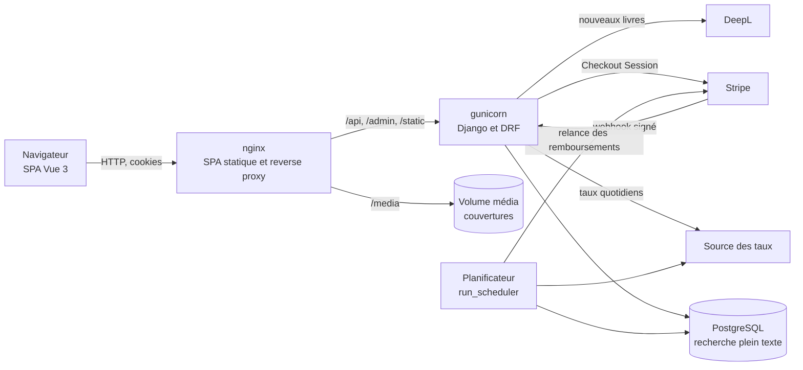
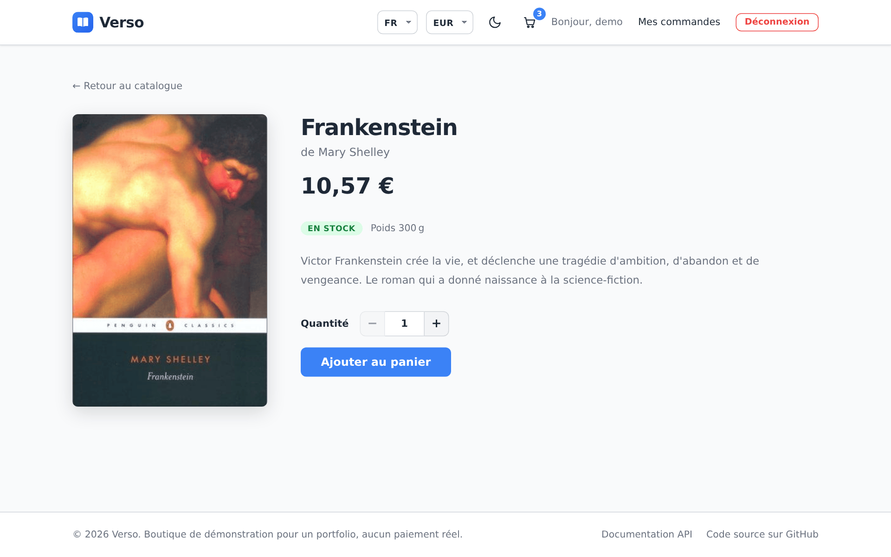
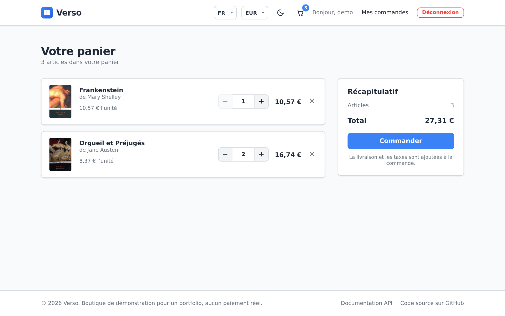
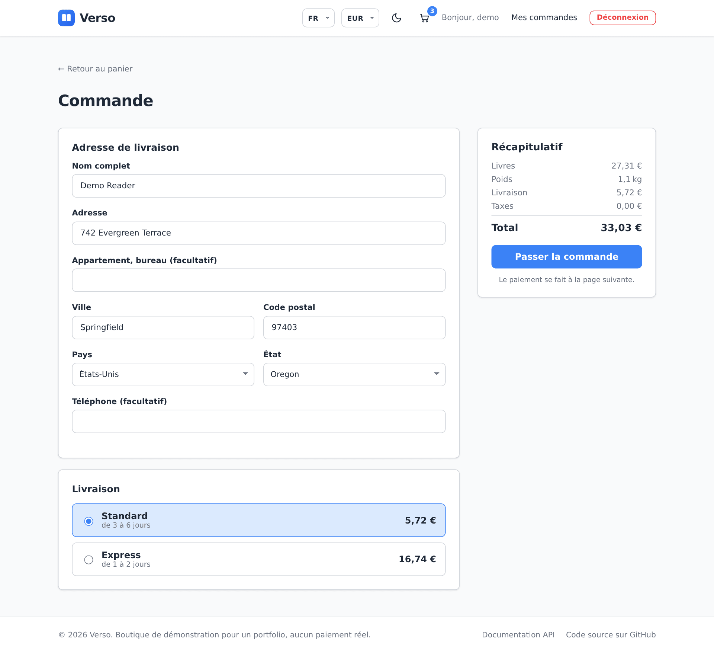
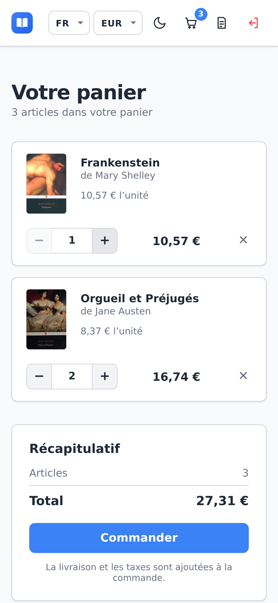
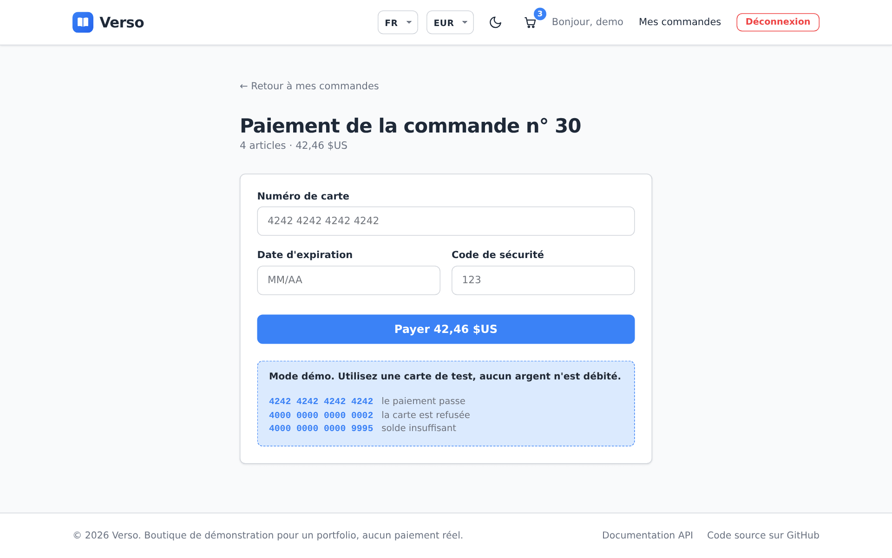
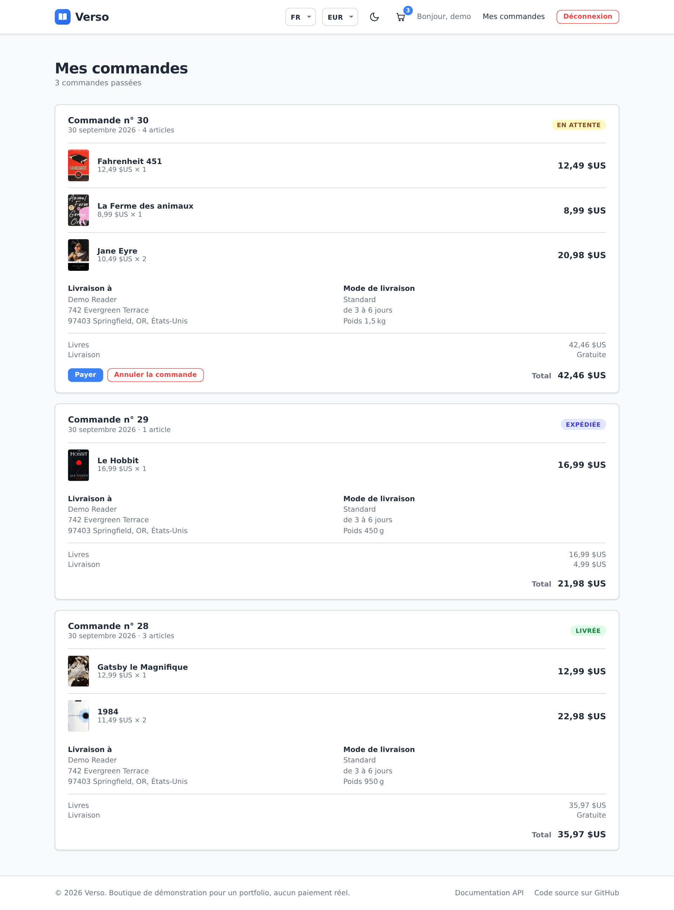
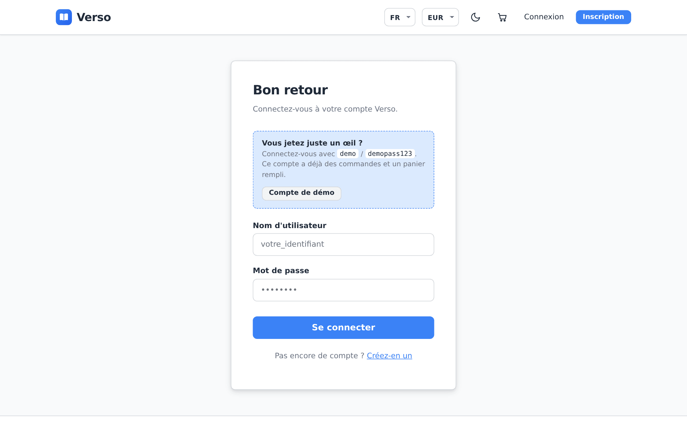

# Verso

> [🇬🇧 English](README.md) | [🇷🇺 Русский](README.ru.md) | 🇫🇷 Français | [🇩🇪 Deutsch](README.de.md)

[](https://github.com/DogNellaf/verso-bookshop/actions/workflows/ci.yml)


Verso est une librairie en ligne écrite avec Django REST Framework et Vue 3. On
peut chercher des livres, remplir un panier, saisir une adresse de livraison,
choisir un mode d'envoi et payer par carte. Les frais de port et la taxe
dépendent du pays de destination. Une commande peut être annulée tant qu'elle
n'est pas expédiée, et l'argent est remboursé. Les prix s'affichent dans toute
devise proposée par la boutique, dollars, euros et roubles par défaut. L'équipe
gère les livres, les commandes, les remboursements, les devises, la livraison
et les taxes dans l'administration Django. L'interface est en anglais par
défaut. Le russe, le français et l'allemand se choisissent dans l'en-tête, et
le catalogue est traduit lui aussi.


## Démarrage rapide

```bash
docker compose up --build
```

Ouvrez <http://localhost:8080> et cliquez sur **Compte de démo** sur la page
de connexion, ou connectez-vous avec **demo / demopass123**. L'utilisateur de
démo a déjà trois commandes et quelques livres dans son panier. Au premier
démarrage, la base reçoit 18 romans classiques avec leurs couvertures et des
taux de change à jour. Un conteneur planificateur séparé garde les taux à jour
et relance les remboursements qui ont échoué.

Pour essayer un paiement, validez le panier et payez avec la carte de test
**4242 4242 4242 4242** (date future et code quelconques). La carte
**4000 0000 0000 0002** est refusée. Le mode démo ne débite aucun argent. Pour
utiliser le vrai Stripe Checkout, voir [Paiements](#paiements). Avant de payer, on saisit une adresse et un
mode de livraison, et la taxe du pays de destination est ajoutée.

La documentation de l'API (Swagger UI) se trouve sur
<http://localhost:8080/api/docs/> et l'administration sur
<http://localhost:8080/admin/>. Pour créer un compte administrateur au
démarrage, définissez `DJANGO_SUPERUSER_USERNAME` et
`DJANGO_SUPERUSER_PASSWORD` dans `.env`.

## Étude de cas

### Problème

Une petite librairie veut vendre en ligne. Elle ne doit pas vendre plus
d'exemplaires qu'elle n'en a, même si deux personnes commandent au même
moment. Les anciennes commandes doivent garder leurs prix quand le catalogue
ou les taux de change changent. Les clients viennent de plusieurs pays, le
site doit donc parler leur langue, afficher leur devise et fonctionner sur
téléphone.

### Solution

Toutes les règles métier sont dans l'API REST, l'application Vue ne fait que
l'appeler. Une commande passe par ces statuts.

| Statut | Qui le définit | Stock |
|---|---|---|
| **En attente** | La validation du panier | Les exemplaires sont retirés du stock |
| **Payée** | Un paiement réussi (carte de démo ou webhook Stripe) | Pas de changement |
| **Expédiée, Livrée** | L'équipe, dans l'administration | Pas de changement |
| **Annulée** | Le client, tant que la commande n'est pas expédiée. Une commande payée est remboursée | Les exemplaires reviennent en stock |

Les frais de port et les taxes viennent de tables modifiables dans
l'administration. Voici les valeurs par défaut.

| Zone | Livraison | Gratuite dès | Taxe sur les livres |
|---|---|---|---|
| États-Unis | Standard $4.99, express $14.99 | $35 | aucune (la taxe des États n'est pas calculée) |
| Union européenne | Standard $6.99, express $19.99 | $50 | TVA réduite, par exemple 7 % en Allemagne et 5,5 % en France |
| Russie | Poste russe $5.99, coursier $11.99 | $40 | 10 % |
| Reste du monde | International $12.99 | $80 | aucune |

La commande se fait dans une seule transaction. Les lignes des livres sont
d'abord verrouillées, puis le stock est vérifié.

```python
with transaction.atomic():
    books = {b.id: b for b in Book.objects.select_for_update().filter(id__in=ids)}
    errors = [stock_message(books[i.book_id]) for i in items
              if i.quantity > books[i.book_id].stock]
    if errors:
        raise ValidationError({"detail": _("Not enough stock."), "items": errors})
    order = Order.objects.create(buyer=user, currency=order_currency)
    ...  # garder titres et prix dans cette devise, retirer du stock, vider le panier
```

### Points techniques

- La commande et l'annulation verrouillent les lignes des livres avec
  `SELECT … FOR UPDATE`. La vérification, la mise à jour du stock et la
  nouvelle commande sont enregistrées dans une seule transaction, donc un
  échec ne laisse pas de commande à moitié créée.
- Une ligne de commande garde le titre et le prix du moment de l'achat, dans
  la devise choisie par le client. Modifier un livre ou changer un taux ne
  touche pas les anciennes commandes.
- Les paiements passent par une petite interface de fournisseur. Le
  fournisseur de démo vérifie le numéro de carte avec l'algorithme de Luhn et
  propose des cartes de test pour le succès, le refus et le solde
  insuffisant. Le fournisseur Stripe crée une Checkout Session, et seule la
  notification Stripe signée marque la commande comme payée. Les notifications
  répétées ne changent rien.
- Le serveur calcule les frais de port et la taxe pour le pays et le mode
  choisis, dans la devise choisie. La taxe porte sur les livres et sur la
  livraison. La commande garde l'adresse, le mode de livraison avec son délai
  et tous les montants, donc un changement de prix ultérieur ne la touche pas.
- Chaque remboursement est une ligne à part avec un montant et un motif, donc
  un paiement peut être remboursé en plusieurs fois. L'équipe rembourse
  n'importe quel montant depuis l'administration, et l'annulation d'une
  commande rembourse le reste. Un paiement reçu pour une commande déjà annulée
  est remboursé automatiquement. Les lignes restent verrouillées pendant
  l'appel au fournisseur et Stripe reçoit une clé d'idempotence par
  remboursement, donc l'argent n'est jamais rendu deux fois. Un remboursement
  qui échoue est relancé par le planificateur jusqu'à dix fois.
- Le planificateur est une commande de gestion dans son propre conteneur. Il
  met à jour les taux une fois par jour, relance les remboursements toutes les
  15 minutes, annule les paiements restés inachevés plus d'un jour et annule
  les commandes impayées depuis deux jours, ce qui remet leurs livres en
  stock. Chaque
  tâche verrouille sa ligne dans la table `JobRun`, donc deux processus ne
  lancent jamais la même tâche, et l'administration montre l'heure et le
  résultat du dernier passage.
- Les prix sont stockés en dollars. Les devises sont des lignes que l'équipe
  ajoute dans l'administration. Une nouvelle devise reçoit tout de suite son
  taux depuis une source publique, et la vitrine la découvre via
  `/api/currencies/`. Un middleware convertit les prix dans la devise demandée
  par la SPA avec l'en-tête `X-Currency` et arrondit à l'unité de chaque
  devise, donc les yens s'affichent sans décimales. Le filtre de prix utilise aussi cette devise.
- Sur PostgreSQL, le catalogue utilise la recherche plein texte. Chaque livre
  a un `tsvector` construit à partir du texte anglais et de toutes les
  traductions, chacune avec sa propre racinisation, et un index GIN. Les
  résultats sont triés par pertinence, la syntaxe `websearch` fonctionne
  (« guillemets », -moins) et un index trigramme retrouve les fautes de frappe
  comme « Tolkein ». Sous SQLite, en développement, la recherche se fait par
  sous-chaîne.
- Le panier se charge avec un nombre fixe de requêtes SQL. Un test les compte,
  et un problème N+1 fait échouer la CI.
- La recherche, le tri, le filtre « en stock » et le numéro de page sont dans
  l'URL. Une page du catalogue peut être partagée, rechargée ou retrouvée avec
  le bouton retour.
- Les couvertures des livres de démo viennent d'Open Library et sont stockées
  dans le dépôt. Un livre sans image reçoit une couverture générée. Les
  fichiers de Swagger UI sont servis localement, l'application n'a besoin
  d'aucun CDN.

### Sécurité

- Les jetons JWT n'arrivent jamais dans JavaScript. Le backend les place dans
  des cookies httpOnly avec `SameSite=Lax` (et `Secure` en HTTPS). Le cookie de
  rafraîchissement n'est envoyé qu'à `/api/auth/`.
- Comme le navigateur envoie les cookies tout seul, chaque requête non sûre
  passe le contrôle CSRF de Django. La SPA lit le cookie `csrftoken` et envoie
  sa valeur dans `X-CSRFToken`, y compris pour la connexion et l'inscription.
- Le jeton d'accès dure 30 minutes. Le jeton de rafraîchissement change à
  chaque utilisation et l'ancien part dans une liste noire, donc un jeton volé
  ne sert plus après le rafraîchissement suivant. La déconnexion le révoque
  aussi.
- La connexion, l'inscription et le rafraîchissement du jeton sont limités à
  20 requêtes par minute par défaut. Les visiteurs anonymes et les
  utilisateurs connectés ont des limites séparées.
- La notification Stripe n'est acceptée qu'avec une signature Stripe valide.
- Après la connexion, le site ne redirige que vers des chemins relatifs du
  même site, donc `?next=` ne peut pas envoyer l'utilisateur vers un autre
  domaine.
- Chaque utilisateur ne voit que son panier, ses commandes et ses paiements.
  Le reste renvoie 404.
- Les secrets viennent des variables d'environnement. `HTTPS=True` active les
  cookies sécurisés, HSTS et la redirection vers HTTPS. L'en-tête
  `X-Frame-Options` vaut toujours `DENY`.

### Localisation

- Il y a quatre langues, l'anglais, le russe, le français et l'allemand.
  L'anglais est la langue par défaut, la langue du navigateur est ignorée
  exprès. Le sélecteur EN / RU / FR / DE garde le choix dans le navigateur et
  met à jour `<html lang>`.
- L'interface utilise vue-i18n avec les règles de pluriel de chaque langue
  (« 0 livre, 2 livres », « 1 книга, 3 книги, 5 книг »). Un test vérifie que
  toutes les langues ont les mêmes clés.
- Les titres, auteurs et descriptions des livres sont stockés dans
  `BookTranslation`, une ligne par langue, avec repli sur l'anglais. Si
  `DEEPL_API_KEY` est défini, un nouveau livre est traduit automatiquement
  quand l'équipe l'ajoute.
- Les traductions automatiques sont marquées à relire. L'administration a une
  file de relecture et une action « Mark as reviewed », et enregistrer une
  traduction corrigée compte comme une relecture. Avec
  `PUBLISH_UNREVIEWED_TRANSLATIONS=False`, la vitrine garde le texte anglais
  tant qu'une personne n'a pas validé la traduction.
- Les messages de l'API, y compris les erreurs de carte, sont traduits avec
  gettext de Django. Le frontend envoie la langue choisie dans
  `Accept-Language`. La CI vérifie que les fichiers `.mo` compilés
  correspondent aux fichiers `.po`.
- La devise suit la langue (USD pour l'anglais, RUB pour le russe, EUR pour le
  français et l'allemand) tant que le visiteur n'en choisit pas une autre. Les
  prix et les dates sont formatés avec `Intl`.

### Architecture



La SPA et l'API partagent la même origine, il n'y a donc pas de CORS en
production et les cookies restent first party. En développement, le serveur
Vite transmet les mêmes chemins à `runserver`.

| Module | Rôle |
|---|---|
| `backend/main/views.py` | Catalogue, panier, commande, historique, annulation |
| `backend/main/checkout.py` | Zones et modes de livraison, taxes, devis pour un panier |
| `backend/main/orders.py` | Annulation d'une commande avec remise en stock et remboursement |
| `backend/main/authentication.py`, `auth_views.py` | JWT en cookies httpOnly, CSRF, connexion, rafraîchissement, déconnexion |
| `backend/main/payments/`, `payment_views.py` | Fournisseurs démo et Stripe, état des paiements, webhook |
| `backend/main/currency.py` | Devise active, conversion, cache des taux |
| `backend/main/search.py` | Document de recherche, requête plein texte, tolérance aux fautes |
| `backend/main/machine_translation.py` | Traduction des nouveaux livres avec DeepL |
| `backend/main/scheduler.py` | Tâches périodiques et leur suivi dans `JobRun` |
| `backend/main/models.py` | `Book`, `BookTranslation`, `Cart`, `Order`, `Payment`, `Refund`, `Currency`, `ShippingZone`, `TaxRate` |
| `frontend/src/services/api.ts` | Client API typé, CSRF, rafraîchissement partagé |
| `frontend/src/currency.ts`, `i18n/` | Choix de la devise et de la langue, textes en quatre langues |
| `frontend/src/pages/Payment.vue` | Formulaire de carte en mode démo, redirection vers Stripe |

### Ce que la refonte a changé

Au départ, le projet était une boutique Django avec des pages rendues côté
serveur, une commande ne contenait qu'un livre et ne pouvait pas être payée.
Il a ensuite été séparé en une API REST et un frontend Vue. La refonte a
apporté ces changements.

- Suppression des restes d'un modèle généré, comme Tailwind et PostCSS
  inutilisés, les types React, l'analytics et les images de remplacement.
- Annulation des commandes, filtres du catalogue et panier avec un nombre fixe
  de requêtes.
- Page de commande avec adresse de livraison, zones et modes de livraison, et
  taxes par pays.
- Paiement par carte avec un fournisseur de démo et Stripe Checkout, avec
  remboursements complets et partiels.
- Liste des devises gérée dans l'administration.
- Conteneur planificateur pour les taux de change, la relance des
  remboursements, les paiements abandonnés et les commandes impayées.
- Prix en euros et en roubles avec des taux de change enregistrés.
- JWT déplacés de `localStorage` vers des cookies httpOnly, avec protection
  CSRF et révocation des jetons.
- Recherche plein texte PostgreSQL en quatre langues avec tolérance aux fautes
  à la place de la recherche par sous-chaîne.
- Traduction de l'interface, des messages de l'API et du catalogue en russe,
  en français et en allemand, avec DeepL pour les nouveaux livres et une
  relecture des traductions automatiques.
- Nouvelle vitrine avec l'état dans l'URL, un mode sombre, une version mobile
  et de vraies couvertures pour les livres de démo.
- Documentation de l'API avec OpenAPI et Swagger UI, limites de débit, health
  check et réglages HTTPS.
- 267 tests, un test de fumée dans le navigateur, et les tests du backend
  tournent en CI sur SQLite et sur PostgreSQL.

## Captures d'écran

| Page d'un livre | Panier |
|---|---|
|  |  |

| Commande | Mobile |
|---|---|
|  |  |

| Paiement | Historique des commandes |
|---|---|
|  |  |

| Mode sombre | Connexion |
|---|---|
|  |  |

## Paiements

Le mode démo fonctionne sans réglage. Pour accepter de vrais paiements avec
Stripe, définissez ces variables et dirigez un webhook Stripe vers
`/api/payments/stripe/webhook/` pour les événements
`checkout.session.completed` et `checkout.session.expired`.

```bash
PAYMENT_PROVIDER=stripe
STRIPE_SECRET_KEY=sk_test_...
STRIPE_WEBHOOK_SECRET=whsec_...
SITE_URL=https://your-shop.example
```

Pour tester en local, la commande
`stripe listen --forward-to localhost:8080/api/payments/stripe/webhook/`
affiche le secret du webhook.

## Lancer sans Docker

Il faut Python 3.12 ou plus récent, Node.js 20 ou plus récent et pnpm. Sans
réglages Postgres, le backend utilise SQLite et la recherche se fait par
sous-chaîne.

```bash
./scripts/build-dev.sh          # Linux et macOS, installe et lance les deux applications
.\scripts\build-dev.ps1         # Windows (PowerShell)
```

Ou étape par étape.

```bash
cd backend
python -m venv .venv && source .venv/bin/activate
pip install -r requirements.txt
python manage.py migrate
python manage.py seed                   # catalogue de démo, traductions, couvertures, utilisateur de démo
python manage.py update_exchange_rates  # facultatif, le seed a des taux par défaut
python manage.py runserver              # http://127.0.0.1:8000

cd ../frontend
pnpm install
pnpm run dev                            # http://127.0.0.1:5173
```

Les couvertures des livres de démo sont dans `backend/main/fixtures/covers/`,
donc `seed` fonctionne sans Internet. `--flush` repart d'un catalogue vide.
`python manage.py translate_books` complète les traductions manquantes avec
DeepL. `python manage.py run_scheduler` lance les tâches périodiques, et
`run_scheduler --once` fait un seul passage pour cron.

## Configuration

Les réglages viennent des variables d'environnement. docker-compose les lit
dans `.env`, voir [`.env.example`](.env.example).

| Variable | Rôle | Par défaut |
|---|---|---|
| `SECRET_KEY` | Clé secrète Django | clé de développement non sûre |
| `DEBUG` | Mode debug | `True` (`False` dans Docker) |
| `ALLOWED_HOSTS` | Hôtes autorisés, séparés par des virgules | hôtes locaux en mode debug |
| `CORS_ALLOWED_ORIGINS`, `CSRF_TRUSTED_ORIGINS` | Adresses du frontend | serveur Vite |
| `POSTGRES_DB`, `POSTGRES_USER`, `POSTGRES_PASSWORD`, `POSTGRES_HOST`, `POSTGRES_PORT` | PostgreSQL est utilisé si `POSTGRES_DB` est défini | SQLite |
| `SITE_URL` | Adresse publique pour le retour depuis Stripe | `http://localhost:8080` |
| `PAYMENT_PROVIDER` | `demo` ou `stripe` | `demo` |
| `STRIPE_SECRET_KEY`, `STRIPE_WEBHOOK_SECRET` | Clés Stripe | aucune |
| `DEEPL_API_KEY` | Traduction automatique des nouveaux livres | aucune |
| `AUTO_TRANSLATE_BOOKS` | Traduire un livre à sa création | `True` |
| `PUBLISH_UNREVIEWED_TRANSLATIONS` | Afficher les traductions automatiques avant relecture | `True` |
| `EXCHANGE_RATES_URL` | Source des taux avec USD comme base | open.er-api.com |
| `UPDATE_RATES_ON_START` | Mettre à jour les taux au démarrage du conteneur | `1` |
| `EXCHANGE_RATES_INTERVAL_HOURS` | Fréquence de mise à jour des taux par le planificateur | `24` |
| `PAYMENT_TIMEOUT_HOURS` | Délai après lequel un paiement inachevé est annulé | `24` |
| `UNPAID_ORDER_TIMEOUT_HOURS` | Les commandes impayées plus anciennes sont annulées et remises en stock | `48` |
| `SEED_ON_START` | Charger les données de démo au démarrage du conteneur | `1` |
| `DJANGO_SUPERUSER_USERNAME`, `DJANGO_SUPERUSER_PASSWORD`, `DJANGO_SUPERUSER_EMAIL` | Compte administrateur créé au démarrage | aucun |
| `HTTPS` | Cookies sécurisés, HSTS, redirection vers HTTPS | `False` |
| `THROTTLE_ANON`, `THROTTLE_USER`, `THROTTLE_AUTH` | Limites de débit | `120/min`, `600/min`, `20/min` |
| `LOG_LEVEL` | Niveau des journaux | `INFO` |

## Tests

```bash
cd backend
ruff check . && ruff format --check .
coverage run manage.py test && coverage report

cd ../frontend
pnpm run type-check
pnpm run coverage
BASE_URL=http://localhost:8080 pnpm run smoke   # test dans le navigateur sur l'application lancée
```

Le backend a 160 tests avec 95 % de couverture. Ils vérifient l'API,
l'authentification par cookies et le CSRF, la commande, l'annulation, les deux
fournisseurs de paiement avec la signature du webhook, le calcul des frais de
port et des taxes, les remboursements complets et partiels et leurs relances,
le planificateur, les devises gérées dans l'administration, la recherche plein
texte, la traduction automatique et sa relecture, le nombre de requêtes SQL et
les limites de débit. La CI les lance sur SQLite et sur PostgreSQL. Le frontend
a 107 tests avec 95 % de couverture pour la page de commande, les pages, le
formulaire de paiement, les contrôles du routeur, le client API, les devises et
les traductions. Le test de fumée se connecte, achète un livre livré en
Allemagne, paie avec une carte refusée puis avec une carte valide, annule la
commande pour être remboursé et vérifie qu'aucun jeton n'est lisible depuis
JavaScript.

Les captures dans toutes les langues sont prises sur l'application en marche
avec `cd frontend && BASE_URL=http://localhost:8080 pnpm run screenshots`.

## Limites

Ce qui manque dans la version actuelle.

- La taxe est fixée par pays. La taxe de vente américaine, qui dépend de
  l'État et de la ville, n'est pas calculée.
- Les frais de port sont fixes pour une commande et un mode de livraison. Ils
  ne dépendent ni du poids ni du nombre de livres.

## Structure du projet

```
├── backend/
│   ├── bookshop/            # réglages et URLconf racine
│   ├── locale/              # messages de l'API en russe, français et allemand (gettext)
│   └── main/
│       ├── fixtures/covers/ # couvertures des livres de démo
│       ├── management/      # seed, update_exchange_rates, translate_books, run_scheduler
│       ├── payments/        # fournisseurs démo et Stripe
│       ├── migrations/
│       ├── tests/           # auth, cœur, devises, paiements, recherche, traduction
│       ├── authentication.py, auth_views.py, payment_views.py
│       ├── checkout.py, orders.py, countries.py
│       ├── currency.py, search.py, machine_translation.py, scheduler.py
│       └── models.py, serializers.py, views.py, admin.py
├── frontend/
│   ├── src/
│   │   ├── i18n/            # configuration de vue-i18n et textes en quatre langues
│   │   ├── pages/           # catalogue, livre, panier, commande, paiement, commandes, connexion, 404
│   │   ├── components/      # BookCover, StockBadge
│   │   ├── services/api.ts  # client API typé
│   │   ├── currency.ts
│   │   └── router.ts
│   ├── scripts/             # screenshots.mjs, smoke.mjs
│   └── nginx.conf
├── docs/screenshots/        # en, ru, fr, de
├── docker-compose.yml
└── .github/workflows/ci.yml
```

## Licence

[MIT](LICENSE)
