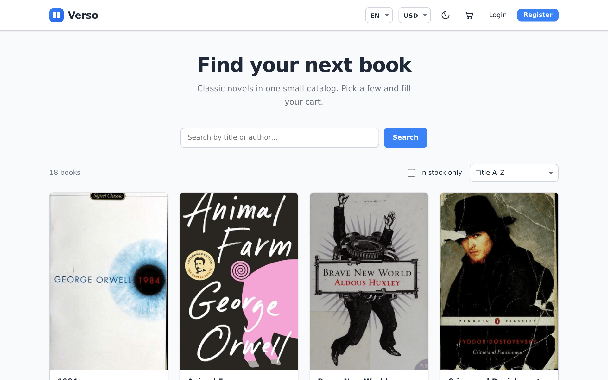
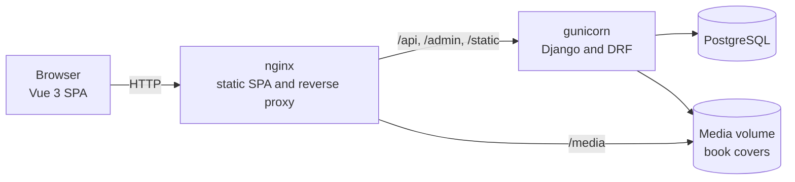
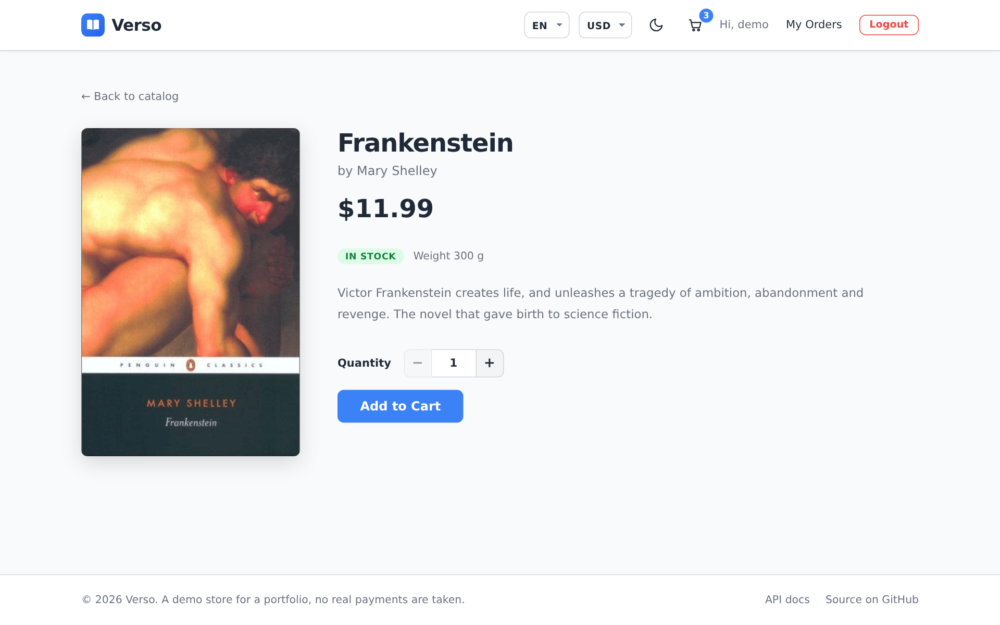
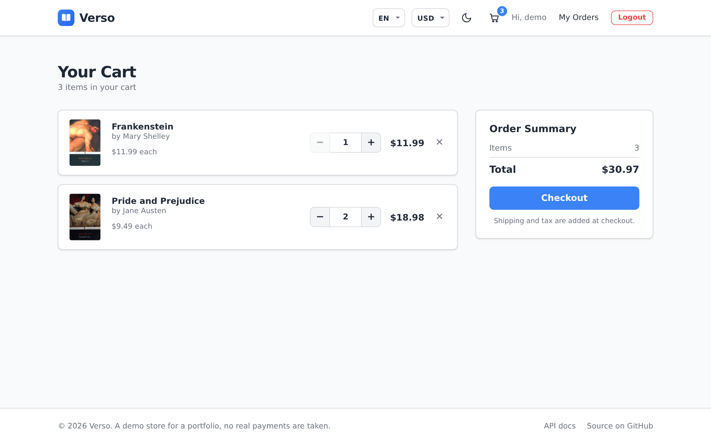
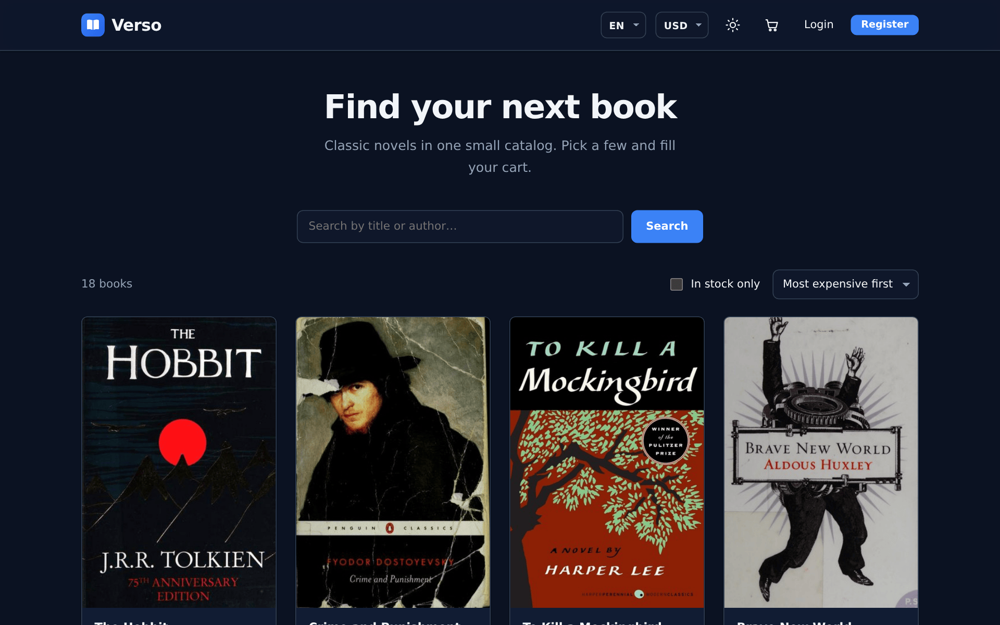
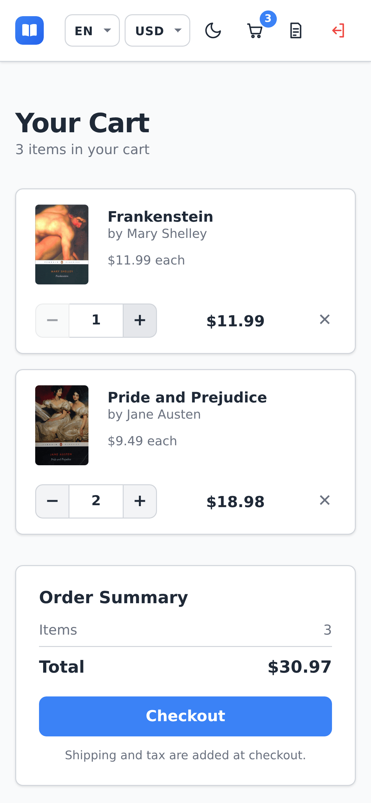
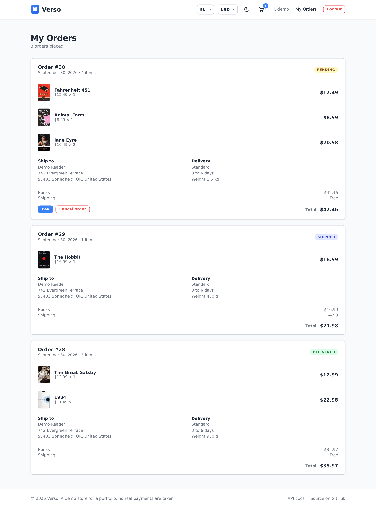
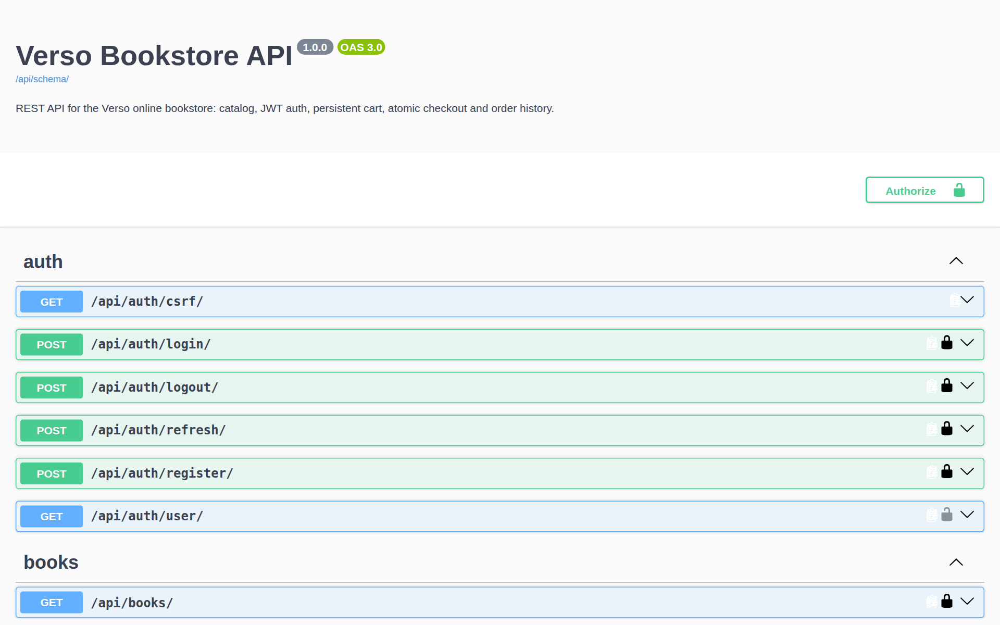

# Verso

> 🇬🇧 English | [🇷🇺 Русский](README.ru.md) | [🇫🇷 Français](README.fr.md) | [🇩🇪 Deutsch](README.de.md)

[](https://github.com/DogNellaf/verso-bookshop/actions/workflows/ci.yml)


Verso is an online bookstore built with Django REST Framework and Vue 3. You
can browse and search the catalog, add books to a cart, place an order and
cancel it while it is still pending. Staff manage books and orders in the
Django admin. The interface is in English by default. Russian, French and
German can be picked in the header, and the book catalog is translated too.



## Quick start

```bash
docker compose up --build
```

Open <http://localhost:8080> and press **Use demo account** on the sign in
page, or sign in as **demo / demopass123**. The demo user has three orders and
a few books in the cart. On the first start the database gets 18 classic
novels with covers.

The API reference (Swagger UI) is at <http://localhost:8080/api/docs/> and the
admin is at <http://localhost:8080/admin/>. To get an admin account on start,
set `DJANGO_SUPERUSER_USERNAME` and `DJANGO_SUPERUSER_PASSWORD` in `.env`.

To see the stock check, put the last copies of a book into the cart in two
browsers and place both orders. The second order is rejected, and the message
says how many copies are left.

## Case study

### Problem

A small bookshop wants to sell online. The shop must not sell more copies than
it has, even when two people order at the same time. Old orders have to keep
their prices after the catalog changes. The site has to work on a phone and in
several languages.

### Solution

All business rules live in the REST API, and the Vue app only calls it. An
order goes through these statuses.

| Status | Who sets it | Stock |
|---|---|---|
| **Pending** | Checkout | Copies are taken from stock |
| **Paid, Shipped, Delivered** | Staff in the admin | No change |
| **Cancelled** | The customer, only while the order is pending | Copies go back to stock |

Checkout runs in one transaction and locks the book rows before it checks the
stock.

```python
with transaction.atomic():
    books = {b.id: b for b in Book.objects.select_for_update().filter(id__in=ids)}
    errors = [stock_message(books[i.book_id]) for i in items
              if i.quantity > books[i.book_id].stock]
    if errors:
        raise ValidationError({"detail": _("Not enough stock."), "items": errors})
    order = Order.objects.create(buyer=user)
    ...  # save title and price, take copies from stock, empty the cart
```

### Engineering highlights

- Checkout and cancellation lock book rows with `SELECT … FOR UPDATE`. The
  stock check, the stock change and the new order are saved in one
  transaction, so a failed check leaves no half-made order.
- An order line keeps the title and the price from the moment of purchase. The
  link to the book is `SET_NULL`, so editing or deleting a book does not change
  old orders.
- The cart is loaded with a fixed number of SQL queries, one `JOIN` for items
  and books and one query for translations. A test counts the queries, so an
  N+1 problem fails CI.
- Search, sorting, the in stock filter and the page number are kept in the URL.
  A catalog page can be shared, reloaded or opened again with the back button.
- When the access token expires, parallel requests wait for one shared refresh
  instead of each sending its own.
- Covers of the demo books come from Open Library and are stored in the
  repository. A book without a picture gets a generated cover with its title
  and author. Swagger UI files are served locally, so the app needs no CDN.
- The OpenAPI 3 schema is generated from the code. CI validates it and fails on
  warnings.

### Security

- The JWT access token lives 30 minutes. The refresh token is replaced on every
  use. If the session cannot be refreshed, the site signs the user out.
- Sign in, registration and token refresh are limited to 20 requests per minute
  by default. Anonymous and signed in users have separate limits.
- Registration checks passwords with the Django validators.
- After sign in the site redirects only to relative paths of the same site, so
  `?next=` cannot send a user to another domain.
- A user sees only their own cart and orders. Any other order returns 404.
- Secrets and hosts come from environment variables. `HTTPS=True` turns on
  secure cookies, HSTS and the redirect to HTTPS. `X-Frame-Options` is always
  set to `DENY`.

### Localization

- There are four languages, English, Russian, French and German. English is
  the default, and the browser language is ignored on purpose. The
  EN / RU / FR / DE switcher saves the choice in the browser and sets
  `<html lang>`.
- The interface uses vue-i18n with plural rules for each language ("1 book,
  3 books", "1 книга, 3 книги, 5 книг", "0 livre, 2 livres"). A test checks
  that all languages have the same keys.
- Book titles, authors and descriptions are stored in `BookTranslation`, one
  row per language. If a translation is missing, the English text is shown.
  Search looks through every language, and sorting by title or author uses the
  translated text.
- API error messages are translated with Django gettext. The frontend sends the
  chosen language in `Accept-Language`, so a message like "Only 2 copies left"
  arrives in the user's language with the right plural form. CI checks that the
  compiled `.mo` files match the `.po` files.
- Prices and dates are formatted with `Intl` for the chosen language.

### Architecture



The SPA and the API share one origin, so there is no CORS in production and
the frontend uses relative URLs. In development the Vite server forwards the
same paths to `runserver`.

| Module | Responsibility |
|---|---|
| `backend/main/views.py` | Catalog, auth, cart, checkout, orders, cancellation |
| `backend/main/serializers.py` | API format, picks the book translation for the request language |
| `backend/main/models.py` | `Book`, `BookTranslation`, `Cart`, `CartItem`, `Order`, `OrderItem` |
| `backend/main/management/commands/seed.py` | Demo catalog, translations, covers, demo user |
| `frontend/src/services/api.ts` | Typed API client, JWT storage, shared token refresh |
| `frontend/src/router.ts` | Lazy routes, auth guards, page titles |
| `frontend/src/i18n/` | vue-i18n setup, plural rules, EN, RU, FR and DE texts |

### What the overhaul changed

The project began as a Django shop with server-rendered pages, where an order
could hold only one book. Later it was split into a REST API and a Vue
frontend. The overhaul included these changes.

- Removed leftovers of a generated template, such as unused Tailwind and
  PostCSS, React types, analytics and placeholder images.
- Added order cancellation that returns stock under row locks, catalog filters
  and a cart with a fixed number of queries.
- Documented the API with OpenAPI and Swagger UI, added rate limits, a health
  check used by docker-compose and HTTPS settings.
- Rebuilt the storefront. The catalog state is in the URL, sign in returns you
  to the page you came from, quantity is limited by stock, and there are
  loading skeletons, empty states, a 404 page, dark mode and a mobile layout.
- Translated the interface, the API messages and the catalog into Russian,
  French and German.
- Added real covers for the demo books.
- Grew the test suite to 138 tests and added lint, schema, translation and
  coverage checks to CI.

## Screenshots

| Book page | Cart |
|---|---|
|  |  |

| Dark mode | Mobile |
|---|---|
|  |  |

| Order history | API reference |
|---|---|
|  |  |

## Running without Docker

You need Python 3.12 or newer, Node.js 20 or newer and pnpm. Without Postgres
settings the backend uses SQLite.

```bash
./scripts/build-dev.sh          # Linux and macOS, sets up and starts both apps
.\scripts\build-dev.ps1         # Windows (PowerShell)
```

Or step by step.

```bash
cd backend
python -m venv .venv && source .venv/bin/activate
pip install -r requirements.txt
python manage.py migrate
python manage.py seed           # demo catalog, translations, covers, demo user
python manage.py runserver      # http://127.0.0.1:8000

cd ../frontend
pnpm install
pnpm run dev                    # http://127.0.0.1:5173
```

Covers of the demo books are stored in `backend/main/fixtures/covers/`, so
`seed` works offline. For a book without a stored cover, `seed` downloads one
from Open Library. `--save-covers` keeps the downloads in that folder,
`--no-covers` skips downloading and `--flush` starts from an empty catalog.

## Configuration

Settings are read from environment variables. docker-compose takes them from
`.env`, see [`.env.example`](.env.example).

| Variable | Purpose | Default |
|---|---|---|
| `SECRET_KEY` | Django secret key | insecure dev key |
| `DEBUG` | Debug mode | `True` (`False` in Docker) |
| `ALLOWED_HOSTS` | Allowed hosts, comma separated | local hosts in debug |
| `CORS_ALLOWED_ORIGINS`, `CSRF_TRUSTED_ORIGINS` | Frontend origins | Vite dev server |
| `POSTGRES_DB`, `POSTGRES_USER`, `POSTGRES_PASSWORD`, `POSTGRES_HOST`, `POSTGRES_PORT` | PostgreSQL is used when `POSTGRES_DB` is set | SQLite |
| `SEED_ON_START` | Load demo data when the container starts | `1` |
| `DJANGO_SUPERUSER_USERNAME`, `DJANGO_SUPERUSER_PASSWORD`, `DJANGO_SUPERUSER_EMAIL` | Admin account created on start | none |
| `HTTPS` | Secure cookies, HSTS, redirect to HTTPS | `False` |
| `THROTTLE_ANON`, `THROTTLE_USER`, `THROTTLE_AUTH` | Rate limits | `120/min`, `600/min`, `20/min` |
| `LOG_LEVEL` | Log level | `INFO` |

## Tests

```bash
cd backend
ruff check . && ruff format --check .
coverage run manage.py test && coverage report

cd ../frontend
pnpm run type-check
pnpm run coverage
```

The backend has 60 tests with 94% coverage. They cover the API, models,
checkout, cancellation, filters, translations, the number of SQL queries, rate
limits and the seed command. The frontend has 78 tests with 92% coverage for
pages, router guards, the API client, components and translations. CI also
looks for missing migrations, validates the OpenAPI schema, checks compiled
translations and builds the Docker images.

Screenshots for all languages are taken from a running app with
`cd frontend && BASE_URL=http://localhost:8080 pnpm run screenshots`.

## Limitations

Known limits of the current version.

- There is no payment provider. Checkout creates a pending order, and staff
  move it forward in the admin.
- Only the demo books have translations. A new book is shown in English until
  someone adds a translation in the admin.
- All prices are in US dollars.
- JWT tokens are kept in `localStorage`. An httpOnly cookie would protect
  better against XSS but needs CSRF protection.
- Search uses `icontains`. A large catalog would need PostgreSQL full text
  search.

## Project structure

```
├── backend/
│   ├── bookshop/            # settings and root URLconf
│   ├── locale/              # API messages in Russian, French and German (gettext)
│   └── main/
│       ├── fixtures/covers/ # covers of the demo books
│       ├── management/      # seed command and catalog translations
│       ├── filters.py, pagination.py, serializers.py, views.py, admin.py
│       └── tests.py
├── frontend/
│   ├── src/
│   │   ├── i18n/            # vue-i18n setup and texts in four languages
│   │   ├── pages/           # catalog, book, cart, orders, sign in, registration, 404
│   │   ├── components/      # BookCover, StockBadge
│   │   ├── services/api.ts  # typed API client
│   │   └── router.ts
│   ├── scripts/screenshots.mjs
│   └── nginx.conf
├── docs/screenshots/        # en, ru, fr, de
├── docker-compose.yml
└── .github/workflows/ci.yml
```

## License

[MIT](LICENSE)
