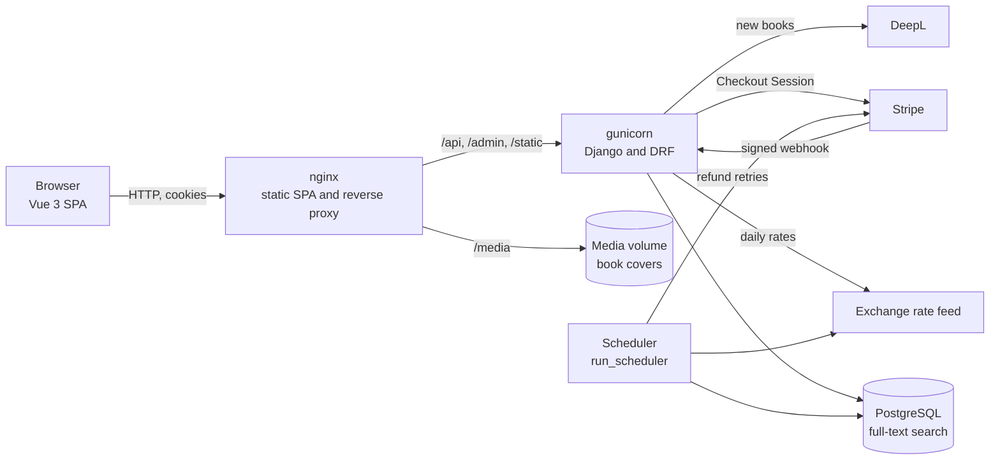
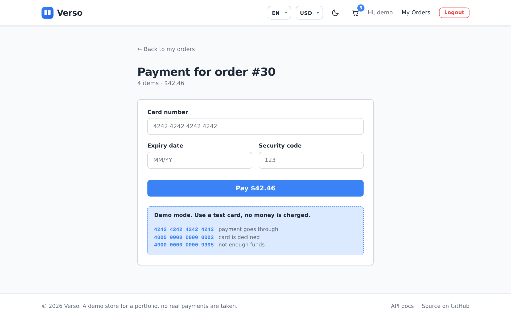

# Verso

> 🇬🇧 English | [🇷🇺 Русский](README.ru.md) | [🇫🇷 Français](README.fr.md) | [🇩🇪 Deutsch](README.de.md)

[](https://github.com/DogNellaf/verso-bookshop/actions/workflows/ci.yml)


Verso is an online bookstore built with Django REST Framework and Vue 3. You
can search the catalog, add books to a cart, place an order and pay for it
with a card, or cancel it while it is still pending. Prices can be shown in US
dollars, euros or rubles. Staff manage books, orders, payments and exchange
rates in the Django admin. The interface is in English by default. Russian,
French and German can be picked in the header, and the book catalog is
translated too.


## Quick start

```bash
docker compose up --build
```

Open <http://localhost:8080> and press **Use demo account** on the sign in
page, or sign in as **demo / demopass123**. The demo user has three orders and
a few books in the cart. On the first start the database gets 18 classic
novels with covers and fresh exchange rates. A separate scheduler container
keeps the rates up to date and retries failed refunds.

To try a payment, check out the cart and pay with the test card
**4242 4242 4242 4242** (any future date, any code). The card
**4000 0000 0000 0002** is declined. No money is charged in the demo mode. To
use real Stripe Checkout instead, see [Payments](#payments).

The API reference (Swagger UI) is at <http://localhost:8080/api/docs/> and the
admin is at <http://localhost:8080/admin/>. To get an admin account on start,
set `DJANGO_SUPERUSER_USERNAME` and `DJANGO_SUPERUSER_PASSWORD` in `.env`.

## Case study

### Problem

A small bookshop wants to sell online. The shop must not sell more copies than
it has, even when two people order at the same time. Old orders have to keep
their prices after the catalog or the exchange rates change. Customers come
from several countries, so the site needs their language and their currency,
and it has to work on a phone.

### Solution

All business rules live in the REST API, and the Vue app only calls it. An
order goes through these statuses.

| Status | Who sets it | Stock |
|---|---|---|
| **Pending** | Checkout | Copies are taken from stock |
| **Paid** | A successful payment (demo card or Stripe webhook) | No change |
| **Shipped, Delivered** | Staff in the admin | No change |
| **Cancelled** | The customer, until the order ships. A paid order is refunded | Copies go back to stock |

Checkout runs in one transaction and locks the book rows before it checks the
stock.

```python
with transaction.atomic():
    books = {b.id: b for b in Book.objects.select_for_update().filter(id__in=ids)}
    errors = [stock_message(books[i.book_id]) for i in items
              if i.quantity > books[i.book_id].stock]
    if errors:
        raise ValidationError({"detail": _("Not enough stock."), "items": errors})
    order = Order.objects.create(buyer=user, currency=order_currency)
    ...  # save titles and prices in that currency, take stock, empty the cart
```

### Engineering highlights

- Checkout and cancellation lock book rows with `SELECT … FOR UPDATE`. The
  stock check, the stock change and the new order are saved in one
  transaction, so a failed check leaves no half-made order.
- An order line keeps the title and the price from the moment of purchase, in
  the currency the customer chose. Editing a book or changing a rate does not
  change old orders.
- Payments go through a small provider interface. The demo provider checks the
  card number with the Luhn algorithm and has test cards for success, decline
  and missing funds. The Stripe provider creates a Checkout Session, and only
  the signed Stripe webhook marks an order as paid. Webhook deliveries are
  idempotent.
- Cancelling a paid order refunds the money through the same provider, and so
  does a payment that arrives for an order cancelled in the meantime. The
  payment row stays locked during the call and Stripe gets an idempotency key,
  so money is never returned twice. A failed refund is retried by the
  scheduler, and staff can refund any payment from the admin.
- The scheduler is a management command in its own container. It updates the
  exchange rates once a day, retries refunds every 15 minutes and cancels
  payments nobody finished within a day. Each job locks its row in the
  `JobRun` table, so two scheduler processes never run the same job, and the
  admin shows the time and result of the last run.
- Prices are stored in US dollars. `ExchangeRate` rows hold the rates, a
  command updates them from a public feed, and a middleware converts prices
  for the currency the SPA asks for in `X-Currency`. Price filters work in the
  chosen currency too.
- On PostgreSQL the catalog uses full-text search. Each book has a `tsvector`
  built from the English text and all translations, each stemmed with its own
  language, with a GIN index. Results are ranked, `websearch` syntax works
  ("quotes", -minus), and a trigram index catches typos like "Tolkein". SQLite
  in development falls back to a simple substring match.
- The cart is loaded with a fixed number of SQL queries. A test counts them, so
  an N+1 problem fails CI.
- Search, sorting, the in stock filter and the page number are kept in the URL.
  A catalog page can be shared, reloaded or opened again with the back button.
- Covers of the demo books come from Open Library and are stored in the
  repository. A book without a picture gets a generated cover. Swagger UI files
  are served locally, so the app needs no CDN.

### Security

- JWT tokens never reach JavaScript. The backend puts them into httpOnly
  cookies with `SameSite=Lax` (and `Secure` over HTTPS). The refresh cookie is
  only sent to `/api/auth/`.
- Because the browser sends cookies by itself, every unsafe request has to pass
  Django's CSRF check. The SPA reads the `csrftoken` cookie and sends it in
  `X-CSRFToken`, sign in and registration included.
- The access token lives 30 minutes. The refresh token is replaced on every use
  and the old one goes to a blacklist, so a stolen refresh token stops working
  after the next refresh. Signing out revokes it as well.
- Sign in, registration and token refresh are limited to 20 requests per minute
  by default. Anonymous and signed in users have separate limits.
- The Stripe webhook is accepted only with a valid Stripe signature.
- After sign in the site redirects only to relative paths of the same site, so
  `?next=` cannot send a user to another domain.
- A user sees only their own cart, orders and payments. Anything else returns
  404.
- Secrets come from environment variables. `HTTPS=True` turns on secure
  cookies, HSTS and the redirect to HTTPS. `X-Frame-Options` is always set to
  `DENY`.

### Localization

- There are four languages, English, Russian, French and German. English is
  the default, and the browser language is ignored on purpose. The
  EN / RU / FR / DE switcher saves the choice in the browser and sets
  `<html lang>`.
- The interface uses vue-i18n with plural rules for each language ("1 book,
  3 books", "1 книга, 3 книги, 5 книг", "0 livre, 2 livres"). A test checks
  that all languages have the same keys.
- Book titles, authors and descriptions are stored in `BookTranslation`, one
  row per language, with a fallback to English. With `DEEPL_API_KEY` set, a
  new book is translated automatically when staff add it.
- Machine translations are marked for review. The admin has a review queue and
  a "Mark as reviewed" action, and saving an edited translation counts as a
  review. With `PUBLISH_UNREVIEWED_TRANSLATIONS=False` the storefront keeps the
  English text until a person has approved the translation.
- API error messages, including card errors, are translated with Django
  gettext. The frontend sends the chosen language in `Accept-Language`. CI
  checks that the compiled `.mo` files match the `.po` files.
- The currency follows the language (USD for English, RUB for Russian, EUR for
  French and German) until the visitor picks another one. Prices and dates are
  formatted with `Intl`.

### Architecture



The SPA and the API share one origin, so there is no CORS in production and
the cookies are first party. In development the Vite server forwards the same
paths to `runserver`.

| Module | Responsibility |
|---|---|
| `backend/main/views.py` | Catalog, cart, checkout, orders, cancellation |
| `backend/main/authentication.py`, `auth_views.py` | JWT in httpOnly cookies, CSRF, sign in, refresh, sign out |
| `backend/main/payments/`, `payment_views.py` | Demo and Stripe providers, payment state, webhook |
| `backend/main/currency.py` | Active currency, conversion, rate cache |
| `backend/main/search.py` | Search document, full-text query, trigram fallback |
| `backend/main/machine_translation.py` | DeepL translation of new books |
| `backend/main/scheduler.py` | Periodic jobs and their `JobRun` records |
| `backend/main/models.py` | `Book`, `BookTranslation`, `Cart`, `Order`, `Payment`, `ExchangeRate` |
| `frontend/src/services/api.ts` | Typed API client, CSRF, shared session refresh |
| `frontend/src/currency.ts`, `i18n/` | Currency and language choice, texts in four languages |
| `frontend/src/pages/Payment.vue` | Card form for the demo mode, redirect for Stripe |

### What the overhaul changed

The project began as a Django shop with server-rendered pages, where an order
could hold only one book and could not be paid. Later it was split into a REST
API and a Vue frontend. The overhaul included these changes.

- Removed leftovers of a generated template, such as unused Tailwind and
  PostCSS, React types, analytics and placeholder images.
- Added order cancellation, catalog filters and a cart with a fixed number of
  queries.
- Added card payments with a demo provider and Stripe Checkout, with automatic
  refunds when a paid order is cancelled.
- Added a scheduler container for exchange rates, refund retries and stale
  payments.
- Added prices in euros and rubles with stored exchange rates.
- Moved JWT tokens from `localStorage` to httpOnly cookies with CSRF
  protection and token revocation.
- Replaced substring search with PostgreSQL full-text search in four languages
  with typo tolerance.
- Translated the interface, the API messages and the catalog into Russian,
  French and German, with DeepL for new books and a review queue for machine
  translations.
- Rebuilt the storefront with state in the URL, dark mode and a mobile layout,
  and added real covers for the demo books.
- Documented the API with OpenAPI and Swagger UI, added rate limits, a health
  check and HTTPS settings.
- Grew the test suite to 229 tests, added a browser smoke test and ran the
  backend tests on both SQLite and PostgreSQL in CI.

## Screenshots

| Book page | Cart |
|---|---|
|  |  |

| Payment | Order history |
|---|---|
|  |  |

| Dark mode | Mobile |
|---|---|
|  |  |

## Payments

The demo mode needs no setup. To take real payments with Stripe, set these
variables and point a Stripe webhook at `/api/payments/stripe/webhook/` for the
`checkout.session.completed` and `checkout.session.expired` events.

```bash
PAYMENT_PROVIDER=stripe
STRIPE_SECRET_KEY=sk_test_...
STRIPE_WEBHOOK_SECRET=whsec_...
SITE_URL=https://your-shop.example
```

For local testing, `stripe listen --forward-to localhost:8080/api/payments/stripe/webhook/`
prints the webhook secret.

## Running without Docker

You need Python 3.12 or newer, Node.js 20 or newer and pnpm. Without Postgres
settings the backend uses SQLite, where search falls back to substring
matching.

```bash
./scripts/build-dev.sh          # Linux and macOS, sets up and starts both apps
.\scripts\build-dev.ps1         # Windows (PowerShell)
```

Or step by step.

```bash
cd backend
python -m venv .venv && source .venv/bin/activate
pip install -r requirements.txt
python manage.py migrate
python manage.py seed                   # demo catalog, translations, covers, demo user
python manage.py update_exchange_rates  # optional, the seed has default rates
python manage.py runserver              # http://127.0.0.1:8000

cd ../frontend
pnpm install
pnpm run dev                            # http://127.0.0.1:5173
```

Covers of the demo books are stored in `backend/main/fixtures/covers/`, so
`seed` works offline. `--flush` starts from an empty catalog.
`python manage.py translate_books` fills in missing translations with DeepL.
`python manage.py run_scheduler` runs the periodic jobs, and
`run_scheduler --once` does a single pass for cron.

## Configuration

Settings are read from environment variables. docker-compose takes them from
`.env`, see [`.env.example`](.env.example).

| Variable | Purpose | Default |
|---|---|---|
| `SECRET_KEY` | Django secret key | insecure dev key |
| `DEBUG` | Debug mode | `True` (`False` in Docker) |
| `ALLOWED_HOSTS` | Allowed hosts, comma separated | local hosts in debug |
| `CORS_ALLOWED_ORIGINS`, `CSRF_TRUSTED_ORIGINS` | Frontend origins | Vite dev server |
| `POSTGRES_DB`, `POSTGRES_USER`, `POSTGRES_PASSWORD`, `POSTGRES_HOST`, `POSTGRES_PORT` | PostgreSQL is used when `POSTGRES_DB` is set | SQLite |
| `SITE_URL` | Public address, used in links back from Stripe | `http://localhost:8080` |
| `PAYMENT_PROVIDER` | `demo` or `stripe` | `demo` |
| `STRIPE_SECRET_KEY`, `STRIPE_WEBHOOK_SECRET` | Stripe keys | none |
| `DEEPL_API_KEY` | Machine translation of new books | none |
| `AUTO_TRANSLATE_BOOKS` | Translate a book when it is created | `True` |
| `PUBLISH_UNREVIEWED_TRANSLATIONS` | Show machine translations before review | `True` |
| `EXCHANGE_RATES_URL` | Rate feed with USD as the base | open.er-api.com |
| `UPDATE_RATES_ON_START` | Fetch rates when the container starts | `1` |
| `EXCHANGE_RATES_INTERVAL_HOURS` | How often the scheduler fetches rates | `24` |
| `PAYMENT_TIMEOUT_HOURS` | Unfinished payments older than this are cancelled | `24` |
| `SEED_ON_START` | Load demo data when the container starts | `1` |
| `DJANGO_SUPERUSER_USERNAME`, `DJANGO_SUPERUSER_PASSWORD`, `DJANGO_SUPERUSER_EMAIL` | Admin account created on start | none |
| `HTTPS` | Secure cookies, HSTS, redirect to HTTPS | `False` |
| `THROTTLE_ANON`, `THROTTLE_USER`, `THROTTLE_AUTH` | Rate limits | `120/min`, `600/min`, `20/min` |
| `LOG_LEVEL` | Log level | `INFO` |

## Tests

```bash
cd backend
ruff check . && ruff format --check .
coverage run manage.py test && coverage report

cd ../frontend
pnpm run type-check
pnpm run coverage
BASE_URL=http://localhost:8080 pnpm run smoke   # browser test against a running app
```

The backend has 133 tests with 96% coverage. They cover the API, cookie
authentication and CSRF, checkout, cancellation, both payment providers
including webhook signatures, refunds and their retries, the scheduler,
currency conversion, full-text search, machine translation and its review,
the number of SQL queries and rate limits. CI runs them on SQLite
and on PostgreSQL. The frontend has 96 tests with 94% coverage for pages, the
payment form, router guards, the API client, currencies and translations. The
smoke test signs in, buys a book, pays with a declined and a working test card,
cancels the order to get a refund and checks that no token is readable from
JavaScript.

Screenshots for all languages are taken from a running app with
`cd frontend && BASE_URL=http://localhost:8080 pnpm run screenshots`.

## Limitations

Known limits of the current version.

- There is no delivery address, shipping cost or tax calculation. Shipping is
  shown as free.
- Refunds always return the full amount. Partial refunds are done in the
  Stripe dashboard.
- The list of currencies (USD, EUR, RUB) is set in `CURRENCIES` in the
  settings. Adding one needs a code change and a rate in the feed.

## Project structure

```
├── backend/
│   ├── bookshop/            # settings and root URLconf
│   ├── locale/              # API messages in Russian, French and German (gettext)
│   └── main/
│       ├── fixtures/covers/ # covers of the demo books
│       ├── management/      # seed, update_exchange_rates, translate_books, run_scheduler
│       ├── payments/        # demo and Stripe providers
│       ├── migrations/
│       ├── tests/           # auth, core, currency, payments, search, translation
│       ├── authentication.py, auth_views.py, payment_views.py
│       ├── currency.py, search.py, machine_translation.py, scheduler.py
│       └── models.py, serializers.py, views.py, admin.py
├── frontend/
│   ├── src/
│   │   ├── i18n/            # vue-i18n setup and texts in four languages
│   │   ├── pages/           # catalog, book, cart, payment, orders, sign in, 404
│   │   ├── components/      # BookCover, StockBadge
│   │   ├── services/api.ts  # typed API client
│   │   ├── currency.ts
│   │   └── router.ts
│   ├── scripts/             # screenshots.mjs, smoke.mjs
│   └── nginx.conf
├── docs/screenshots/        # en, ru, fr, de
├── docker-compose.yml
└── .github/workflows/ci.yml
```

## License

[MIT](LICENSE)
