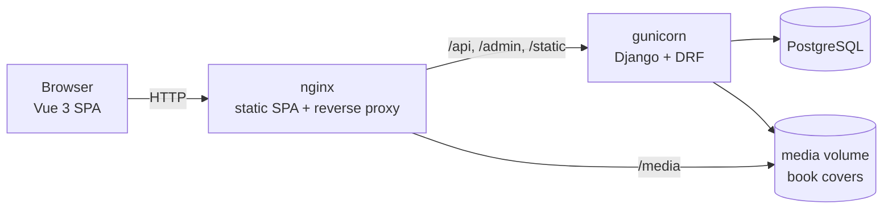

# Verso — Online Bookstore

> 🇬🇧 English | [🇷🇺 Русский](README.ru.md) · 📄 [Case study (RU)](docs/case-study.ru.md)

[](https://github.com/DogNellaf/verso-bookshop/actions/workflows/ci.yml)


A full-stack online bookstore: a **Django REST Framework** API with an admin
back office and a **Vue 3 + TypeScript** single-page storefront. Browse the
catalog, sign in, fill a persistent cart, check out and track or cancel orders.
One command brings up the whole stack with Docker.


<table>
  <tr>
    <td></td>
    <td></td>
  </tr>
  <tr>
    <td></td>
    <td></td>
  </tr>
  <tr>
    <td></td>
    <td align="center">
      
      
    </td>
  </tr>
</table>

## Try it in 30 seconds

```bash
docker compose up --build
```

Open **http://localhost:8080** and click **“Use demo account”** on the login
page (`demo` / `demopass123`) — it comes with order history and a filled cart.

| | URL |
|---|---|
| Storefront | http://localhost:8080/ |
| Interactive API docs (Swagger) | http://localhost:8080/api/docs/ |
| Admin | http://localhost:8080/admin/ — set `DJANGO_SUPERUSER_USERNAME` / `DJANGO_SUPERUSER_PASSWORD` in `.env` |

## Features

**Storefront**
- Catalog with search, sorting, an in-stock filter and pagination — all kept in
  the URL, so any view can be shared, reloaded or navigated back to
- Book pages with stock-aware quantity pickers and “Only N left” badges
- Persistent per-user cart; checkout, order history, cancelling pending orders
- JWT auth with silent token refresh; protected routes return you to where you
  were after logging in
- Light / dark theme (follows the OS, remembered per browser), responsive down
  to small phones, skeleton loading, empty and error states
- Generated typographic covers when a book has no image — no third-party
  placeholder services

**API & back office**
- Atomic checkout: stock is validated and decremented under row-level locks
  (`SELECT … FOR UPDATE`), so concurrent buyers can't oversell
- Order lines snapshot title and price, so history stays correct after edits
- Cancelling an order returns its books to stock in the same transaction
- OpenAPI 3 schema + Swagger UI, validated in CI
- Rate limiting on login / registration, health-check endpoint, HTTPS hardening
- Django admin with cover thumbnails, stock-level filters and inline order lines

## Architecture



A single origin (nginx) serves the SPA and proxies the API, so there is no CORS
in production and the frontend uses relative URLs. In development the Vite dev
server proxies the same paths to `runserver`.

### Engineering decisions

| Problem | Decision |
|---|---|
| Two buyers check out the last copy at the same time | Checkout runs in one transaction and locks the affected `Book` rows with `select_for_update()` before validating stock |
| Prices change after a sale | `OrderItem` stores a snapshot of title and unit price; the `book` FK is `SET_NULL`, so deleting a book keeps history intact |
| N+1 queries when rendering a cart | Items and books load with one `JOIN` via `Prefetch` + `select_related`; a test pins the query count |
| Parallel requests hit an expired access token | The axios interceptor shares one in-flight refresh between concurrent 401s |
| Open redirects via `/login?next=` | Only same-site relative paths are accepted |
| Catalog state lost on reload | The URL query is the single source of truth for search, sort, filters and page |

## Tech stack

| Layer | Technology |
|---|---|
| Backend | Python 3.12, Django 5, Django REST Framework, SimpleJWT, django-filter, drf-spectacular |
| Database | PostgreSQL 16 (Docker) / SQLite (local dev) |
| Frontend | Vue 3 (Composition API), TypeScript, Vue Router, Axios, Vite, hand-written CSS design tokens |
| Testing | Django test runner (API + models), Vitest + Vue Test Utils, Playwright (screenshots) |
| Infrastructure | Docker Compose, gunicorn, WhiteNoise, nginx, GitHub Actions (lint, schema, tests, build) |

## Local development (without Docker)

```bash
./scripts/build-dev.sh      # Linux / macOS
.\scripts\build-dev.ps1     # Windows (PowerShell)
```

Backend on http://127.0.0.1:8000, frontend on http://127.0.0.1:5173.

<details>
<summary>Manual setup</summary>

```bash
# Backend
cd backend
python -m venv .venv && source .venv/bin/activate
pip install -r requirements.txt
python manage.py migrate
python manage.py seed              # demo books, user, orders
python manage.py createsuperuser   # optional, for /admin/
python manage.py runserver

# Frontend (second terminal)
cd frontend
pnpm install
pnpm run dev
```
</details>

## Demo data

```bash
python manage.py seed              # idempotent
python manage.py seed --flush      # wipe books/orders/carts, then reseed
python manage.py seed --no-covers  # skip downloading covers (offline)
```

Creates 18 classic novels (covers from Open Library) and the `demo` account
with three orders in different states and a pre-filled cart.

## Quality checks

```bash
cd backend  && ruff check . && ruff format --check . && python manage.py test
cd frontend && pnpm run type-check && pnpm run test && pnpm run build
```

CI runs all of the above plus a missing-migrations check, OpenAPI schema
validation and a Docker image build.

Screenshots are generated from a running instance:
`cd frontend && BASE_URL=http://localhost:8080 pnpm run screenshots`.

## REST API

Full, interactive reference: **`/api/docs/`** (schema at `/api/schema/`).
Authentication is JWT via `Authorization: Bearer <access>`.

| Method | Endpoint | Description |
|---|---|---|
| GET | `/api/books/?search=&ordering=&in_stock=&min_price=&max_price=&page=` | Catalog |
| GET | `/api/books/:id/` | Book detail |
| POST | `/api/auth/register/` | Register → user + tokens |
| POST | `/api/auth/token/` | Log in → access + refresh tokens |
| POST | `/api/auth/token/refresh/` | Refresh an access token |
| GET | `/api/auth/user/` | Current user |
| GET | `/api/cart/` | Current user's cart |
| POST | `/api/cart/items/` | Add a book to the cart |
| PATCH / DELETE | `/api/cart/items/:id/` | Change quantity / remove |
| POST | `/api/cart/checkout/` | Turn the cart into an order |
| GET | `/api/orders/` · `/api/orders/:id/` | Order history / detail |
| POST | `/api/orders/:id/cancel/` | Cancel a pending order, restock books |
| GET | `/api/health/` | Health check |

## Configuration

| Variable | Description | Default |
|---|---|---|
| `SECRET_KEY` | Django secret key | insecure dev key |
| `DEBUG` | Debug mode (`True`/`False`) | `True` (`False` in Docker) |
| `ALLOWED_HOSTS` | Comma-separated allowed hosts | _(empty)_ |
| `CORS_ALLOWED_ORIGINS` / `CSRF_TRUSTED_ORIGINS` | Allowed frontend origins | dev origins |
| `POSTGRES_DB` / `_USER` / `_PASSWORD` / `_HOST` / `_PORT` | Use Postgres when `POSTGRES_DB` is set | SQLite |
| `SEED_ON_START` | Seed demo data on container boot | `1` |
| `DJANGO_SUPERUSER_USERNAME` / `_PASSWORD` / `_EMAIL` | Create an admin on boot | _(unset)_ |
| `HTTPS` | Secure cookies, HSTS, SSL redirect | `False` |
| `THROTTLE_ANON` / `THROTTLE_USER` / `THROTTLE_AUTH` | Rate limits | `120/min` / `600/min` / `20/min` |

## Project structure

```
verso-bookshop/
├── backend/
│   ├── bookshop/                 # settings, root URLs, WSGI
│   └── main/
│       ├── models.py             # Book, Cart, CartItem, Order, OrderItem
│       ├── views.py              # catalog, auth, cart, checkout, orders
│       ├── serializers.py · filters.py · pagination.py · admin.py
│       ├── tests.py              # API, model, query-count, throttling tests
│       └── management/commands/seed.py
├── frontend/
│   ├── src/
│   │   ├── pages/                # Home, BookDetail, Cart, Orders, Login, Register, NotFound
│   │   ├── components/           # BookCover, StockBadge
│   │   ├── router.ts             # routes, auth guards, titles
│   │   ├── stores/session.ts     # auth + cart-count store
│   │   ├── services/api.ts       # typed API client with JWT refresh
│   │   └── style.css             # design tokens, light/dark themes
│   ├── scripts/screenshots.mjs
│   └── nginx.conf
├── docs/                         # case study, screenshots
├── docker-compose.yml
└── .github/workflows/ci.yml
```

## License

[MIT](LICENSE)
