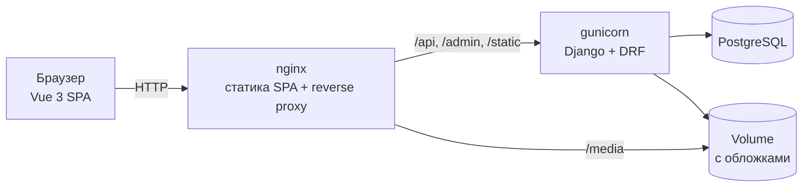

# Verso

> [🇬🇧 English](README.md) | 🇷🇺 Русский | [🇫🇷 Français](README.fr.md) | [🇩🇪 Deutsch](README.de.md)

[](https://github.com/DogNellaf/verso-bookshop/actions/workflows/ci.yml)


Интернет-магазин книг: REST API на Django REST Framework с админкой и витрина
на Vue 3 + TypeScript. Покупатель ищет книги в каталоге, собирает корзину,
которая сохраняется между сессиями, оформляет заказ, следит за ним и может его
отменить. Интерфейс по умолчанию на английском, а через переключатель в шапке
доступны русский, французский и немецкий — переведён и сам каталог книг.


## Быстрый старт

```bash
docker compose up --build
```

Откройте <http://localhost:8080> и на странице входа нажмите
**«Войти в демо-аккаунт»** (**demo / demopass123**). У демо-пользователя уже
есть три заказа в разных статусах и заполненная корзина. При первом запуске
в каталог загружаются 18 классических романов.

- Интерактивная документация API (Swagger UI): <http://localhost:8080/api/docs/>
- Админка: <http://localhost:8080/admin/> — задайте `DJANGO_SUPERUSER_USERNAME`
  и `DJANGO_SUPERUSER_PASSWORD` в `.env`, и аккаунт создастся при старте.

Чтобы увидеть защиту остатков в деле, положите последние экземпляры книги в
корзину в двух браузерах и оформите заказ в обоих: второй получит отказ с
сообщением, сколько экземпляров осталось.

## Кейс

### Задача

Небольшой книжный магазин хочет продавать онлайн. Магазин должен вести себя как
настоящий, а не как CRUD-демо: никогда не продавать экземпляр, которого нет,
даже если два человека оформляют заказ одновременно; история заказов не должна
меняться при правке цен или каталога; витриной должно быть удобно пользоваться
с телефона и на нескольких языках.

### Решение

Все бизнес-правила живут в REST API, SPA — тонкий типизированный клиент.
Заказ проходит такие состояния:

| Статус | Кто ставит | Что с остатками |
|---|---|---|
| **Ожидает** | Оформление заказа | Экземпляры атомарно списываются со склада |
| **Оплачен / Отправлен / Доставлен** | Сотрудник в админке | — |
| **Отменён** | Покупатель (только пока заказ ожидает) | Экземпляры возвращаются на склад |

Оформление — одна транзакция, которая сначала блокирует строки книг:

```python
with transaction.atomic():
    books = {b.id: b for b in Book.objects.select_for_update().filter(id__in=ids)}
    errors = [stock_message(books[i.book_id]) for i in items
              if i.quantity > books[i.book_id].stock]
    if errors:
        raise ValidationError({"detail": _("Not enough stock."), "items": errors})
    order = Order.objects.create(buyer=user)
    ...  # снимок названия и цены, списание остатков, очистка корзины
```

### Инженерные решения

- **Без перепродажи.** Оформление и отмена блокируют строки книг через
  `SELECT … FOR UPDATE`; проверка, изменение остатков и заказ — одна
  транзакция, поэтому неудачная проверка ничего не оставляет после себя.
- **История заказов — это снимок.** Строка заказа хранит название и цену на
  момент покупки, а FK на книгу — `SET_NULL`: правка или удаление книги не
  переписывает прошлые заказы.
- **Постоянное число запросов.** Корзина загружает позиции и книги одним
  `JOIN` плюс одним запросом за переводами; тест фиксирует число SQL-запросов,
  так что регрессия N+1 роняет CI.
- **Состояние — в URL.** Поиск, сортировка, фильтр «в наличии» и номер страницы
  хранятся в query-параметрах: любым видом каталога можно поделиться, его можно
  перезагрузить или вернуться к нему кнопкой «назад».
- **Один refresh на все запросы.** Когда access-токен истекает, все
  параллельные 401 ждут одного обновления, а не устраивают гонку с одним и тем
  же ротируемым refresh-токеном.
- **Законченный вид даже офлайн.** Книги без картинки получают сгенерированную
  типографскую обложку (цвет вычисляется из названия), а ассеты Swagger UI
  раздаются локально — приложению не нужны сторонние CDN.
- **Документированный и проверенный API.** Схема OpenAPI 3 генерируется из
  кода и валидируется в CI, где предупреждения считаются ошибками.

### Безопасность

- Access-токен JWT живёт 30 минут, refresh-токен ротируется при каждом
  использовании. Если сессию обновить нельзя, интерфейс выходит из аккаунта,
  а не показывает устаревшее состояние.
- Вход, регистрация и обновление токена ограничены по частоте (по умолчанию
  `20/min`); для анонимного и авторизованного трафика — свои лимиты.
- При регистрации работают валидаторы паролей Django.
- Редирект `?next=` после входа принимает только относительные пути этого сайта,
  поэтому его нельзя использовать как open redirect.
- Пользователь видит только свою корзину и свои заказы; всё остальное — 404.
- Секреты и хосты берутся из окружения. `HTTPS=True` включает secure-cookies,
  HSTS и редирект на HTTPS; `X-Frame-Options: DENY` и `nosniff` включены всегда.

### Локализация

- **Английский, русский, французский и немецкий.** Английский — язык по
  умолчанию для всех; язык браузера намеренно игнорируется, а переключатель
  EN / RU / FR / DE запоминает выбор в браузере и выставляет `<html lang>`.
- **Интерфейс** переведён через vue-i18n с правильными формами
  множественного числа («1 книга / 3 книги / 5 книг», «0 livre / 2 livres»).
  Тест проверяет, что во всех языках одинаковый набор ключей.
- **Каталог** тоже переводится: `BookTranslation` хранит название, автора и
  описание на каждом языке с откатом на английский оригинал. Поиск находит
  книгу на любом языке, а сортировка по названию и автору идёт по переводу.
- **Сообщения API** переведены через gettext Django. SPA передаёт выбранный
  язык в `Accept-Language`, поэтому ошибки вроде «Осталось только 2 экземпляра»
  приходят на языке пользователя и с правильной формой числа. CI проверяет, что
  скомпилированные `.mo` совпадают с исходными `.po`.
- Цены и даты форматируются через `Intl` для выбранного языка.

### Архитектура



SPA и API отдаются с одного origin, поэтому в продакшене нет CORS, а фронтенд
использует относительные URL. В разработке те же пути проксирует dev-сервер
Vite на `runserver`.

| Модуль | Ответственность |
|---|---|
| `backend/main/views.py` | Каталог, авторизация, корзина, оформление, заказы, отмена |
| `backend/main/serializers.py` | Формат API; выбор перевода книги под язык запроса |
| `backend/main/models.py` | `Book`, `BookTranslation`, `Cart`, `CartItem`, `Order`, `OrderItem` |
| `backend/main/management/commands/seed.py` | Демо-каталог, переводы, обложки, демо-пользователь |
| `frontend/src/services/api.ts` | Типизированный API-клиент, хранение JWT, общий refresh |
| `frontend/src/router.ts` | Ленивые маршруты, guard'ы авторизации, заголовки страниц |
| `frontend/src/i18n/` | Настройка vue-i18n, правила множественного числа, тексты EN/RU/FR/DE |

### Что изменила доработка

Проект начинался как магазин на Django-шаблонах, где заказ состоял из одной
книги, а позже был разделён на REST API и фронтенд на Vue. Чтобы довести его до
уровня портфолио, понадобилось:

- убрать остатки сгенерированного каркаса: неиспользуемые Tailwind/PostCSS,
  типы React, аналитику и картинки-заглушки;
- добавить отмену заказа с возвратом остатков под блокировкой строк, фильтры
  каталога и корзину с постоянным числом запросов;
- описать API через OpenAPI + Swagger UI, добавить rate limiting, health check
  в docker-compose и настройки для HTTPS;
- перестроить витрину: состояние в URL, guard'ы с возвратом после входа, выбор
  количества с учётом остатка, скелетоны, пустые состояния, страница 404,
  тёмная тема и мобильная вёрстка;
- перевести интерфейс, сообщения API и каталог на русский, французский и
  немецкий;
- расширить тесты до 138 и добавить в CI линтер, проверку схемы, переводов и
  покрытия.

## Скриншоты

| Страница книги | Корзина |
|---|---|
|  |  |

| Тёмная тема | Мобильная версия |
|---|---|
|  |  |

| История заказов | Документация API |
|---|---|
|  |  |

## Запуск без Docker

Понадобятся Python 3.12+, Node.js 20+ и pnpm. Если настройки Postgres не
заданы, используется SQLite.

```bash
./scripts/build-dev.sh          # Linux / macOS: настраивает и запускает оба приложения
.\scripts\build-dev.ps1         # Windows (PowerShell)
```

Или вручную:

```bash
cd backend
python -m venv .venv && source .venv/bin/activate
pip install -r requirements.txt
python manage.py migrate
python manage.py seed           # демо-каталог, переводы, обложки, демо-пользователь
python manage.py runserver      # http://127.0.0.1:8000

cd ../frontend
pnpm install
pnpm run dev                    # http://127.0.0.1:5173
```

`seed` берёт обложки из `backend/main/fixtures/covers/`, если они есть в
репозитории, а иначе скачивает их из Open Library; `--save-covers` сохраняет
скачанное туда, `--no-covers` отключает загрузку, `--flush` начинает с чистого листа.

## Настройки

Настройки берутся из переменных окружения; docker-compose читает их из `.env`.
См. [`.env.example`](.env.example).

| Переменная | Назначение | По умолчанию |
|---|---|---|
| `SECRET_KEY` | Секретный ключ Django | небезопасный dev-ключ |
| `DEBUG` | Режим отладки | `True` (`False` в Docker) |
| `ALLOWED_HOSTS` | Разрешённые хосты через запятую | локальные хосты в debug |
| `CORS_ALLOWED_ORIGINS`, `CSRF_TRUSTED_ORIGINS` | Origin фронтенда | dev-сервер Vite |
| `POSTGRES_DB`, `POSTGRES_USER`, `POSTGRES_PASSWORD`, `POSTGRES_HOST`, `POSTGRES_PORT` | PostgreSQL, если задан `POSTGRES_DB` | SQLite |
| `SEED_ON_START` | Загрузить демо-данные при старте контейнера | `1` |
| `DJANGO_SUPERUSER_USERNAME`, `DJANGO_SUPERUSER_PASSWORD`, `DJANGO_SUPERUSER_EMAIL` | Администратор, создаваемый при старте | — |
| `HTTPS` | Secure-cookies, HSTS, редирект на HTTPS | `False` |
| `THROTTLE_ANON`, `THROTTLE_USER`, `THROTTLE_AUTH` | Лимиты запросов | `120/min`, `600/min`, `20/min` |
| `LOG_LEVEL` | Уровень логирования | `INFO` |

## Тесты

```bash
cd backend
ruff check . && ruff format --check .
coverage run manage.py test && coverage report

cd ../frontend
pnpm run type-check
pnpm run coverage
```

На бэкенде 60 тестов (покрытие 94%): API, модели, конкурентное оформление,
отмена, фильтры, переводы, число SQL-запросов, rate limiting и команда `seed`.
На фронтенде 78 тестов (покрытие 92%): страницы, guard'ы роутера, API-клиент,
компоненты и i18n. CI также проверяет отсутствие несозданных миграций, схему
OpenAPI, скомпилированные переводы и собирает Docker-образы.

Скриншоты на всех языках снимаются с запущенного экземпляра:
`cd frontend && BASE_URL=http://localhost:8080 pnpm run screenshots`.

## Ограничения

Известные ограничения текущей реализации:

- Нет платёжного провайдера: оформление создаёт заказ в статусе «Ожидает»,
  дальше его ведут сотрудники в админке.
- Переводы есть только у демо-книг; новые книги показываются на английском,
  пока в админке не добавят перевод.
- Цены в одной валюте (USD) для всех языков.
- JWT хранится в `localStorage`. Сессия на httpOnly-cookie лучше защищает от
  XSS, но требует обработки CSRF.
- Поиск работает через `icontains`; большому каталогу понадобится
  полнотекстовый поиск PostgreSQL.

## Структура проекта

```
├── backend/
│   ├── bookshop/            # Настройки и корневой URLconf
│   ├── locale/              # Переводы сообщений API на ru, fr, de (gettext)
│   └── main/
│       ├── fixtures/covers/ # Обложки для загрузки без интернета (необязательно)
│       ├── management/      # Команда seed и переводы каталога
│       ├── filters.py, pagination.py, serializers.py, views.py, admin.py
│       └── tests.py
├── frontend/
│   ├── src/
│   │   ├── i18n/            # Настройка vue-i18n и тексты EN/RU/FR/DE
│   │   ├── pages/           # Каталог, книга, корзина, заказы, вход, регистрация, 404
│   │   ├── components/      # BookCover, StockBadge
│   │   ├── services/api.ts  # Типизированный API-клиент
│   │   └── router.ts
│   ├── scripts/screenshots.mjs
│   └── nginx.conf
├── docs/screenshots/        # en/, ru/, fr/, de/
├── docker-compose.yml
└── .github/workflows/ci.yml
```

## Лицензия

[MIT](LICENSE)
