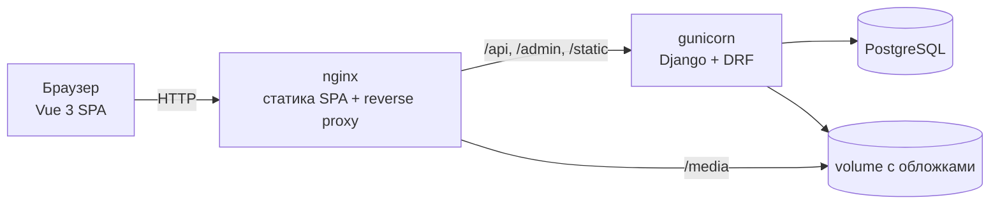

# Verso — интернет-магазин книг

> [🇬🇧 English](README.md) | 🇷🇺 Русский · 📄 [Кейс для портфолио](docs/case-study.ru.md)

[](https://github.com/DogNellaf/verso-bookshop/actions/workflows/ci.yml)


Fullstack интернет-магазин книг: REST API на **Django REST Framework** с
админкой и одностраничная витрина на **Vue 3 + TypeScript**. Каталог, вход,
персональная корзина, оформление, история и отмена заказов. Весь стек
поднимается одной командой через Docker.


<table>
  <tr>
    <td></td>
    <td></td>
  </tr>
  <tr>
    <td></td>
    <td></td>
  </tr>
  <tr>
    <td></td>
    <td align="center">
      
      
    </td>
  </tr>
</table>

## Запуск за 30 секунд

```bash
docker compose up --build
```

Откройте **http://localhost:8080** и на странице входа нажмите
**«Use demo account»** (`demo` / `demopass123`) — у демо-пользователя уже есть
заказы и заполненная корзина.

| | Адрес |
|---|---|
| Витрина | http://localhost:8080/ |
| Интерактивная документация API (Swagger) | http://localhost:8080/api/docs/ |
| Админка | http://localhost:8080/admin/ — задайте `DJANGO_SUPERUSER_USERNAME` / `DJANGO_SUPERUSER_PASSWORD` в `.env` |

## Возможности

**Витрина**
- Каталог с поиском, сортировкой, фильтром «в наличии» и пагинацией — всё
  состояние хранится в URL: ссылкой можно поделиться, страница переживает
  перезагрузку и кнопку «назад»
- Страница книги: выбор количества с учётом остатка, бейдж «Осталось N»
- Персональная корзина, оформление заказа, история, отмена ожидающих заказов
- JWT с бесшумным обновлением токена; после входа пользователь возвращается
  туда, откуда его попросили авторизоваться
- Светлая и тёмная темы (по настройке ОС, запоминается), адаптив до маленьких
  телефонов, скелетоны загрузки, пустые состояния и обработка ошибок
- Генерируемые типографские обложки, если у книги нет картинки

**API и бэк-офис**
- Атомарный checkout: остатки проверяются и списываются под блокировкой строк
  (`SELECT … FOR UPDATE`) — параллельные покупатели не «перепродадут» товар
- Строки заказа хранят снимок названия и цены — история не меняется при
  редактировании каталога
- Отмена заказа возвращает книги на склад в той же транзакции
- OpenAPI 3 + Swagger UI, схема валидируется в CI
- Rate limiting на вход и регистрацию, health-check, настройки для HTTPS
- Django-админка с превью обложек, фильтром по остаткам и строками заказа

## Архитектура



Витрина и API отдаются с одного origin (nginx), поэтому в продакшене нет CORS,
а фронтенд использует относительные URL. В разработке те же пути проксирует
dev-сервер Vite.

### Инженерные решения

| Проблема | Решение |
|---|---|
| Два покупателя одновременно берут последний экземпляр | Checkout — одна транзакция, строки `Book` блокируются `select_for_update()` до проверки остатка |
| Цена меняется после продажи | `OrderItem` хранит снимок названия и цены; FK на книгу — `SET_NULL` |
| N+1 запросов при отрисовке корзины | Позиции и книги грузятся одним `JOIN` (`Prefetch` + `select_related`), число запросов закреплено тестом |
| Параллельные запросы с истёкшим access-токеном | Интерсептор axios делит один refresh-запрос между всеми 401 |
| Open redirect через `/login?next=` | Принимаются только относительные пути этого сайта |
| Состояние каталога теряется при перезагрузке | Единственный источник правды — query-параметры URL |

## Стек

| Уровень | Технологии |
|---|---|
| Backend | Python 3.12, Django 5, Django REST Framework, SimpleJWT, django-filter, drf-spectacular |
| База данных | PostgreSQL 16 (Docker) / SQLite (локально) |
| Frontend | Vue 3 (Composition API), TypeScript, Vue Router, Axios, Vite, собственные CSS-токены |
| Тесты | Django test runner (API и модели), Vitest + Vue Test Utils, Playwright (скриншоты) |
| Инфраструктура | Docker Compose, gunicorn, WhiteNoise, nginx, GitHub Actions (линтер, схема, тесты, сборка) |

## Локальная разработка (без Docker)

```bash
./scripts/build-dev.sh      # Linux / macOS
.\scripts\build-dev.ps1     # Windows (PowerShell)
```

Backend: http://127.0.0.1:8000, frontend: http://127.0.0.1:5173.

<details>
<summary>Ручная настройка</summary>

```bash
# Backend
cd backend
python -m venv .venv && source .venv/bin/activate
pip install -r requirements.txt
python manage.py migrate
python manage.py seed              # демо-книги, пользователь, заказы
python manage.py createsuperuser   # опционально, для /admin/
python manage.py runserver

# Frontend (во втором терминале)
cd frontend
pnpm install
pnpm run dev
```
</details>

## Демо-данные

```bash
python manage.py seed              # идемпотентно
python manage.py seed --flush      # очистить книги/заказы/корзины и заполнить заново
python manage.py seed --no-covers  # без загрузки обложек (офлайн)
```

Создаёт 18 классических романов (обложки из Open Library) и аккаунт `demo` с
тремя заказами в разных статусах и заполненной корзиной.

## Проверки качества

```bash
cd backend  && ruff check . && ruff format --check . && python manage.py test
cd frontend && pnpm run type-check && pnpm run test && pnpm run build
```

В CI дополнительно проверяются отсутствие несозданных миграций, валидность
OpenAPI-схемы и сборка Docker-образов.

Скриншоты снимаются с запущенного экземпляра:
`cd frontend && BASE_URL=http://localhost:8080 pnpm run screenshots`.

## REST API

Полный интерактивный справочник — **`/api/docs/`** (схема — `/api/schema/`).
Авторизация: заголовок `Authorization: Bearer <access>`.

| Метод | Endpoint | Описание |
|---|---|---|
| GET | `/api/books/?search=&ordering=&in_stock=&min_price=&max_price=&page=` | Каталог |
| GET | `/api/books/:id/` | Книга |
| POST | `/api/auth/register/` | Регистрация → пользователь + токены |
| POST | `/api/auth/token/` | Вход → access + refresh |
| POST | `/api/auth/token/refresh/` | Обновление access-токена |
| GET | `/api/auth/user/` | Текущий пользователь |
| GET | `/api/cart/` | Корзина пользователя |
| POST | `/api/cart/items/` | Добавить книгу в корзину |
| PATCH / DELETE | `/api/cart/items/:id/` | Изменить количество / удалить |
| POST | `/api/cart/checkout/` | Оформить заказ из корзины |
| GET | `/api/orders/` · `/api/orders/:id/` | История / детали заказа |
| POST | `/api/orders/:id/cancel/` | Отменить ожидающий заказ, вернуть остатки |
| GET | `/api/health/` | Health check |

## Переменные окружения

| Переменная | Описание | По умолчанию |
|---|---|---|
| `SECRET_KEY` | Секретный ключ Django | небезопасный dev-ключ |
| `DEBUG` | Режим отладки | `True` (`False` в Docker) |
| `ALLOWED_HOSTS` | Разрешённые хосты через запятую | _(пусто)_ |
| `CORS_ALLOWED_ORIGINS` / `CSRF_TRUSTED_ORIGINS` | Разрешённые origin фронтенда | dev-адреса |
| `POSTGRES_DB` / `_USER` / `_PASSWORD` / `_HOST` / `_PORT` | Postgres, если задан `POSTGRES_DB` | SQLite |
| `SEED_ON_START` | Демо-данные при старте контейнера | `1` |
| `DJANGO_SUPERUSER_USERNAME` / `_PASSWORD` / `_EMAIL` | Создать администратора при старте | _(не задано)_ |
| `HTTPS` | Secure-cookies, HSTS, редирект на HTTPS | `False` |
| `THROTTLE_ANON` / `THROTTLE_USER` / `THROTTLE_AUTH` | Лимиты запросов | `120/min` / `600/min` / `20/min` |

## Лицензия

[MIT](LICENSE)
