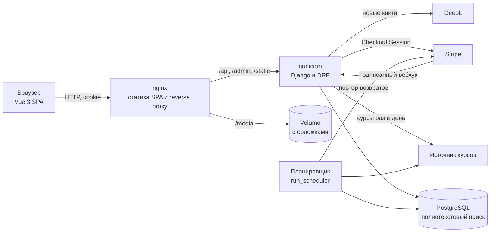
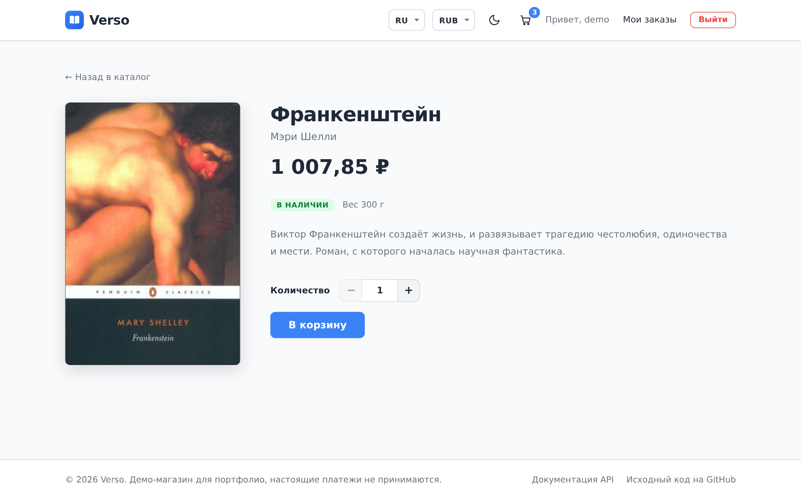
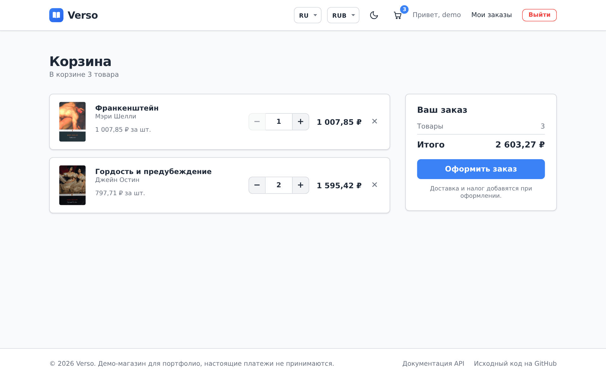
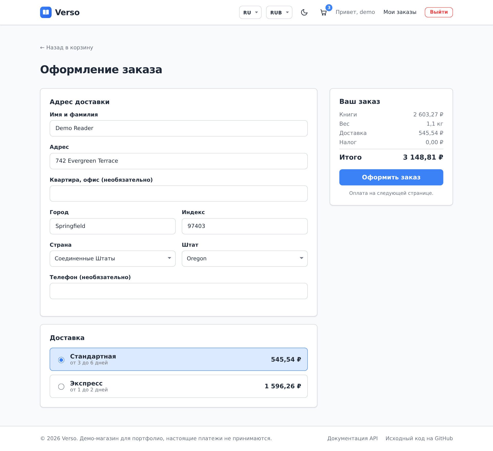
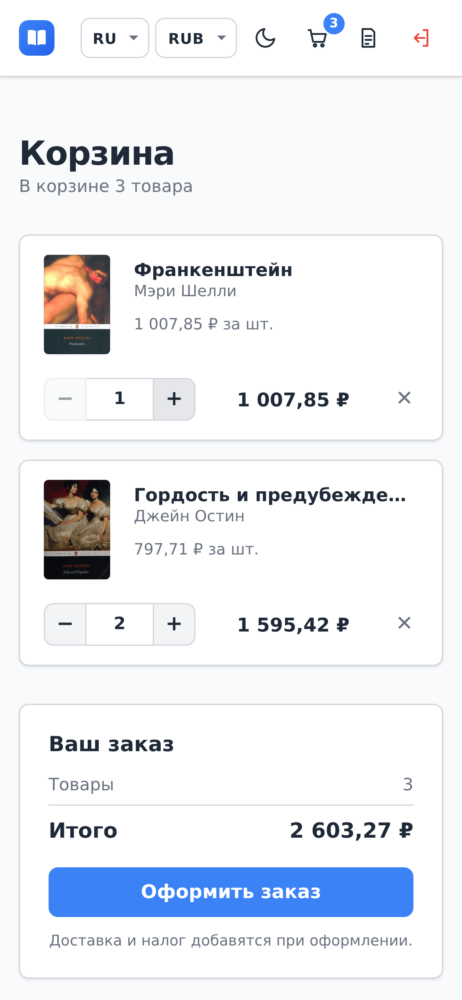
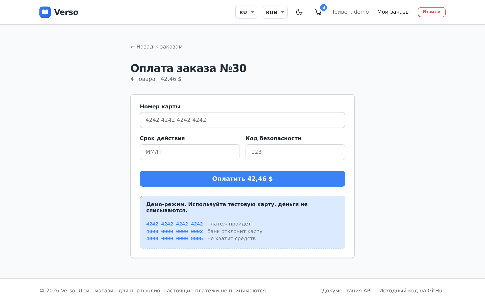
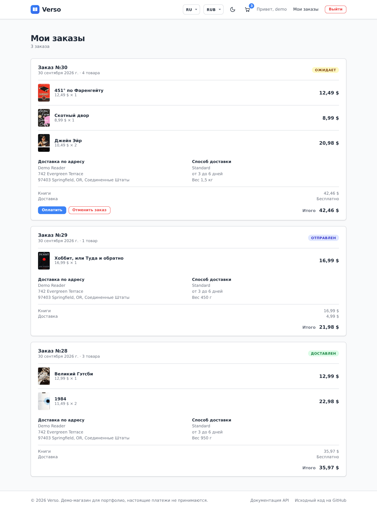
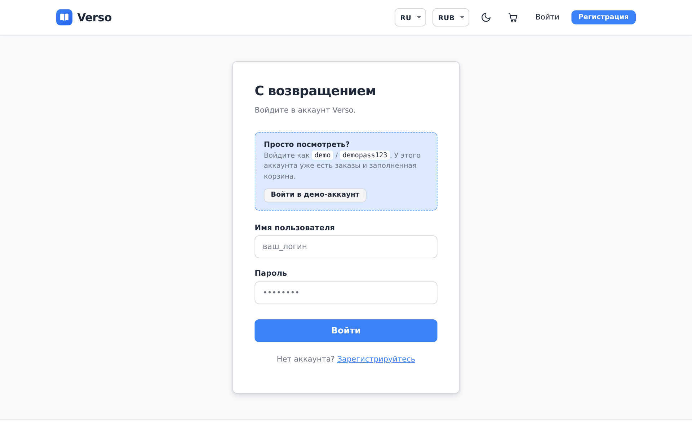

# Verso

> [🇬🇧 English](README.md) | 🇷🇺 Русский | [🇫🇷 Français](README.fr.md) | [🇩🇪 Deutsch](README.de.md)

[](https://github.com/DogNellaf/verso-bookshop/actions/workflows/ci.yml)


Verso это интернет-магазин книг на Django REST Framework и Vue 3. В нём можно
искать книги, собирать корзину, указывать адрес доставки, выбирать способ
доставки и платить картой. Стоимость доставки и налог зависят от страны
получателя. Заказ можно отменить, пока он не отправлен, и деньги вернутся. Цены
показываются в любой валюте, которую предлагает магазин, из коробки это
доллары, евро и рубли. Книгами, заказами, возвратами, валютами, доставкой и
налогами сотрудники управляют в админке Django. По умолчанию интерфейс на английском. В шапке можно выбрать
русский, французский или немецкий, каталог книг тоже переведён.


## Быстрый старт

```bash
docker compose up --build
```

Откройте <http://localhost:8080> и на странице входа нажмите
**«Войти в демо-аккаунт»** или войдите как **demo / demopass123**. У
демо-пользователя уже есть три заказа и несколько книг в корзине. При первом
запуске в базу загружаются 18 классических романов с обложками и свежие курсы
валют. Отдельный контейнер-планировщик держит курсы актуальными и повторяет
неудавшиеся возвраты денег.

Чтобы попробовать оплату, оформите заказ из корзины и оплатите его тестовой
картой **4242 4242 4242 4242** (любая будущая дата, любой код). Карту
**4000 0000 0000 0002** банк отклонит. В демо-режиме деньги не списываются.
Как подключить настоящий Stripe Checkout, написано в разделе
[Оплата](#оплата). Перед оплатой покупатель указывает адрес и способ
доставки, а к сумме добавляется налог страны получателя.

Документация API (Swagger UI) открывается по адресу
<http://localhost:8080/api/docs/>, админка по адресу
<http://localhost:8080/admin/>. Чтобы при старте создался администратор,
задайте `DJANGO_SUPERUSER_USERNAME` и `DJANGO_SUPERUSER_PASSWORD` в `.env`.

## Кейс

### Задача

Небольшой книжный магазин хочет продавать через интернет. Магазин не должен
продавать больше экземпляров, чем есть на складе, даже если два человека
оформляют заказ одновременно. Старые заказы должны сохранять свои цены после
изменений в каталоге и курсах валют. Покупатели живут в разных странах, поэтому
сайту нужны их язык и их валюта, и им должно быть удобно пользоваться с
телефона.

### Решение

Вся бизнес-логика находится в REST API, приложение на Vue только обращается к
нему. Заказ проходит такие статусы.

| Статус | Кто ставит | Остатки |
|---|---|---|
| **Ожидает** | Оформление заказа | Экземпляры списываются со склада |
| **Оплачен** | Успешный платёж (демо-карта или вебхук Stripe) | Не меняются |
| **Отправлен, Доставлен** | Сотрудник в админке | Не меняются |
| **Отменён** | Покупатель, пока заказ не отправлен. За оплаченный заказ деньги возвращаются | Экземпляры возвращаются на склад |

Доставка и налоги берутся из таблиц, которые сотрудники правят в админке. Вот
значения по умолчанию.

| Зона | Доставка, первый кг | Каждый следующий кг | Бесплатно от | Налог на книги |
|---|---|---|---|---|
| США | Стандартная $4.99, экспресс $14.99 | $1.50, $4.00 | $35 | налог штата, например 7,25% в Калифорнии и 8,875% в Нью-Йорке |
| Евросоюз | Стандартная $6.99, экспресс $19.99 | $2.00, $5.00 | $50 | пониженный НДС, например 7% в Германии и 5,5% во Франции |
| Россия | Почта России $5.99, курьер $11.99 | $1.50, $3.00 | $40 | 10% |
| Остальной мир | Международная $12.99 | $6.00 | $80 | нет |

У каждой книги есть вес. Способ доставки берёт базовую цену за первый килограмм
и фиксированную сумму за каждый начатый килограмм сверх него, а экспресс
принимает посылки до 10 кг. Ставка налога задаётся на страну, штат или диапазон
почтовых индексов, и побеждает самая точная. По умолчанию заведены ставки всех
штатов США и общие городские ставки Нью-Йорка и Чикаго. У ставки также есть
флаг, облагается ли налогом доставка.

Оформление заказа идёт в одной транзакции. Сначала блокируются строки книг,
потом проверяются остатки.

```python
with transaction.atomic():
    books = {b.id: b for b in Book.objects.select_for_update().filter(id__in=ids)}
    errors = [stock_message(books[i.book_id]) for i in items
              if i.quantity > books[i.book_id].stock]
    if errors:
        raise ValidationError({"detail": _("Not enough stock."), "items": errors})
    order = Order.objects.create(buyer=user, currency=order_currency)
    ...  # сохранить названия и цены в этой валюте, списать остатки, очистить корзину
```

### Инженерные решения

- Оформление и отмена блокируют строки книг через `SELECT … FOR UPDATE`.
  Проверка остатков, их изменение и новый заказ сохраняются в одной
  транзакции, поэтому после неудачной проверки не остаётся недоделанного
  заказа.
- Строка заказа хранит название и цену на момент покупки в той валюте, которую
  выбрал покупатель. Правка книги или новый курс не меняют старые заказы.
- Платежи проходят через небольшой интерфейс провайдера. Демо-провайдер
  проверяет номер карты по алгоритму Луна, у него есть тестовые карты для
  успеха, отказа и нехватки средств. Провайдер Stripe создаёт Checkout Session,
  а оплаченным заказ становится только после подписанного вебхука Stripe.
  Повторные вебхуки ничего не ломают.
- При оформлении сервер считает доставку и налог для адреса и способа доставки
  в выбранной валюте. Цена зависит от веса книг, способ пропадает, если посылка
  тяжелее его лимита, а налог определяется страной, штатом США или индексом. В
  заказе сохраняются адрес, способ доставки со сроком, вес и все суммы, так что
  последующие изменения цен его не затрагивают.
- Каждый возврат это отдельная строка с суммой и причиной, поэтому платёж
  можно вернуть частями. Сотрудник возвращает любую сумму из админки, а отмена
  заказа возвращает остаток. Платёж, пришедший за уже отменённый заказ,
  возвращается автоматически. Строки заблокированы на время запроса к
  провайдеру, а Stripe получает свой ключ идемпотентности для каждого возврата,
  поэтому деньги не вернутся дважды. Неудавшийся возврат планировщик повторяет
  до десяти раз.
- Планировщик это management-команда в отдельном контейнере. Раз в сутки он
  обновляет курсы валют, каждые 15 минут повторяет возвраты, отменяет
  платежи, которые никто не завершил за сутки, и отменяет заказы без оплаты
  старше двух суток, возвращая книги на склад. Каждая задача блокирует свою
  строку в таблице `JobRun`, поэтому два процесса не выполнят одну задачу
  одновременно, а админка показывает время и результат последнего запуска.
- Цены хранятся в долларах. Валюты это строки, которые сотрудник добавляет в
  админке. Новая валюта сразу получает курс из открытого источника, а витрина
  узнаёт о ней из `/api/currencies/`. Middleware пересчитывает цены в валюту,
  которую SPA просит в заголовке `X-Currency`, и округляет до минимальной
  единицы валюты, поэтому иены показываются без копеек. Фильтр по цене тоже
  работает в выбранной валюте.
- На PostgreSQL в каталоге полнотекстовый поиск. У каждой книги есть
  `tsvector` из английского текста и всех переводов, каждый со своей
  морфологией, и GIN-индекс. Результаты ранжируются, работает синтаксис
  `websearch` («кавычки», -минус), а триграммный индекс находит книгу даже с
  опечаткой вроде «Tolkein». На SQLite при разработке используется простой
  поиск по подстроке.
- Корзина загружается за постоянное число SQL-запросов. Тест считает запросы,
  и проблема N+1 уронит CI.
- Поиск, сортировка, фильтр «в наличии» и номер страницы хранятся в URL.
  Страницей каталога можно поделиться, её можно перезагрузить или вернуться к
  ней кнопкой «назад».
- Обложки демо-книг взяты из Open Library и лежат в репозитории. Книга без
  картинки получает сгенерированную обложку. Файлы Swagger UI отдаются
  локально, так что приложению не нужны CDN.

### Безопасность

- JWT-токены не попадают в JavaScript. Бэкенд кладёт их в httpOnly-cookie с
  `SameSite=Lax` (и `Secure` при HTTPS). Refresh-cookie отправляется только на
  `/api/auth/`.
- Браузер сам отправляет cookie, поэтому каждый небезопасный запрос проходит
  CSRF-проверку Django. SPA читает cookie `csrftoken` и отправляет её значение
  в `X-CSRFToken`, в том числе при входе и регистрации.
- Access-токен живёт 30 минут. Refresh-токен меняется при каждом
  использовании, а старый попадает в чёрный список, так что украденный
  refresh-токен перестаёт работать после следующего обновления. Выход из
  аккаунта тоже отзывает токен.
- Вход, регистрация и обновление токена по умолчанию ограничены 20 запросами
  в минуту. У анонимных и авторизованных пользователей отдельные лимиты.
- Вебхук Stripe принимается только с правильной подписью Stripe.
- После входа сайт перенаправляет только на относительные пути этого же
  сайта, поэтому через `?next=` нельзя увести пользователя на чужой домен.
- Пользователь видит только свою корзину, свои заказы и платежи. На всё
  остальное API отвечает 404.
- Секреты задаются переменными окружения. `HTTPS=True` включает
  secure-cookies, HSTS и редирект на HTTPS. Заголовок `X-Frame-Options` всегда
  равен `DENY`.

### Локализация

- Языков четыре, английский, русский, французский и немецкий. По умолчанию
  английский, язык браузера специально не учитывается. Переключатель
  EN / RU / FR / DE запоминает выбор в браузере и выставляет `<html lang>`.
- Интерфейс переведён через vue-i18n с правилами множественного числа для
  каждого языка («1 книга, 3 книги, 5 книг», «0 livre, 2 livres»). Тест
  проверяет, что во всех языках одинаковый набор ключей.
- Названия, авторы и описания книг хранятся в `BookTranslation`, по одной
  строке на язык, с откатом на английский. Если задан `DEEPL_API_KEY`, новая
  книга переводится автоматически, когда её добавляют в админке.
- Машинные переводы помечаются как непроверенные. В админке есть очередь на
  проверку и действие «Mark as reviewed», а сохранение исправленного перевода
  тоже считается проверкой. С `PUBLISH_UNREVIEWED_TRANSLATIONS=False` витрина
  показывает английский текст, пока человек не одобрит перевод.
- Сообщения API, включая ошибки по карте, переведены через gettext Django.
  Фронтенд передаёт выбранный язык в `Accept-Language`. CI проверяет, что
  скомпилированные файлы `.mo` совпадают с файлами `.po`.
- Валюта по умолчанию зависит от языка (USD для английского, RUB для
  русского, EUR для французского и немецкого), пока посетитель не выберет
  другую. Цены и даты форматируются через `Intl`.

### Архитектура



SPA и API работают на одном origin, поэтому в продакшене нет CORS, а cookie
остаются first-party. В разработке те же пути перенаправляет на `runserver`
сервер Vite.

| Модуль | Что делает |
|---|---|
| `backend/main/views.py` | Каталог, корзина, оформление, заказы, отмена |
| `backend/main/checkout.py` | Зоны и способы доставки, налоги, расчёт суммы для корзины |
| `backend/main/orders.py` | Отмена заказа с возвратом на склад и возвратом денег |
| `backend/main/authentication.py`, `auth_views.py` | JWT в httpOnly-cookie, CSRF, вход, обновление, выход |
| `backend/main/payments/`, `payment_views.py` | Демо-провайдер и Stripe, статусы платежей, вебхук |
| `backend/main/currency.py` | Текущая валюта, пересчёт, кэш курсов |
| `backend/main/search.py` | Поисковый документ, полнотекстовый запрос, поиск с опечатками |
| `backend/main/machine_translation.py` | Перевод новых книг через DeepL |
| `backend/main/scheduler.py` | Периодические задачи и записи `JobRun` |
| `backend/main/models.py` | `Book`, `BookTranslation`, `Cart`, `Order`, `Payment`, `Refund`, `Currency`, `ShippingZone`, `TaxRate` |
| `frontend/src/services/api.ts` | Типизированный API-клиент, CSRF, общее обновление сессии |
| `frontend/src/currency.ts`, `i18n/` | Выбор валюты и языка, тексты на четырёх языках |
| `frontend/src/pages/Payment.vue` | Форма карты в демо-режиме, переход на Stripe |

### Что изменилось при доработке

Сначала проект был магазином на Django с серверными шаблонами, в заказе могла
быть только одна книга, а оплаты не было. Потом его разделили на REST API и
фронтенд на Vue. При доработке было сделано следующее.

- Удалены остатки сгенерированного шаблона, в том числе неиспользуемые
  Tailwind и PostCSS, типы React, аналитика и картинки-заглушки.
- Добавлены отмена заказа, фильтры каталога и корзина с постоянным числом
  запросов.
- Добавлена страница оформления с адресом доставки, зонами и способами
  доставки и налогами по странам, штатам США и индексам, а также доставкой по
  весу.
- Добавлена оплата картой через демо-провайдер и Stripe Checkout с полным и
  частичным возвратом денег.
- Список валют перенесён в админку.
- Добавлен контейнер-планировщик для курсов валют, повторных возвратов,
  зависших платежей и неоплаченных заказов.
- Добавлены цены в евро и рублях с хранимыми курсами валют.
- JWT перенесены из `localStorage` в httpOnly-cookie с CSRF-защитой и отзывом
  токенов.
- Поиск по подстроке заменён полнотекстовым поиском PostgreSQL на четырёх
  языках с поиском по опечаткам.
- Интерфейс, сообщения API и каталог переведены на русский, французский и
  немецкий, новые книги переводит DeepL, а машинные переводы проходят
  проверку.
- Витрина переделана. Состояние каталога хранится в URL, появились тёмная
  тема и мобильная вёрстка, у демо-книг настоящие обложки.
- API описан через OpenAPI и Swagger UI, добавлены лимиты запросов, health
  check и настройки HTTPS.
- Тестов стало 287, появился браузерный смоук-тест, а тесты бэкенда в CI
  запускаются на SQLite и на PostgreSQL.

## Скриншоты

| Страница книги | Корзина |
|---|---|
|  |  |

| Оформление заказа | Мобильная версия |
|---|---|
|  |  |

| Оплата | История заказов |
|---|---|
|  |  |

| Тёмная тема | Вход |
|---|---|
|  |  |

## Оплата

Демо-режим работает без настройки. Чтобы принимать настоящие платежи через
Stripe, задайте эти переменные и направьте вебхук Stripe на
`/api/payments/stripe/webhook/` для событий `checkout.session.completed` и
`checkout.session.expired`.

```bash
PAYMENT_PROVIDER=stripe
STRIPE_SECRET_KEY=sk_test_...
STRIPE_WEBHOOK_SECRET=whsec_...
SITE_URL=https://your-shop.example
```

Для локальной проверки команда
`stripe listen --forward-to localhost:8080/api/payments/stripe/webhook/`
выводит секрет вебхука.

## Запуск без Docker

Нужны Python 3.12 или новее, Node.js 20 или новее и pnpm. Если настройки
Postgres не заданы, бэкенд работает на SQLite, и поиск идёт по подстроке.

```bash
./scripts/build-dev.sh          # Linux и macOS, настраивает и запускает оба приложения
.\scripts\build-dev.ps1         # Windows (PowerShell)
```

Или по шагам.

```bash
cd backend
python -m venv .venv && source .venv/bin/activate
pip install -r requirements.txt
python manage.py migrate
python manage.py seed                   # демо-каталог, переводы, обложки, демо-пользователь
python manage.py update_exchange_rates  # по желанию, в seed есть курсы по умолчанию
python manage.py runserver              # http://127.0.0.1:8000

cd ../frontend
pnpm install
pnpm run dev                            # http://127.0.0.1:5173
```

Обложки демо-книг лежат в `backend/main/fixtures/covers/`, поэтому `seed`
работает без интернета. `--flush` начинает с пустого каталога. Команда
`python manage.py translate_books` дополняет недостающие переводы через DeepL.
`python manage.py run_scheduler` запускает периодические задачи, а
`run_scheduler --once` делает один проход для cron.

## Настройки

Настройки берутся из переменных окружения. docker-compose читает их из `.env`,
пример в [`.env.example`](.env.example).

| Переменная | Назначение | По умолчанию |
|---|---|---|
| `SECRET_KEY` | Секретный ключ Django | небезопасный ключ для разработки |
| `DEBUG` | Режим отладки | `True` (`False` в Docker) |
| `ALLOWED_HOSTS` | Разрешённые хосты через запятую | локальные хосты в режиме отладки |
| `CORS_ALLOWED_ORIGINS`, `CSRF_TRUSTED_ORIGINS` | Адреса фронтенда | сервер Vite |
| `POSTGRES_DB`, `POSTGRES_USER`, `POSTGRES_PASSWORD`, `POSTGRES_HOST`, `POSTGRES_PORT` | PostgreSQL используется, если задан `POSTGRES_DB` | SQLite |
| `SITE_URL` | Публичный адрес для возврата со Stripe | `http://localhost:8080` |
| `PAYMENT_PROVIDER` | `demo` или `stripe` | `demo` |
| `STRIPE_SECRET_KEY`, `STRIPE_WEBHOOK_SECRET` | Ключи Stripe | нет |
| `DEEPL_API_KEY` | Машинный перевод новых книг | нет |
| `AUTO_TRANSLATE_BOOKS` | Переводить книгу при создании | `True` |
| `PUBLISH_UNREVIEWED_TRANSLATIONS` | Показывать машинные переводы до проверки | `True` |
| `EXCHANGE_RATES_URL` | Источник курсов с базой USD | open.er-api.com |
| `UPDATE_RATES_ON_START` | Обновлять курсы при старте контейнера | `1` |
| `EXCHANGE_RATES_INTERVAL_HOURS` | Как часто планировщик обновляет курсы | `24` |
| `PAYMENT_TIMEOUT_HOURS` | Через сколько часов отменять незавершённые платежи | `24` |
| `UNPAID_ORDER_TIMEOUT_HOURS` | Через сколько часов отменять неоплаченные заказы и возвращать книги на склад | `48` |
| `SEED_ON_START` | Загружать демо-данные при старте контейнера | `1` |
| `DJANGO_SUPERUSER_USERNAME`, `DJANGO_SUPERUSER_PASSWORD`, `DJANGO_SUPERUSER_EMAIL` | Администратор, который создаётся при старте | нет |
| `HTTPS` | Secure-cookies, HSTS, редирект на HTTPS | `False` |
| `THROTTLE_ANON`, `THROTTLE_USER`, `THROTTLE_AUTH` | Лимиты запросов | `120/min`, `600/min`, `20/min` |
| `LOG_LEVEL` | Уровень логов | `INFO` |

## Тесты

```bash
cd backend
ruff check . && ruff format --check .
coverage run manage.py test && coverage report

cd ../frontend
pnpm run type-check
pnpm run coverage
BASE_URL=http://localhost:8080 pnpm run smoke   # браузерный тест запущенного приложения
```

На бэкенде 176 тестов, покрытие 95%. Они проверяют API, авторизацию через
cookie и CSRF, оформление и отмену заказов, оба платёжных провайдера вместе с
подписью вебхука, доставку по весу, налоги по стране, штату и индексу, полные и
частичные возвраты и их повторы, планировщик, валюты из админки, полнотекстовый
поиск, машинный перевод и его проверку, число SQL-запросов и лимиты. В CI они
запускаются на SQLite и на PostgreSQL. На фронтенде 111 тестов, покрытие 95%.
Они проверяют оформление заказа, страницы, форму оплаты, проверки в роутере,
API-клиент, валюты и переводы. Смоук-тест запускается в CI против всего стека
из Docker Compose. Он входит в аккаунт, проверяет налог с продаж Нью-Йорка,
покупает книгу с доставкой в Германию, платит сначала отклонённой, потом
рабочей тестовой картой, отменяет заказ с возвратом денег и проверяет, что из
JavaScript не читается ни один токен.

Скриншоты на всех языках снимаются с запущенного приложения командой
`cd frontend && BASE_URL=http://localhost:8080 pnpm run screenshots`.

## Структура проекта

```
├── backend/
│   ├── bookshop/            # настройки и корневой URLconf
│   ├── locale/              # сообщения API на русском, французском и немецком (gettext)
│   └── main/
│       ├── fixtures/covers/ # обложки демо-книг
│       ├── management/      # seed, update_exchange_rates, translate_books, run_scheduler
│       ├── payments/        # демо-провайдер и Stripe
│       ├── migrations/
│       ├── tests/           # авторизация, ядро, валюты, платежи, поиск, перевод
│       ├── authentication.py, auth_views.py, payment_views.py
│       ├── checkout.py, orders.py, countries.py
│       ├── currency.py, search.py, machine_translation.py, scheduler.py
│       └── models.py, serializers.py, views.py, admin.py
├── frontend/
│   ├── src/
│   │   ├── i18n/            # настройка vue-i18n и тексты на четырёх языках
│   │   ├── pages/           # каталог, книга, корзина, оформление, оплата, заказы, вход, 404
│   │   ├── components/      # BookCover, StockBadge
│   │   ├── services/api.ts  # типизированный API-клиент
│   │   ├── currency.ts
│   │   └── router.ts
│   ├── scripts/             # screenshots.mjs, smoke.mjs
│   └── nginx.conf
├── docs/screenshots/        # en, ru, fr, de
├── docker-compose.yml
└── .github/workflows/ci.yml
```

## Лицензия

[MIT](LICENSE)
